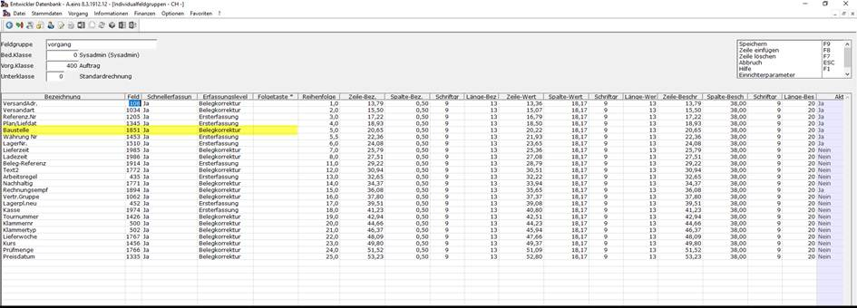

# Einrichtung

<!-- source: https://amic.de/hilfe/einrichtung6.htm -->

• Zunächst muss sichergestellt sein, dass der Lizenzsteuerparameter „Futter App“ (SPA 1025) aktiv ist.

• Im Steuerparameter „FutterApp Optionen und Ausprägungen“ (SPA 1047) muss ein Dateipfad hinterlegt werden.

Hierfür muss der Punkt „An/Aus“ auf „Ja“ (1), „Ausprägung“ auf „Dateipfad für Ordnerstruktur“(4) und „Wert/Value“ auf „&lt;gewünschter Dateipfad>“ gestellt werden.

• Als nächstes unter **[OSQL]** den Control-String „^jpl FutterAppEinrichter“ ausführen.

o Die Ordnerstruktur unter dem im Steuerparameter 1047 angegebenen Pfad wird angelegt.

o Es werden die Exportprofile für den *„DbExporter“,* in der Tabelle „H_GS_EXPORT_PROFIL“ angelegt.

o Es werden die Transferprofile für den *„A.eins.FtpTransfer“*, in der Tabelle „H_GS_TRANSFER_FTP“ angelegt.

o Es wird die Batch-Datei „FutterAppExporter.bat“ in der Ordnerstruktur (SPA 1047) erstellt.

o Übergabeparameter A.eins.FtpTransfer.exe: “CONNECTION=Mandantname TRANSFERID=TransferId“ aus Tabelle H_GS_TRANSFER_FTP

• Die Serverinformationen müssen in den Transferprofilen nachgepflegt werden. **[FTPTRA]**

• Der Import der Bestellungen muss als Event eingetragen werden **[EVT]**. Es wird eine minütliche Wiederholung empfohlen.

Verarbeitungsroutine:

begin

insert into "DATENSTROM"( "ds_status","BedienerId","DS_DSC","DS_Id","DS_Parameter","ds_RefText" ) values

( 0,-1,12,"amic_func_dbxident"('Datenstrom',0),'^jpl FutterApp abc 400 0 1','FutterAppBelegImport' )

end

o Der erste Parameter („abc“) war ursprünglich der Dateipfad. Dieser wird noch gezogen, wenn kein Eintrag im Steuerparameter eingetragen ist. Dies ist nicht mehr empfohlen.

• Diese Batch-Datei „FutterAppExporter.bat“ muss nun im Windows-Aufgabenplaner eingetragen werden. Es wird eine Wiederholung in 5-Minuten Intervallen empfohlen.

**•** Im Lieferschein und in den Aufträgen muss das UFLD-Feld für die Baustelle hinzugefügt werden. Hierfür zunächst mit **[UFLD]** auf die **zugehörige Auswahlliste springen. Und dort die Datensätze mit passender Vorgangs-, Vorgangsunter- und Bedienerklasse auswählen. Mit F5 bearbeiten.**

**Nun (falls noch nicht vorhanden) den Punkt Baustelle hinzufügen. (Vergleiche gelben Bereich in der Abbildung)**

