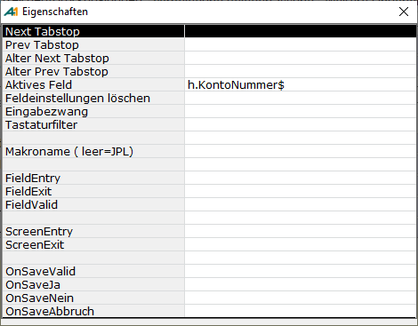

# Tabulatorreihenfolge

<!-- source: https://amic.de/hilfe/tabulatorreihenfolge.htm -->

Funktionen bei der Tabulatorreihenfolge.

Wenn man auf ein Eingabefeld klickt, so öffnet sich eine Maske mit folgenden Feldern. In „**Aktives Feld**“ wird das Feld angezeigt, dass man gerade ausgewählt hat. Klick man dann auf eine der Funktionen „**Next Tabstop, PrevTabstop, Alter Next Tabstop, Alter Prev Tabstop**“, so schließt sich diese Maske und man kann dann in das Feld klicken, dass dann das nächste, vorherige,… in der Tabulatorreihenfolge werden soll.  

| Funktion | Bedeutung |
| --- | --- |
| Next Tabstop |   
 |
| Prev Tabstop |   
 |
| Alter Next Tabstop |   
 |
| Alter Prev Tabstop |   
 |
| Aktives Feld | Anzeige des aktuellen Feldnamens  
 |
| Feldeinstellungen löschen | Setzt die Feldeinstellungen zurück  
 |
| Eingabezwang | Kann Ja und Nein annehmen,  
 |
| Tastaturfilter | Die Werte des Feldes werde durch das Anklicken der Zeile gesetzt. Diese Werte werden unterstützt.  
• Unfiltered  
• Digits only  
• Yes-no  
• Alphabetic  
• Numeric  
• Alphanumeric  
• Regular Expression  
• Edit Mask  
Bei Regular Expression und Edit Mask öffnet sich ein weiteres Fenster in dem die entsprechenden Werte eingegeben werden können.  
 |
| Makroname(leer=JPL) | Hier kann ein Makro hinterlegt werden, in dem folgende Funktionen behandelt werden können. Ist kein Makro hinterlegt, so wird davon ausgegangen, dass die folgenden Funktionen JPL-Funktionen sind und im User JPL stehen.  
 |
| FieldEntry | Funktion die beim Betreten des Feldes ausgeführt wird.  
 |
| FieldExit | Funktion die beim Verlassen des Feldes ausgeführt wird.  
 |
| FieldValid | Funktion die vor dem Verlassen des Feldes ausgeführt wird.  
Liefert diese Funktion einen Wert größer als 0 zurück, so wird das Feld nicht verlassen.  
 |
| ScreenEnty | Funktion, die beim Betreten und Verlassen der Maske ausgeführt werden. Sie hat zwei Parameter, der erste ist der Name der Maske und der zweite ist ein Flag, welches angibt, wie die Maske betreten bzw. verlassen wird.  
 |
| ScreenExit |
| |
| OnSaveValid  
 | Diese Funktionen erscheinen nur dann, wenn es sich bei der Maske technisch um ein Stammdateninterface handelt - zu erkennen am Aufruf der Maske über „jpl sd_interface“ mit 5,7,8 oder 77.  
Alle diese Funktionen haben einen Parameter, der angibt, was gerade gemacht worden ist:  
• 5 für Ändern  
• 7 für Löschen  
• 8 für Neu  
• 77 für Undelete  
    
Die Funktion OnsSaveValid wird aufgerufen, nachdem die programmeigene Funktion ausgeführt wurde und nur dann, wenn die programmeigene Funktion Ok signalisierte. OnSaveValid muss 0 zurückliefern, wenn Speichern erlaubt sein soll ansonsten einen beliebigen Wert größer 0, wenn nicht gespeichert oder gelöscht werden soll:  
   
   
Die anderen Funktionen werden aufgerufen, nachdem gespeichert wurde, oder Speichern mit Nein oder mit Abbruch verlassen wurde.  
Wenn man ein User-JPL – nicht bei Verwendung eines Makros - angebunden hat, dann werden die Funktionen sofort angelegt. Beispiel für OnSaveJa:  
    
    
   
**Hinweis**: Der Modus 7 (Löschen) wird extra im Template separat behandelt, damit nicht vergessen wird, dass diese Funktion auch bei Löschen aufgerufen wird!  
 |
| OnSaveJa  
 |
| OnSaveNein  
 |
| *OnSaveAbbruch*  
 |

Wenn der Makroname leer ist und es sich somit um JPL handelt, müssen die verwendeten Funktionen mit „User-Jpl editieren“ noch mit Leben gefüllt werden,
