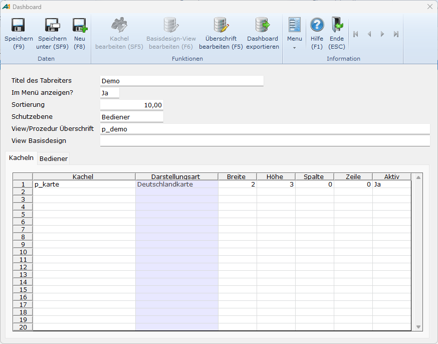

# Board einrichten

<!-- source: https://amic.de/hilfe/boardeinrichten.htm -->

Administration > Menü > Dashboard > Variante Dashboard

oder

Direktsprung **[DASH]** \> Variante Dashboard

Bei bereits eingerichtetem Dashboard erreicht man die Bearbeitungsmaske des Dashboards direkt über das Kontextmenü (rechte Maustaste) des Dashboards.

 

  <table>
    <tbody>
      <tr>
        <td></td>
        <td>
          
Beschreibung

        </td>
      </tr>
      <tr>
        <td>
          
Titel

        </td>
        <td>
          
Der Titel ist ein Pflichtfeld. Er ist gleichzeitig die Bezeichnung auf dem Register im Hauptmenü. Ändert man den Titel des Boards, so wird diese Änderung erst nach Neustart von A.eins wirksam. Der Titel muss eindeutig sein.

        </td>
      </tr>
      <tr>
        <td>
          
Im Menü anzeigen?

        </td>
        <td>
          
Soll das Dashboard nicht im Menü angezeigt werden, da es bspw. nur für AIS-Masken angedacht ist, so kann man dieses Feld auf „Nein“ stellen.

          
Die Standardeinstellung ist „Ja“.

        </td>
      </tr>
      <tr>
        <td>
          
Sortierung

        </td>
        <td>
          
Hat man mehrere Dashboards angelegt, kann mit der Sortierung deren Reihenfolge festgelegt werden, wie sie im Hauptmenü erscheinen. Dashboards können nicht vor die Standard-Registerkarten des Menüs platziert werden.

        </td>
      </tr>
      <tr>
        <td>
          
Schutzebene

        </td>
        <td>
          
Die Schutzebene kann „Bediener“ oder „Rolle“ sein. Legt man ein Dashboard neu an, so ist die Schutzebene auf „Bediener“ eingestellt und man selbst ist sofort zugeordnet. Auf einem Register, welches eingeblendet wird, können weitere Benutzer zugeordnet werden, die dieses Dashboard sehen dürfen.

          
Wählt man Rolle, so dürfen nur bestimmte einer Rolle zugewiesene Bedienerklassen dieses Board sehen. Es existiert dann im Menü eine Funktion <strong><em>Rolle Festlegen</em></strong>.

          
Hinweis:

          
<i>Die Schutzebene hat nur Auswirkungen auf die Dashboards, die im Hauptmenü angezeigt werden.</i>

        </td>
      </tr>
      <tr>
        <td>
          
View/Prozedur Überschrift

        </td>
        <td>
          
Für jedes Board kann eine Überschriftszeile bestehend aus einer Textzeile und einer Grafik (optional) eingerichtet werden. Die Werte werden wie bei den Kacheln über eine private View oder Prozedur angegeben. Mit der Funktion <strong><em>View/Prozedur bearbeiten</em></strong> kann die Funktion direkt bearbeitet oder neu angelegt werden. Bei der Neuanlage wird ein Gerüst mit den möglichen Feldern vorgegeben.   

          <table>
            <tbody>
              <tr>
                <th></th>
                <th></th>
              </tr>
              <tr>
                <td>Forecolor,</td>
                <td>Optional: Die Schriftfarbe. Standard ist Schwarz.</td>
              </tr>
              <tr>
                <td>Backcolor,</td>
                <td>Optional. Die Hintergrundfarbe der Überschrift. Ist sie nicht gesetzt, hat der Hintergrund dieselbe Farbe wie das Board.</td>
              </tr>
              <tr>
                <td>Backcolor2,</td>
                <td>Optional. Wird Backcolor2 mit angegeben und unterscheidet sich von Backcolor, dann wird die Hintergrundfarbe der Kachel als Farbverlauf dargestellt: <code>Select '255/128/0' as headercolor, '255/254/0' as headercolor2</code></td>
              </tr>
              <tr>
                <td>Borderstyle,</td>
                <td>
                  Rahmen um die Überschriftszeile.
                   
                  <ul>
                    <li>'none' as borderstyle</li>
                    <li>'solid' as borderstyle</li>
                    <li>'raised' as borderstyle</li>
                    <li>'inset‘ as borderstyle Standardeinstellung ist 'none'</li>
                  </ul>
                </td>
              </tr>
              <tr>
                <td>BorderColor</td>
                <td>Die Rahmenfarbe wird nur beim Borderstyle 'solid' ausgewertet. Die Angabe erfolgt in RGB-Form, entweder hexadezimal mit einem # vorweg oder dezimal durch einen Schrägstich '/' getrennt.  '#FF0000‘ as headerbordercolor Oder '255/00/00'</td>
              </tr>
              <tr>
                <td>Textalign</td>
                <td>
                  Ausrichtung der Überschrift. Mögliche Werte sind
                   
                  <ul>
                    <li>'left' as headeralign</li>
                    <li>'center' as headeralign</li>
                    <li>'right' as headeralign</li>
                  </ul>
                </td>
              </tr>
              <tr>
                <td>Text</td>
                <td>Der Text</td>
              </tr>
              <tr>
                <td>Fontsize</td>
                <td>Die Größe der Schriftart. Sie bestimmt die Höhe der Überschriftszeile und des Bildes.</td>
              </tr>
              <tr>
                <td>Picture</td>
                <td>Optional: Ein Bild (z.B. aus dem Archiv), das am rechten Rand dargestellt wird.</td>
              </tr>
            </tbody>
          </table>
        </td>
      </tr>
      <tr>
        <td>
          
View Basisdesign

        </td>
        <td>
          
Um zentral für das Dashboard ein <a href="./prozeduren_oder_views_fuer_kacheln_einrichten/basisdesign.md">einheitliches Design</a> zu hinterlegen, empfiehlt es sich hier eine View zu verwenden. Alle diesem Board zugewiesenen Kacheln arbeiten dann – es sei denn es wurden in der Kachel abweichende Werte definiert – mit dieser Vorgabe.

        </td>
      </tr>
      <tr>
        <td>
          
Kachel

        </td>
        <td>
          
Hier kann man eine bereits eingerichtete Kachel mit <strong>F3</strong> auswählen. Diese kann auch sofort mit <strong>Umschalt+F5</strong> bearbeitet werden. Steht man in einer leeren Zeile und drückt <strong>Umschalt+F5</strong>, kann man sofort eine neue Kachel erfassen.

          
Neben der Kachel wird sofort die Darstellungsart dieser Kachel angezeigt.

        </td>
      </tr>
      <tr>
        <td>
          
Zeile und Spalte

        </td>
        <td>
          
Das Dashboard ist in ein Raster eingeteilt, dessen oberster linke Kachel in Zeile 0 und Spalte 0 beginnt.

        </td>
      </tr>
      <tr>
        <td>
          
Breite und Höhe

        </td>
        <td>
          
Der Wert von 1 entspricht einer Seitenlänge von 166 Pixeln. Gibt man einen anderen Wert an, so wird ist die Seitenlänge ein Vielfaches von 166 Pixeln.

        </td>
      </tr>
      <tr>
        <td>
          
Aktiv

        </td>
        <td>
          
Hier kann eingestellt werden, ob die Kachel im Dashboard angezeigt werden soll. Steht der Wert auf „Nein“, so wird die entsprechende Kachel im Dashboard ausgeblendet. Der Standardwert ist „Ja“.

        </td>
      </tr>
    </tbody>
  </table>

