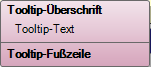
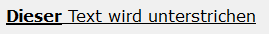

# Basisdesign

<!-- source: https://amic.de/hilfe/kachelbasisdesign.htm -->

Administration > Menü > Dashboard > Variante Kachel

oder

Direktsprung **[DASH]** \> Variante Kachel

Jede Prozedur bzw. jede View kann zur Gestaltung die folgenden Felder verwenden. Es wird empfohlen eine View für das Basisdesign im Dashboard zu hinterlegen und für die einzelnen Kacheln in den Prozeduren nur dort Werte zurückzuliefern, wo eine Abweichung vom Basisdesign gewünscht wird.

| Allgemeingültige Felder |
| --- |
| Pixelsize | Optional. Jede Kachel hat standardmäßig eine Seitenlänge von 166 Pixeln bzw. ein Vielfaches davon. Es kann hier ein Wert zwischen 120 und 360 Pixeln für die zu verwendenden Kantenlänge angegeben werden.  
 |
| Header | Text, der als Überschrift der Kachel verwendet wird. Wird dieses Feld nicht von der View geliefert oder ist leer, dann wird keine Überschriftzeile generiert und der Platz steht dem Mittelteil zur Verfügung.  
 |
| HeaderForecolor  
 | Optional. Die Vordergrundfarbe der Kopfzeile. Ist sie nicht gesetzt, so ist die Schriftfarbe Schwarz. Die Angabe aller Farben erfolgt in RGB-Form, entweder hexadezimal mit einem # vorweg oder dezimal durch einen Schrägstich '/' getrennt.  
    
'#FF0000‘ as headerbordercolor  
Oder  
'255/00/00'  
 |
| HeaderBackcolor  
 | Optional. Die Hintergrundfarbe der Kopfzeile. Ist sie nicht gesetzt, behält der Hintergrund dieselbe Farbe wie der Mittelteil.  
 |
| HeaderBackcolor2 | Optional. Wird HeaderBackcolor2 mit angegeben und unterscheidet sich von Backcolor, dann wird die Hintergrundfarbe der Kachel als Farbverlauf dargestellt:  
 |
| HeaderBorderStyle | Rahmen um die Kachel-Überschriftszeile.  
• 'none' as borderstyle  
• 'solid' as borderstyle  
• 'raised' as borderstyle  
• 'inset‘ as borderstyle  
Standardeinstellung ist 'none'  
 |
| HeaderBorderColor | Die Rahmenfarbe wird nur beim Borderstyle 'solid' ausgewertet.  
 |
| Headeralign | Ausrichtung der Überschrift. Mögliche Werte sind  
• 'left' as headeralign  
• 'center' as headeralign  
• 'right' as headeralign  
 |
| Footer | Text, der in der Fußzeile erscheint. Wird dieses Feld nicht von der View geliefert oder ist leer, dann wird keine Überschriftzeile generiert und der Platz steht dem Mittelteil zur Verfügung.  
 |
| FooterForecolor,  
FooterBackcolor,  
FooterBackcolor2  
FooterBorderstyle  
FooterBorderColor,  
FooterAlign  
 | Siehe Beschreibung zu Header. |
| Forecolor,  
Backcolor,  
Backcolor2,  
Borderstyle,  
BorderColor  
TextAlign  
 | Siehe Beschreibung zu Header. |
| Tooltipheader  
Tooltiptext  
Tolltipfooter  
 | Zusätzlich besteht die Möglichkeit der Kachel einen Tooltip zuzuordnen. Dafür kann man in der View diese Felder verwenden. Diese Texte lassen sich **nicht** mit HTML formatieren. Nur ein Zeilenumbruch kann mit &lt;br> erzwungen werden.  
  
 |
| Id1  
Id2  
Id3  
Id4  
 | Diese Felder werden dann benötigt, wenn man aus der Kachel heraus einen Pfleger aufrufen will, oder wenn man einen Punkt/eine Zeile auswählen will. Diese IDs entsprechen den Ident´s, wie man sie z.B. aus der Auswahlliste kennt. |
| Selected  
 | Bei den Darstellungsarten „Geographische Karte“ und „Tabelle“ kann ein Punkt bzw. eine Zeile ausgewählt werden. Möchte man, dass nach dem Refreshen einer Kachel (siehe auch [Refresh-Prozedur](../kachel_einrichten.md#RefreshProzedur)) der Punkt/die Zeile, die den Datensatz kennzeichnet, wieder angezeigt wird, dann kann man das mit diesem Feld erreichen. Das Feld hat den Typen integer. Die erste Zeile mit dem Wert 1 wird dann markiert. Es ist nicht möglich mehrere Datensätze zu markieren.  
   
Beispielprozedur:  
 |

Die Texte Überschrift und Fußzeile können mit einfachen HTML-Tags formatiert werden. Der Text

```xml
<font
color=“#000000“ size=5><u><b>Dieser</b> Text wird
unterstrichen</u></font>
```

wird folgendermaßen dargestellt:


