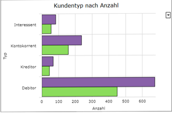

# Darstellungsart Balkendiagramm

<!-- source: https://amic.de/hilfe/kachelbalkendiagramm.htm -->

Administration > Menü > Dashboard > Variante Kachel

oder

Direktsprung **[DASH]** \> Variante Kachel

Neben den hier beschriebenen Feldern stehen zusätzlich alle Felder aus dem [Basisdesign](./basisdesign.md) zur Verfügung.

| | |
| --- | --- |
|   | Balkendiagramm Das Balkendiagramm unterscheidet sich vom den anderen Diagrammarten dadurch, dass im Balkendiagramm die Typen der Achsen „vertauscht“ sind. So werden im Balkendiagramm für die X-Achse (horizontale Achse) numerische Werte erwartet. Die Minimal- und Maximalwerte der X-Achse können mit den Feldern **XAxisMinValue** und **XAxisMaxValue** festgelegt werden.   Hinweis: *Im Balkendiagramm kann der Achsentyp nicht auf „date“ gestellt werden. Für Datumsangaben werden daher die anderen Diagrammarten empfohlen.* |
