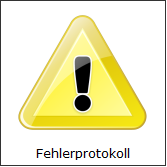

# Darstellungsart Bild

<!-- source: https://amic.de/hilfe/kachelbild.htm -->

Administration > Menü > Dashboard > Variante Kachel

oder

Direktsprung **[DASH]** \> Variante Kachel

Neben den hier beschriebenen Feldern stehen zusätzlich alle Felder aus dem [Basisdesign](./basisdesign.md) zur Verfügung.

| | |
| --- | --- |
|  | Bild  
Neben den bekannten Feldern muss die View zusätzlich ein Feld **Picture** mit dem Bildinhalt zurückliefern. Dafür bietet sich das Formulararchiv an. Erlaubte Formate sind Bitmap, Icon, JPEG, GIF und PNG.  
    
Beispielview:  
 |
