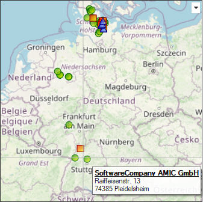
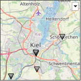
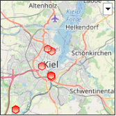
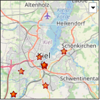
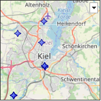
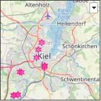

# Darstellungsart Deutschland-/Europakarte

<!-- source: https://amic.de/hilfe/kachelkarte.htm -->

Administration > Menü > Dashboard > Variante Kachel

oder

Direktsprung [DASH] \> Variante Kachel

Neben den hier beschriebenen Feldern stehen zusätzlich alle Felder aus dem [Basisdesign](./basisdesign.md) zur Verfügung.

<table class="AMIC-Tabelle" style="WIDTH: 102.92%; BORDER-COLLAPSE: collapse" cellspacing="0" cellpadding="0" width="102%" border="0"><tbody><tr><td style="WIDTH: 347.3pt; BACKGROUND: #005d5b; PADDING-BOTTOM: 0pt; PADDING-TOP: 0pt; PADDING-LEFT: 5.4pt; PADDING-RIGHT: 5.4pt" width="463"></td><td style="WIDTH: 1236.7pt; BACKGROUND: #005d5b; PADDING-BOTTOM: 0pt; PADDING-TOP: 0pt; PADDING-LEFT: 5.4pt; PADDING-RIGHT: 5.4pt" width="1649"></td></tr><tr><td style="BORDER-TOP: medium none; BORDER-RIGHT: white 1.5pt solid; WIDTH: 347.3pt; BACKGROUND: #bad9d9; BORDER-BOTTOM: medium none; PADDING-BOTTOM: 0pt; PADDING-TOP: 0pt; PADDING-LEFT: 5.4pt; BORDER-LEFT: medium none; PADDING-RIGHT: 5.4pt" valign="top" width="463">

</td><td style="BORDER-TOP: medium none; BORDER-RIGHT: medium none; WIDTH: 1236.7pt; BACKGROUND: #bad9d9; BORDER-BOTTOM: medium none; PADDING-BOTTOM: 0pt; PADDING-TOP: 0pt; PADDING-LEFT: 5.4pt; BORDER-LEFT: medium none; PADDING-RIGHT: 5.4pt" valign="top" width="1649">
Deutschland- und Europakarte

Es steht eine Karte von Deutschland und Europa zur Verfügung, in der man sich Google-Maps Koordinaten anzeigen kann. Zusätzlich zu den Standardfeldern müssen die Felder <b>Label, X, Y</b> angegeben werden.

Der Label lässt sich mit HTML formatieren und wird angezeigt, wann man mit der Maus über einen Punkt fährt.

Ein weiteres optionales Feld „<b>Serie</b>“ bestimmt das Symbol und die Farbe. Serie muss im Bereich von 0 bis 9 liegen. Jede Serie wird mit einer anderen Farbe und einem anderen Symbol dargestellt:
<table class="MsoTableGridLight" style="BORDER-TOP: medium none; BORDER-RIGHT: medium none; WIDTH: 100%; BORDER-COLLAPSE: collapse; BORDER-BOTTOM: medium none; BORDER-LEFT: medium none" cellspacing="0" cellpadding="0" width="100%" border="0"><tbody><tr><td style="WIDTH: 132.3pt; PADDING-BOTTOM: 0pt; PADDING-TOP: 0pt; PADDING-LEFT: 5.4pt; PADDING-RIGHT: 5.4pt" valign="top" width="176">Serie 0</td><td style="WIDTH: 132.6pt; PADDING-BOTTOM: 0pt; PADDING-TOP: 0pt; PADDING-LEFT: 5.4pt; PADDING-RIGHT: 5.4pt" valign="top" width="177">Serie 1</td><td style="WIDTH: 131pt; PADDING-BOTTOM: 0pt; PADDING-TOP: 0pt; PADDING-LEFT: 5.4pt; PADDING-RIGHT: 5.4pt" valign="top" width="175">Serie 2</td><td style="WIDTH: 130.8pt; PADDING-BOTTOM: 0pt; PADDING-TOP: 0pt; PADDING-LEFT: 5.4pt; PADDING-RIGHT: 5.4pt" valign="top" width="174">Serie 3</td><td style="WIDTH: 130.8pt; PADDING-BOTTOM: 0pt; PADDING-TOP: 0pt; PADDING-LEFT: 5.4pt; PADDING-RIGHT: 5.4pt" valign="top" width="174">Serie 4</td></tr><tr><td style="WIDTH: 132.3pt; PADDING-BOTTOM: 0pt; PADDING-TOP: 0pt; PADDING-LEFT: 5.4pt; PADDING-RIGHT: 5.4pt" valign="top" width="176"></td><td style="WIDTH: 132.6pt; PADDING-BOTTOM: 0pt; PADDING-TOP: 0pt; PADDING-LEFT: 5.4pt; PADDING-RIGHT: 5.4pt" valign="top" width="177"></td><td style="WIDTH: 131pt; PADDING-BOTTOM: 0pt; PADDING-TOP: 0pt; PADDING-LEFT: 5.4pt; PADDING-RIGHT: 5.4pt" valign="top" width="175"></td><td style="WIDTH: 130.8pt; PADDING-BOTTOM: 0pt; PADDING-TOP: 0pt; PADDING-LEFT: 5.4pt; PADDING-RIGHT: 5.4pt" valign="top" width="174"></td><td style="WIDTH: 130.8pt; PADDING-BOTTOM: 0pt; PADDING-TOP: 0pt; PADDING-LEFT: 5.4pt; PADDING-RIGHT: 5.4pt" valign="top" width="174"></td></tr><tr><td style="WIDTH: 132.3pt; PADDING-BOTTOM: 0pt; PADDING-TOP: 0pt; PADDING-LEFT: 5.4pt; PADDING-RIGHT: 5.4pt" valign="top" width="176"></td><td style="WIDTH: 132.6pt; PADDING-BOTTOM: 0pt; PADDING-TOP: 0pt; PADDING-LEFT: 5.4pt; PADDING-RIGHT: 5.4pt" valign="top" width="177"></td><td style="WIDTH: 131pt; PADDING-BOTTOM: 0pt; PADDING-TOP: 0pt; PADDING-LEFT: 5.4pt; PADDING-RIGHT: 5.4pt" valign="top" width="175"></td><td style="WIDTH: 130.8pt; PADDING-BOTTOM: 0pt; PADDING-TOP: 0pt; PADDING-LEFT: 5.4pt; PADDING-RIGHT: 5.4pt" valign="top" width="174"></td><td style="WIDTH: 130.8pt; PADDING-BOTTOM: 0pt; PADDING-TOP: 0pt; PADDING-LEFT: 5.4pt; PADDING-RIGHT: 5.4pt" valign="top" width="174"></td></tr><tr><td style="WIDTH: 132.3pt; PADDING-BOTTOM: 0pt; PADDING-TOP: 0pt; PADDING-LEFT: 5.4pt; PADDING-RIGHT: 5.4pt" valign="top" width="176">Serie 5</td><td style="WIDTH: 132.6pt; PADDING-BOTTOM: 0pt; PADDING-TOP: 0pt; PADDING-LEFT: 5.4pt; PADDING-RIGHT: 5.4pt" valign="top" width="177">Serie 6</td><td style="WIDTH: 131pt; PADDING-BOTTOM: 0pt; PADDING-TOP: 0pt; PADDING-LEFT: 5.4pt; PADDING-RIGHT: 5.4pt" valign="top" width="175">Serie 7</td><td style="WIDTH: 130.8pt; PADDING-BOTTOM: 0pt; PADDING-TOP: 0pt; PADDING-LEFT: 5.4pt; PADDING-RIGHT: 5.4pt" valign="top" width="174">Serie 8</td><td style="WIDTH: 130.8pt; PADDING-BOTTOM: 0pt; PADDING-TOP: 0pt; PADDING-LEFT: 5.4pt; PADDING-RIGHT: 5.4pt" valign="top" width="174">Serie 9</td></tr><tr><td style="WIDTH: 132.3pt; PADDING-BOTTOM: 0pt; PADDING-TOP: 0pt; PADDING-LEFT: 5.4pt; PADDING-RIGHT: 5.4pt" valign="top" width="176"></td><td style="WIDTH: 132.6pt; PADDING-BOTTOM: 0pt; PADDING-TOP: 0pt; PADDING-LEFT: 5.4pt; PADDING-RIGHT: 5.4pt" valign="top" width="177"></td><td style="WIDTH: 131pt; PADDING-BOTTOM: 0pt; PADDING-TOP: 0pt; PADDING-LEFT: 5.4pt; PADDING-RIGHT: 5.4pt" valign="top" width="175"></td><td style="WIDTH: 130.8pt; PADDING-BOTTOM: 0pt; PADDING-TOP: 0pt; PADDING-LEFT: 5.4pt; PADDING-RIGHT: 5.4pt" valign="top" width="174"></td><td style="WIDTH: 130.8pt; PADDING-BOTTOM: 0pt; PADDING-TOP: 0pt; PADDING-LEFT: 5.4pt; PADDING-RIGHT: 5.4pt" valign="top" width="174"></td></tr></tbody></table>
Zu einer Serie kann man einen <b>SeriesTitle</b> angeben, der erscheint, wenn man auf den Knopf rechts oben klickt. Dieser Knopf ist nur dann sichtbar, wenn man mehrere Serien verwendet. Hierüber können dann einzelne Serien ein- und ausgeblendet werden.:

Mit dem mittleren Mausrad oder den Tasten Bild▼ und Bild▲ lässt sich ein Ausschnitt vergrößern oder verkleinern.

Mit Strg+Maus lässt sich ein Bereich auswählen.

Mit den Pfeiltasten lässt sich der Bereich verschieben.

Mit Pos1 wird die Anfangsgröße wieder herstellen.

Fährt man mit der Maus auf ein Symbol der Serie, so wird der mit Label angegebene Text eingeblendet.

Ist eine Klick-Funktion angegeben, so wird ein Hand-Symbol als Mauszeiger angezeigt, wenn man mit der Maus über einen Punkt fährt.

Beispielview mit Rückgabe der Adressid der angezeigten Anschrift:

CREATE VIEW p_dash_geographicMap AS

&nbsp;select

&nbsp;&nbsp; 'solid' as borderstyle,

&nbsp;&nbsp; '#333333' as bordercolor,

-- Pro Angezeigter Position muss ein Datensatz mit dem

-- &gt;label&lt; und den Google-Maps Koordinaten zurückgeliefert werden

&nbsp;&nbsp; if Adresstyp = 11 then 0

&nbsp;&nbsp; else if Adresstyp = 12 then 1

&nbsp;&nbsp; else if Adresstyp = 15 then 2

&nbsp;&nbsp; else 3

&nbsp;&nbsp; endif endif endif as <b>Serie</b>, &nbsp;&nbsp; if Adresstyp in (11,12,15) then

&nbsp;&nbsp;&nbsp;&nbsp; AMIC_FORMLST_GETBEZEICH('ADRESSTYP',Adresstyp)

&nbsp;&nbsp; else

&nbsp;&nbsp;&nbsp;&nbsp; 'Sonstige'

&nbsp;&nbsp; endif as <b>SeriesTitle</b>,

&nbsp;&nbsp; ans.Adressid as ID1,

&nbsp;&nbsp;&nbsp; '&lt;u&gt;&lt;b&gt;' || ans.adressname || '&lt;/b&gt;&lt;/u&gt;&lt;br&gt;'

&nbsp;&nbsp;&nbsp;&nbsp;&nbsp;&nbsp;&nbsp;&nbsp;&nbsp;&nbsp;&nbsp;&nbsp; || ans.adressStrasse || '&lt;br&gt;'

&nbsp;&nbsp;&nbsp;&nbsp;&nbsp;&nbsp;&nbsp;&nbsp;&nbsp;&nbsp;&nbsp;&nbsp;&nbsp; || ans.adressPLZ1 || ' ' || ans.adressOrt || '&lt;br&gt;' as <b>label</b>,

&nbsp;&nbsp;&nbsp; cast(posi.ST_LAT() as numeric(15,6))&nbsp; as <b>X</b>,

&nbsp;&nbsp;&nbsp; cast(posi.ST_LONG() as numeric(15,6))&nbsp; as <b>Y</b>

&nbsp;&nbsp;&nbsp; from anschriftgeodata geo join anschriftstamm ans on ans.adressid=geo.adressid where ans.adressnummer &gt;= 0  

</td></tr></tbody></table>
