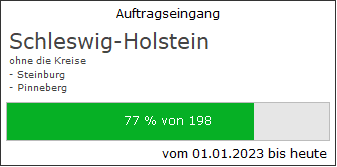

# Darstellungsart Fortschrittsbalken

<!-- source: https://amic.de/hilfe/kachelfortschrittsbalken.htm -->

Administration > Menü > Dashboard > Variante Kachel

oder

Direktsprung **[DASH]** \> Variante Kachel

Neben den hier beschriebenen Feldern stehen zusätzlich alle Felder aus dem [Basisdesign](./basisdesign.md) zur Verfügung.

  <table>
    <tbody>
      <tr>
        <td></td>
        <td></td>
      </tr>
      <tr>
        <td>
          

        </td>
        <td>
          
<strong>Fortschrittsbalken</strong>

          
Der Fortschrittsbalken benötigt zusätzlich zu den Feldern, die auch die Darstellungsart Text haben, noch die Felder, die den ihn beschreiben:

          
ProgressbarMinimum,&nbsp;&nbsp;&nbsp;&nbsp;&nbsp;&nbsp;&nbsp;&nbsp;&nbsp;&nbsp; muss den Datenbanktypen integer liefern. Standard ist 0.

          
ProgressbarMaximum,&nbsp;&nbsp;&nbsp;&nbsp;&nbsp;&nbsp;&nbsp;&nbsp;&nbsp; muss den Datenbanktypen integer liefern. Standard ist 100.

          
<b>ProgressbarValue</b>, &nbsp;&nbsp;&nbsp;&nbsp;&nbsp;&nbsp;&nbsp;&nbsp;&nbsp;&nbsp;&nbsp;&nbsp;&nbsp; muss den Datenbanktypen integer liefern. Der Wert sollte zwischen Minimum und Maximum liegen.

          
ProgressbarText &nbsp;&nbsp;&nbsp;&nbsp;&nbsp;&nbsp;&nbsp;&nbsp;&nbsp;&nbsp;&nbsp;&nbsp;&nbsp;&nbsp;&nbsp;&nbsp;&nbsp;&nbsp; (Optional). Wenn nicht angegeben, so wird „{nnn}% vom {ProgressbarMaximum}“ ausgegeben

          
Beispielview:

          

            <pre><code>CREATE VIEW p_dash_fortschritt AS
select
   'Auftragseingang' as header,
   'von 01.01.' || year(Today(*)) ||' bis heute' as footer,
   'Text' as text,
   '255/255/255' as Backcolor,
   '63/63/63' as bordercolor,
   'solid' as borderstyle,
 -- Der Fortschrittsbalken benötigt folgende Felder
   0   as progressdBarMinimum,
   (select count() from amic_v_vorgaenge vs where vs.v_klassnummer=400 and vs.V_Datum=today())
       as progressdBarMaximum,
   (select count() from amic_v_vorgaenge vs where vs.v_klassnummer=400 and vs.V_Datum=today() and v_statusUmwand &gt;= 5)
       as progressdBarValue,
   ' ' as progressdBarText</code></pre>
          

        </td>
      </tr>
    </tbody>
  </table>

