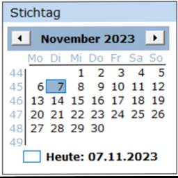
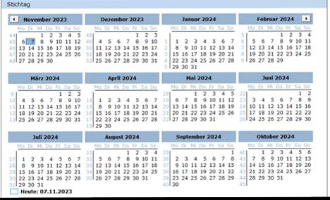

# Darstellungsart Kalender

<!-- source: https://amic.de/hilfe/kachelkalender.htm -->

Administration > Menü > Dashboard > Variante Kachel

oder

Direktsprung **[DASH]** \> Variante Kachel

Neben den hier beschriebenen Feldern stehen zusätzlich alle Felder aus dem [Basisdesign](./basisdesign.md) zur Verfügung.

| | |
| --- | --- |
|  | Kalender Der Kalender ist ein Control, welches zur Auswahl eines Stichtages verwendet werden kann. Das Design ist über folgende Felder in der View/Prozedur zu steuern:   • **SelectedDate:** Das Datum, das in der Anzeige als ausgewählt erscheint. Das ausgewählte Datum bestimmt den Monat, der angezeigt wird. Standard ist das Tagesdatum. • **Fontname**: Name der Schriftart. Standard ist „Verdana“. • **Fontsize**: Größe der Schriftart. Die Größe des Kalenders wird durch die Größe der Schriftart gesteuert. Standard ist 9. • **TitleBackColor**: Hintergrundfarbe der Überschrift mit Monat und Jahr. • **TitleForeColor**: Vordergrundfarbe der Überschrift mit Monat und Jahr. • **TrailingForeColor:** Die Farbe für die Tage, die nicht zum Monat gehören. Standard ist Transparent. • **DimensionX** und • **DimensionY:** Es besteht die Möglichkeit mehrere Monate nebeneinander und/oder untereinander darzustellen. Standardeinstellung ist 1 für X und 1 für Y. Setzt man z.B. für DimensionX auf 4 und DimensionY auf 3 sieht das Ergebnis folgendermaßen aus:    Beispielview: <pre><code>CREATE VIEW&#10; p_dash_v_kalender AS&#10; &#10; select&#10;&#10; &#10; &#10; 'Stichtag' as header,&#10; 'solid'&#10; as borderstyle,&#10; &#10; '68/68/68' as bordercolor,&#10; 'Verdana'&#10; as fontname,&#10; &#10; 9.0 as fontsize,&#10; &#10; 4 as&#10; DimensionX,&#10; &#10; 3 as DimensionY</code></pre>   Um eine Datenbankvariable mit dem Stichtag setzen zu können, muss diese dann in der Refresh-Prozedur gesetzt werden. In dem Feld in_Ident1 wird der ausgewählte Tag übergeben. Beispiel Refresh-Prozedur: <pre><code>CREATE PROCEDURE&#10; p_dash_refresh_kalender &#10; (in in_board&#10; integer,&#10; in&#10; in_kachel integer,&#10; in&#10; in_ident1 date default null,&#10; in&#10; in_ident2 char(100) default null,&#10; in&#10; in_ident3 char(100) default null,&#10; in&#10; in_ident4 char(100) default null )&#10;BEGIN&#10; create or Replace Variable pdb_stichtag&#10; date;&#10; set&#10; pdb_stichtag = in_ident1;&#10; select&#10; id_kachel from Dash_Board_Kachel_Link&#10; &#10; where Id_Board = in_board and id_kachel!=in_Kachel;&#10;EXCEPTION&#10; when others&#10; then&#10; &#10; call amic_exception( ERRORMSG() &#124;&#124;&#10; CHAR(10) &#124;&#124; CHAR(13) &#124;&#124; TRACEBACK(), SQLCODE , SQLSTATE ,&#10; 'p_dash_refresh_kalender' , -1 );&#10;END</code></pre>    |
