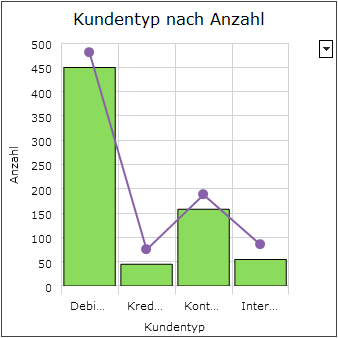

# Darstellungsart Kombinationsdiagramm

<!-- source: https://amic.de/hilfe/kachelkombinationsdiagramm.htm -->

Administration > Menü > Dashboard > Variante Kachel

oder

Direktsprung **[DASH]** \> Variante Kachel

Neben den hier beschriebenen Feldern stehen zusätzlich alle Felder aus dem [Basisdesign](./basisdesign.md) zur Verfügung.

  <table>
    <tbody>
      <tr>
        <td></td>
        <td></td>
      </tr>
      <tr>
        <td>
          

        </td>
        <td>
          
<strong>Kombinationsdiagramm</strong>

          
Das Kombinationsdiagramm unterscheidet sich vom <a href="./darstellungsart_saeulen_flaechen_und_liniendiagramm.md">Säulen-, Flächen- und Liniendiagramm</a> dadurch, dass im Kombinationsdiagramm für jede Serie eine Darstellungsart ausgewählt wird. Die Darstellungsart wird in der View/Prozedur mit dem Feld <b>SeriesType</b> angegeben.

          
Es kann zwischen folgenden Typen gewählt werden:

          <ul>
            <li>Area (Fläche)</li>
            <li>Column (Säule)</li>
            <li>Line (Linie)</li>
          </ul>
        </td>
      </tr>
    </tbody>
  </table>

