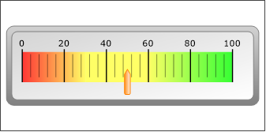

# Darstellungsart Skala

<!-- source: https://amic.de/hilfe/kachelskala.htm -->

Administration > Menü > Dashboard > Variante Kachel

oder

Direktsprung **[DASH]** \> Variante Kachel

Neben den hier beschriebenen Feldern stehen zusätzlich alle Felder aus dem [Basisdesign](./basisdesign.md) zur Verfügung.

<table class="AMIC-Tabelle" style="WIDTH: 103.46%; BORDER-COLLAPSE: collapse" cellspacing="0" cellpadding="0" width="103%" border="0"><tbody><tr><td style="WIDTH: 272.3pt; BACKGROUND: #005d5b; PADDING-BOTTOM: 0pt; PADDING-TOP: 0pt; PADDING-LEFT: 5.4pt; PADDING-RIGHT: 5.4pt" width="363"></td><td style="WIDTH: 694.85pt; BACKGROUND: #005d5b; PADDING-BOTTOM: 0pt; PADDING-TOP: 0pt; PADDING-LEFT: 5.4pt; PADDING-RIGHT: 5.4pt" width="926"></td></tr><tr><td style="BORDER-TOP: medium none; BORDER-RIGHT: white 1.5pt solid; WIDTH: 272.3pt; BACKGROUND: #bad9d9; BORDER-BOTTOM: medium none; PADDING-BOTTOM: 0pt; PADDING-TOP: 0pt; PADDING-LEFT: 5.4pt; BORDER-LEFT: medium none; PADDING-RIGHT: 5.4pt" valign="top" width="363">

</td><td style="BORDER-TOP: medium none; BORDER-RIGHT: medium none; WIDTH: 694.85pt; BACKGROUND: #bad9d9; BORDER-BOTTOM: medium none; PADDING-BOTTOM: 0pt; PADDING-TOP: 0pt; PADDING-LEFT: 5.4pt; BORDER-LEFT: medium none; PADDING-RIGHT: 5.4pt" valign="top" width="926">
Skala

Die Skala ähnelt sehr dem Fortschrittsbalken, hat jedoch ein paar mehr Einstellmöglichkeiten:
<table class="MsoTableGrid" style="BORDER-TOP: medium none; BORDER-RIGHT: medium none; WIDTH: 100%; BORDER-COLLAPSE: collapse; BORDER-BOTTOM: medium none; BORDER-LEFT: medium none" cellspacing="0" cellpadding="0" width="100%" border="0"><tbody><tr><td style="WIDTH: 104.8pt; PADDING-BOTTOM: 0pt; PADDING-TOP: 0pt; PADDING-LEFT: 5.4pt; PADDING-RIGHT: 5.4pt" valign="top" width="140"><b>Minimum</b></td><td style="WIDTH: 579.25pt; PADDING-BOTTOM: 0pt; PADDING-TOP: 0pt; PADDING-LEFT: 5.4pt; PADDING-RIGHT: 5.4pt" valign="top" width="772">muss den Datenbanktypen integer liefern. Standard ist 0</td></tr><tr><td style="WIDTH: 104.8pt; PADDING-BOTTOM: 0pt; PADDING-TOP: 0pt; PADDING-LEFT: 5.4pt; PADDING-RIGHT: 5.4pt" valign="top" width="140"><b>Maximum</b></td><td style="WIDTH: 579.25pt; PADDING-BOTTOM: 0pt; PADDING-TOP: 0pt; PADDING-LEFT: 5.4pt; PADDING-RIGHT: 5.4pt" valign="top" width="772">muss den Datenbanktypen integer liefern. Standard ist 100.</td></tr><tr><td style="WIDTH: 104.8pt; PADDING-BOTTOM: 0pt; PADDING-TOP: 0pt; PADDING-LEFT: 5.4pt; PADDING-RIGHT: 5.4pt" valign="top" width="140"><b>Value</b><b></b></td><td style="WIDTH: 579.25pt; PADDING-BOTTOM: 0pt; PADDING-TOP: 0pt; PADDING-LEFT: 5.4pt; PADDING-RIGHT: 5.4pt" valign="top" width="772">Der Wert wird durch den Zieger dargestellt. Er muss den Datenbanktypen integer liefern und zwischen Minimum und Maximum liegen.</td></tr><tr><td style="WIDTH: 104.8pt; PADDING-BOTTOM: 0pt; PADDING-TOP: 0pt; PADDING-LEFT: 5.4pt; PADDING-RIGHT: 5.4pt" valign="top" width="140"><b>Majorinterval</b></td><td style="WIDTH: 579.25pt; PADDING-BOTTOM: 0pt; PADDING-TOP: 0pt; PADDING-LEFT: 5.4pt; PADDING-RIGHT: 5.4pt" valign="top" width="772">Das Intervall des Markers unter den Zahlen. Standartmäßig wird dieses Intervall mit (Maximum-Minimum) / 5 berechnet.</td></tr><tr><td style="WIDTH: 104.8pt; PADDING-BOTTOM: 0pt; PADDING-TOP: 0pt; PADDING-LEFT: 5.4pt; PADDING-RIGHT: 5.4pt" valign="top" width="140"><b>Minorinterval</b></td><td style="WIDTH: 579.25pt; PADDING-BOTTOM: 0pt; PADDING-TOP: 0pt; PADDING-LEFT: 5.4pt; PADDING-RIGHT: 5.4pt" valign="top" width="772">Das Intervall für die kleineren Markierungen. Standartmäßig wird dieses Intervall mit Majorintervall / 5 berechnet.</td></tr><tr><td style="WIDTH: 684.05pt; PADDING-BOTTOM: 0pt; PADDING-TOP: 0pt; PADDING-LEFT: 5.4pt; PADDING-RIGHT: 5.4pt" valign="top" width="912" colspan="2"><u>Farbangaben</u> Die Skala kann in bis zu drei Farbbereiche unterteilt werden.</td></tr><tr><td style="WIDTH: 104.8pt; PADDING-BOTTOM: 0pt; PADDING-TOP: 0pt; PADDING-LEFT: 5.4pt; PADDING-RIGHT: 5.4pt" valign="top" width="140"><b>LowerFillingColor</b> <b></b>&nbsp;</td><td style="WIDTH: 579.25pt; PADDING-BOTTOM: 0pt; PADDING-TOP: 0pt; PADDING-LEFT: 5.4pt; PADDING-RIGHT: 5.4pt" valign="top" width="772">Die Farbe am linken Rand, in den Beispielabbildungen ist es die Farbe #FF3333. Wenn keine Farbe angegeben wird, dann wird die Hintergrundfarbe verwendet. Es wird ein Verlauf von LowerFillingColor auf Fillingcolor dargestellt.</td></tr><tr><td style="WIDTH: 104.8pt; PADDING-BOTTOM: 0pt; PADDING-TOP: 0pt; PADDING-LEFT: 5.4pt; PADDING-RIGHT: 5.4pt" valign="top" width="140"><b>LowerFillingTo</b> <b></b>&nbsp;</td><td style="WIDTH: 579.25pt; PADDING-BOTTOM: 0pt; PADDING-TOP: 0pt; PADDING-LEFT: 5.4pt; PADDING-RIGHT: 5.4pt" valign="top" width="772">Eine Zahl, die zwischen Minimum und Maximum liegen muss. Diese Zahl gibt die Breite an, die LowerFillingColor einnehmen darf. Setzt man diesen Wert auf Minimum werden nur FillingColor bzw. UpperFillingColor dargestellt. <u>Hinweis:</u> <i>Soll es so aussehen, als ob nur zwei Farben verwendet werden, so setzt man LowerFillingTo auf Minimum.</i> <i></i>&nbsp;</td></tr><tr><td style="WIDTH: 104.8pt; PADDING-BOTTOM: 0pt; PADDING-TOP: 0pt; PADDING-LEFT: 5.4pt; PADDING-RIGHT: 5.4pt" valign="top" width="140"><b>FillingColor</b> <b></b>&nbsp;</td><td style="WIDTH: 579.25pt; PADDING-BOTTOM: 0pt; PADDING-TOP: 0pt; PADDING-LEFT: 5.4pt; PADDING-RIGHT: 5.4pt" valign="top" width="772">Die Farbe wird zwischen zwischen LowerFillingTo und UpperFillingFrom dargestellt.</td></tr><tr><td style="WIDTH: 104.8pt; PADDING-BOTTOM: 0pt; PADDING-TOP: 0pt; PADDING-LEFT: 5.4pt; PADDING-RIGHT: 5.4pt" valign="top" width="140"><b>UpperFillingColor</b> <b></b>&nbsp;</td><td style="WIDTH: 579.25pt; PADDING-BOTTOM: 0pt; PADDING-TOP: 0pt; PADDING-LEFT: 5.4pt; PADDING-RIGHT: 5.4pt" valign="top" width="772">Die Farbe am rechten Rand, in den Beispielabbildungen ist es die Farbe #33FF33. Wenn keine Farbe angegeben wird, dann wird die Hintergrundfarbe verwendet. Es wird ein Verlauf von Fillingcolor auf UpperFillingcolor dargestellt.</td></tr><tr><td style="WIDTH: 104.8pt; PADDING-BOTTOM: 0pt; PADDING-TOP: 0pt; PADDING-LEFT: 5.4pt; PADDING-RIGHT: 5.4pt" valign="top" width="140"><b>UpperFillingFrom</b> <b></b>&nbsp;</td><td style="WIDTH: 579.25pt; PADDING-BOTTOM: 0pt; PADDING-TOP: 0pt; PADDING-LEFT: 5.4pt; PADDING-RIGHT: 5.4pt" valign="top" width="772">Eine Zahl, die angibt ab welcher Position der Bereich für UpperFillingColor beginnt. Er muss zwischen Minimum und Maximum liegen.</td></tr><tr><td style="WIDTH: 104.8pt; PADDING-BOTTOM: 0pt; PADDING-TOP: 0pt; PADDING-LEFT: 5.4pt; PADDING-RIGHT: 5.4pt" valign="top" width="140"><b>Orientation</b> <b></b>&nbsp;</td><td style="WIDTH: 579.25pt; PADDING-BOTTOM: 0pt; PADDING-TOP: 0pt; PADDING-LEFT: 5.4pt; PADDING-RIGHT: 5.4pt" valign="top" width="772">Orientation kann sein <b>horizontal</b> (Standard) oder <b>vertical</b></td></tr><tr><td style="WIDTH: 104.8pt; PADDING-BOTTOM: 0pt; PADDING-TOP: 0pt; PADDING-LEFT: 5.4pt; PADDING-RIGHT: 5.4pt" valign="top" width="140"><b>Overlap</b> <b></b>&nbsp;</td><td style="WIDTH: 579.25pt; PADDING-BOTTOM: 0pt; PADDING-TOP: 0pt; PADDING-LEFT: 5.4pt; PADDING-RIGHT: 5.4pt" valign="top" width="772">Sollen die Markierungen über dem Farbbalken sitzen, dann muss hier eine 1 geliefert werden. Standard ist 0.</td></tr></tbody></table>
Beispielview:

 create view p_dash_skala select

&nbsp;&nbsp; 0&nbsp;&nbsp; as Minimum ,&nbsp;&nbsp;&nbsp;&nbsp;&nbsp; &nbsp;&nbsp;&nbsp;&nbsp;&nbsp;&nbsp;&nbsp;&nbsp;&nbsp;-- Wenn nicht angegeben, dann 0

&nbsp;&nbsp; 100 as Maximum,&nbsp;&nbsp;&nbsp;&nbsp;&nbsp;&nbsp; &nbsp;&nbsp;&nbsp;&nbsp;&nbsp;&nbsp;&nbsp;&nbsp;&nbsp;-- Wenn nicht angegeben, dann 100

&nbsp;&nbsp; 32&nbsp; as Value,&nbsp;&nbsp;&nbsp;&nbsp;&nbsp;&nbsp;&nbsp;&nbsp; &nbsp;&nbsp;&nbsp;&nbsp;&nbsp;&nbsp;&nbsp;&nbsp;&nbsp;-- muss sollte zwischen minimum und maximum liegen.

&nbsp; -- 20 majorinterval,&nbsp;&nbsp;&nbsp;&nbsp; &nbsp;&nbsp;&nbsp;&nbsp;&nbsp;&nbsp;&nbsp;-- Optional. Wenn nicht gesetzt dann (maximun-minimum)/5

&nbsp; -- 6 minorinterval,&nbsp;&nbsp;&nbsp; &nbsp;&nbsp;&nbsp;&nbsp;&nbsp;&nbsp;&nbsp;&nbsp;&nbsp;-- Optional. Wenn nicht gesetzt dann majorinterval/5

&nbsp;&nbsp; '#ff3333' LowerFillingColor ,&nbsp; -- Linker Farbwert

&nbsp;&nbsp; '#ffff66' FillingColor ,&nbsp;&nbsp;&nbsp;&nbsp;&nbsp;&nbsp; -- mittlerer Farbwert

&nbsp;&nbsp; '#33ff33' UpperFillingColor ,&nbsp; -- rechter Farbwert

&nbsp;&nbsp; 30 LowerFillingTo,&nbsp;&nbsp;&nbsp;&nbsp;&nbsp;&nbsp;&nbsp;&nbsp;&nbsp;&nbsp;&nbsp;&nbsp; -- Grenze zwischen linkem und mittlerem Farbwert

&nbsp;&nbsp; 60 UpperFillingFrom,&nbsp;&nbsp;&nbsp;&nbsp;&nbsp;&nbsp;&nbsp;&nbsp;&nbsp;&nbsp; -- Grenze zwischen mittlerem und rechtem Farbwert

&nbsp;&nbsp; 'horizontal' as orientation,&nbsp;&nbsp; -- Ausrichtung der Skala. Kann &gt;vertical&lt; oder &gt;horizontal&lt; sein(default).

&nbsp;&nbsp; 0 as Overlap&nbsp;&nbsp;&nbsp;&nbsp;&nbsp;&nbsp;&nbsp;&nbsp;&nbsp;&nbsp;&nbsp;&nbsp;&nbsp;&nbsp;&nbsp;&nbsp;&nbsp;&nbsp; -- Bei 1 liegt die Farbe hinter der Skala

</td></tr></tbody></table>
