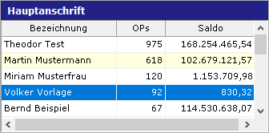

# Darstellungsart Tabelle

<!-- source: https://amic.de/hilfe/kacheltabelle.htm -->

Administration > Menü > Dashboard > Variante Kachel

oder

Direktsprung **[DASH]** \> Variante Kachel

Neben den hier beschriebenen Feldern stehen zusätzlich alle Felder aus dem [Basisdesign](./basisdesign.md) zur Verfügung.

  <table>
    <tbody>
      <tr>
        <td></td>
        <td></td>
      </tr>
      <tr>
        <td>
          

        </td>
        <td>
          
<strong>Tabelle</strong>

          
In dieser Tabelle lassen sich ausgewählte Daten darstellen. Die Tabelle ist <u>nicht</u> für Massendaten vorgesehen und bietet <u>nicht</u> die Möglichkeiten der Auswahlliste. Die angegebene Klick-Funktion reagiert beim Klick auf die Zeile. Aus der zugrundeliegenden View werden alle Spalten, die mit „col(“ beginnen, angezeigt. Dabei steht in Klammern die Überschrift. Die Breite richtet sich nach der Breite der Datenfelder, numerische Werte werden immer mit zwei Nachkommastellen ausgegeben.

          
Beispielview:

          

            <pre><code>Create view p_dash_tabelle
Select TOP 20
  (select Count(*) from offenerposten where KontoNummer = k.KontoNummer ) as AnzahlOPs,
  (select sum(kontoSumerfSoll-KontoSumerfhaben) from kontosummen where KontoNummer = k.KontoNummer ) as SummeOPs,
   kundbezeich    as "col(Bezeichnung)",
   AnzahlOPs      as "col(OPs)",
   SummeOPs       as "col(Saldo)",
   KundId       as ID1,
   ans.AdressId as ID2,
   if ans.AdressId = pdb_adressid then 1 else 0 endif as selected
   From Kundenstamm k
   join anschriftstamm ans on ans.adressid=k.adressidhauptadr and adresstyp = 11
   join anschriftgeodata geo on ans.adressid=geo.adressid
  where kundid&gt;0 and kundloekennz=0
   order by AnzahlOps desc</code></pre>
          

          
Um auf das Klicken in eine Zeile zu reagieren und ggf. mehr Informationen anzuzeigen, kann dies mit der Refresh-Prozedur geschehen. An die Prozedur werden die Werte übergeben, die in der View/der Prozedur als ID1, ID2, ID3 und ID4 geliefert werden.

          
Beispiel Refresh-Prozedur:

          

            <pre><code>CREATE PROCEDURE p_dash_Refresh_tableview
  (in in_board integer,
   in in_kachel integer,
   in in_ident1 integer default null,
   in in_ident2 integer default null,
   in in_ident3 integer default null,
   in in_ident4 integer default null )
--
BEGIN
 create or replace Variable pdb_adressid integer =0;
 set pdb_adressid = in_ident2;
 select id_kachel from Dash_Board_Kachel_Link
  where Id_Board = in_board and id_kachel!=in_Kachel;
 EXCEPTION
  when others then
    call amic_exception( ERRORMSG() || CHAR(10) || CHAR(13) || TRACEBACK(), SQLCODE , SQLSTATE , 'p_dash_Refresh' , -1 );
END</code></pre>
          

        </td>
      </tr>
    </tbody>
  </table>

