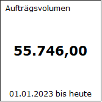

# Darstellungsart Text

<!-- source: https://amic.de/hilfe/kacheltext.htm -->

Administration > Menü > Dashboard > Variante Kachel

oder

Direktsprung **[DASH]** \> Variante Kachel

Neben den hier beschriebenen Feldern stehen zusätzlich alle Felder aus dem [Basisdesign](./basisdesign.md) zur Verfügung.

  <table>
    <tbody>
      <tr>
        <td></td>
        <td></td>
      </tr>
      <tr>
        <td>
          

        </td>
        <td>
          
<strong>Text</strong>

          
Für die Darstellungsart Text benötigt die View zusätzlich zu den Standardfeldern nur das Feld <b>Text</b>. Optional kann noch Textalign verwendet werden, um anzugeben, wo der Text dargestellt wird. Mögliche Werte sind 'left', 'center' und 'right'. Wird Textalig nicht angegeben, so wird der Text zentriert dargestellt.

          
Beispielview:

          

            <pre><code>CREATE VIEW p_dash_button_oder_text AS
  select
    'Auftragsvolumen' as Header,
    trim(AMIC_FSTR(sum(WaBewWert), 20, 2)) as Text,
'center' as Textalign
    'vom 01.01.'|| year(today(*)) || ' bis heute'  as Footer,
    '255/255/255' as color,
    'solid' as borderstyle,
    '#333333' as bordercolor
   from
  . . .</code></pre>
          

        </td>
      </tr>
    </tbody>
  </table>

