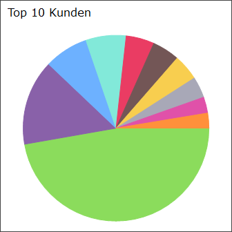

# Darstellungsart Tortendiagramm

<!-- source: https://amic.de/hilfe/kacheltortendiagramm.htm -->

Administration > Menü > Dashboard > Variante Kachel

oder

Direktsprung **[DASH]** \> Variante Kachel

Neben den hier beschriebenen Feldern stehen zusätzlich alle Felder aus dem [Basisdesign](./basisdesign.md) zur Verfügung.

| | |
| --- | --- |
|  | Tortendiagramm In einem Tortendiagramm können bis zu zehn Datensätze („Tortenstücke“) angezeigt werden. Der Wert und die Bezeichnung des Datensatzes werden in der View/Prozedur mit den Feldern **Wert** und **Label** angegeben. Im Tortendiagramm besteht die Möglichkeit kleinere Tortenstücke in einem einzelnen Tortenstück („Sonstige“) zusammenzufassen. Dazu wird in der View/Prozedur dem Feld **OthersCategoryInPercent** ein Wert größer 0 zugewiesen. Mit diesem Wert gibt man eine Schwelle an, unter der alle Tortenstücke zusammengefasst werden. Beispiel: In der View wird für das Feld OthersCategoryInPercent eine 2 angegeben. Dann werden alle Datensätze, die weniger als 2% ausmachen, in dem Tortenstück „Sonstige“ zusammengefasst. Hinweis: *Auf dem Tortenstück „Sonstige“ kann keine Klick-Funktion ausgeführt werden. Des Weiteren wird im Tooltip nur der Text „Sonstige“ angezeigt.*   Legende Mithilfe des Feldes **LegendVisible** kann eingestellt werden, ob die Legende standardmäßig ein- oder ausgeblendet ist. Unabhängig von dieser Option kann die Legende über die Funktion ***Legende ein-/ausblenden*** (rechte Maustaste auf der Kachel) aktiviert bzw. deaktiviert werden. Des Weiteren ist die Position (**LegendPosition**) und die Ausrichtung (**LegendOrientation**) der Legende über die View/Prozedur einstellbar. Mögliche Werte sind: LegendPosition • Right • Left • Bottom • Top LegendOrientation • Vertical • Horizontal   Hinweis: *Im Tortendiagramm besteht die Möglichkeit die Klick-Funktion über die Legende auszuführen.*   Tooltipp Mit dem Feld **SliceTooltip** kann der Tooltip über HTML formatiert werden. Der Tooltip erscheint, wenn der Mauszeiger über einen Datenpunkt des Diagramms bewegt wird. Existiert das Feld **SliceTooltip** nicht in der View/Prozedur, so wird der Tooltip nicht angezeigt.   Beispielview: <pre><code>CREATE VIEW p_dash_torte AS&#10; &#10;select&#10; top 10&#10; sum(wabewWert) as wert,&#10; 'Top 10 Kunden' as&#10; header, -- Wird kein&#10; header angegeben, steht der Platz dem Mittelteil zur Verfügung.&#10; &#10; 'solid' as&#10; borderstyle, --&#10; Mögliche Wert sind: &gt;none&lt;(standard), &gt;solid&lt;, &gt;raised&lt;,&#10; &gt;inset&lt;&#10; '68/68/68' as&#10; bordercolor, -- Bei Borderstyle =&#10; Solid muss man noch die bordercolor festlegen&#10; &#10; -- Pro&#10; Tortenstück muss ein Datensatz mit dem&#10; -- &gt;wert&lt;&#10; des Kuchenstücks und dem&#10; -- &gt;label&lt;&#10; des Kuchenstücks zurückgeliefert werden&#10; 'bottom' as LegendPosition,&#10; '0' as&#10; LegendVisible,&#10; 'horizontal' as&#10; LegendOrientation,&#10; ks.kundBezeich&#10; as label,&#10; ks.KundId as&#10; Id1&#10; from warenbewegung wb &#10; join v_posiWare vp on vp.wabewId = wb.wabewId &#10;&#10; join vorgangstamm vs on vs.V_Id = vp.V_Id &#10;&#10; join&#10; Kundenstamm ks on ks.KundId = vs.KundIdZuord&#10; where&#10; vs.V_Klassnummer = 700 and ks.KundNummer&#10; group by&#10; ks.kundId, ks.kundNummer, ks.kundBezeich&#10; order by wert desc</code></pre>    |
