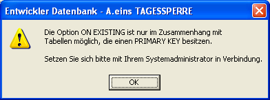

# XMLExport

<!-- source: https://amic.de/hilfe/xmlexport.htm -->

<p class="just-emphasize">Syntax</p>

XMLEXPORT Relationsname [ **ON EXISTING** { **ERROR &#124; SKIP &#124; UPDATE** } ]  
[ REPLACING ColumnName=Value ]  
[ <strong><span style="FONT-FAMILY: &quot;Arial&quot;,sans-serif; FONT-WEIGHT: normal">WHERE</span>&nbsp;</strong><em>search-condition</em> ]  
[ WITH DELETE]  
[ WITH FOREIGNKEY]  
[ INTO Filename ]

<p class="just-emphasize">Purpose</p>

Schreibt die Werte dieser Relation in eine Datei im XML-Format

<p class="just-emphasize">Anwendung</p>

Befehlszeile, Kommandodatei

<p class="just-emphasize">Berechtigung</p>

Alle Anwender

<p class="just-emphasize">Siehe auch</p>

[DBFLOAD](./dbfload_statement.md), [DBFCREATE](./dbfcreate_statement_ab_version_5_0.md), [LOAD](./load.md), [READ](./read.md), [IDENTLOAD](./identload_statement.md), [CREATE STRUCT](./create_struct_statement.md), [ALTER STRUCT](./alter_struct_statement.md), [XMLIMPORT](./xmlimport.md)

<p class="just-emphasize">Beschreibung</p>

Hier werden die Daten der Relation „Relationsname“ und **alle über Foreign Keys verbundene Relationen** in eine Datei im XML-Format ausgegeben. Gibt man optional ON EXISTING an wird diese Option in die Datei geschrieben:  
&lt;insert-option>ON EXISTING SKIP&lt;/insert-option>  
Diese Option wird von XMLLOAD ausgewertet. Ein Export für Tabellen ohne PRIMARY KEY mit dieser Option ist nicht möglich. Es erscheint dann die Fehlermeldung:  


Der optionale Parameter REPLACING teilt dem System mit, dass die folgenden Spalten einem anderen Wert bekommen sollen. Beispiel:  
    
REPLACING FormularId=@JVARS(1000,‘FormularID‘)  
    
oder  
    
REPLACING FormularId=7000  
    
Es können auch mehrere Spalten durch komma getrennt angegeben werden.  
    

Der Optionale Parameter WHERE gefolgt von der Searchcondition sorgt dafür, das nicht alle Daten der Relation exportiert werden

Die Option „WITH DELETE“ sorgt dafür, dass eine Option  
&lt;delete-option>[WHERE serach-condition]&lt;/delete-option> in die Datei geschrieben wird. Beim Import wird diese Option dann ausgewertet und vor dem Insert werden entweder alle Daten oder nur die über die Where-Bedingung eingegrenzten gelöscht.

Wenn „WITH FOREIGNKEY“ angegeben wird, so wird geprüft, ob in dieser Tabelle Foreign-Keys existieren. Wenn Ja, so werden diese Tabellen mit exportiert.

Mit INTO gefolgt vom Dateinamen kann das Exportverzeichnis angegeben werden. Wird diese Option weggelassen, werden die Daten auf das Exportverzeichnis geschrieben.

Die XML-Datei hat folgendes Aussehen:

```xml
<?xml version="1.0" encoding="UTF-8" ?>
- <OSQLXML App="OSQL" dbf="d:\AEINS\daten\entwahoi.db" User="OD" Version="1.0" >
- <table>
   <table-name>fibuvorgklasse</table-name>
   <insert-option>ON EXISTING SKIP</insert-option>
   <delete-option>WHERE FIBUV_KLASSE<8</delete-option>
 - <column-definitions>
  - <column-definition>
     <column-name>FiBuV_Klasse</column-name>
     <data-type>INTEGER</data-type>
     <null-value>NOT NULL</null-value>
    </column-definition>
  - <column-definition>
     <column-name>FiBuV_KlBeaKennz</column-name>
     <data-type>SMALLINT</data-type>
    </column-definition>
  - <column-definition>
     <column-name>FiBuV_KlBezeich</column-name>
     <data-type>CHAR( 40)</data-type>
    </column-definition>
  - <column-definition>
     <column-name>fibuv_klKurzBez</column-name>
     <data-type>CHAR( 2)</data-type>
    </column-definition>
  </column-definitions>
- <table-constraints>
  - <primary-key>FiBuV_Klasse</primary-key>
  - <index>create unique index i0_fiklkube on Fibuvorgklasse (FiBuV_klKuzrBez)</index>
  </table-constraints>
- <column-datas>
  - <column-data>
     <FiBuV_Klasse>1</FiBuV_Klasse>
     <FiBuV_KlBeaKennz>0</FiBuV_KlBeaKennz>
     <FiBuV_KlBezeich>Zahlungsverkehr Banken</FiBuV_KlBezeich>
     <fibuv_klKurzBez>ZA</fibuv_klKurzBez>
    </column-data>
  - <column-data>
     <FiBuV_Klasse>2</FiBuV_Klasse>
     <FiBuV_KlBeaKennz>0</FiBuV_KlBeaKennz>
     <FiBuV_KlBezeich>Ausgangsrechnung </FiBuV_KlBezeich>
     <fibuv_klKurzBez>AR</fibuv_klKurzBez>
    </column-data>
  </column-datas>
 </table>
</OSQLXML>
```

<p class="just-emphasize">Beispiel</p>

```text
XMLExport Fibuvorgklasse ON EXISTING SKIP Where fibuv_klasse>1 INTO c:\fibukl.xml
```
