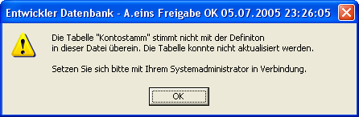

# XMLImport

<!-- source: https://amic.de/hilfe/xmlimport.htm -->

Syntax

XMLImport Dateiname;

Purpose

Importiert Daten aus einer XML-Datei. Format ist vorgegeben. Siehe dazu XMLExport

Anwendung

Befehlszeile, Kommandodatei

Berechtigung

Alle Anwender

Siehe auch

[DBFLOAD](./dbfload_statement.md), [DBFCREATE](./dbfcreate_statement_ab_version_5_0.md), [LOAD](./load.md), [READ](./read.md), [IDENTLOAD](./identload_statement.md), [CREATE STRUCT](./create_struct_statement.md), [ALTER STRUCT](./alter_struct_statement.md), [XMLEXPORT](./xmlexport.md)

Beschreibung

Daten die mit XMLExport ausgelagert wurden, bzw. die dieselbe Struktur haben, können hier importiert werden. Exsitiert die Tabelle nicht, so wird diese angelegt. Existieren einzelne Felder nicht in der Relation, so werden diese angelegt. Ist dies nicht möglich – z.B. Tabelle von einem Benutzer gesperrt – werden die Daten nicht eingespielt. Es erscheint dann der Fehlerhinweis  


Existiert auf der Zieldatenbank zu dieser Tabelle kein Primary Key, so wird er – gegebenenfalls nach Ausführen des Delete-Statements - angelegt. Es wird nicht geprüft, ob der Primary Key sich unterscheidet.

Indexe werden nicht angelegt.

Beispiel

```text
XMLImport c:\AEINS\EXPORT\Fibuvorgklasse.xml
```
