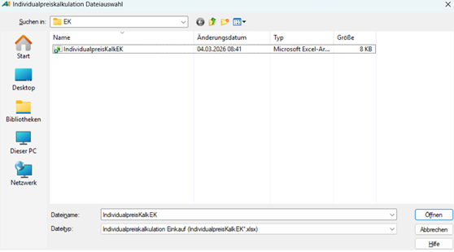
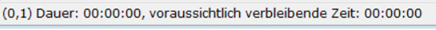

# Excel-Datei importieren

<!-- source: https://amic.de/hilfe/_ExcelDateiImportieren.htm -->

Hauptmenü > Preise / Konditionen > Preiskalkulation tabellarisch > Individualpreiskalkulation Excel > Funktion ***Individualpreiskalkulation Einkauf/Verkauf***

Direktsprung **[PKXI]** > Funktion ***Individualpreiskalkulation Einkauf/Verkauf***

Um die neuen Individualpreise in A.eins zu importieren, müssen folgende Schritte ausgeführt werden:

1. Im Menüband die Funktion ***Individualpreiskalkulation Einkauf*** bzw**.** ***Individualpreiskalkulation Verkauf*** auswählen oder **F9** **drücken**.

2. Es öffnet sich der Datei-Explorer an dem zuvor definierten Import-Pfad. Es sollte die Datei **IndividualpreisKalkEK** bzw. **IndividualpreisKalkVK,** wie im Screenshot abgebildet, zu sehen sein.

5. Die Datei auswählen und auf „Öffnen“ klicken. Der Import wird nun durchgeführt. Je nach Größe der Preisliste kann dies einige Minuten dauern. Sobald die folgende Meldung nicht mehr am unteren linken Rand vom A.eins-Fenster zu sehen ist, ist der Import abgeschlossen. Die Datei wird abschließend gelöscht, kann aber im [Import-Protokoll](./import_protokoll_pruefen.md) erneut aufgerufen werden.

6. Sollte beim Import ein Fehler aufgetreten sein, erscheint eine Nachrichtenbox mit einer Fehlermeldung. Ist dies der Fall, sollte direkt der Schritt [Import-Protokoll prüfen](./import_protokoll_pruefen.md) ausgeführt werden, um Näheres über den Fehler zu erfahren. Erscheint keine Nachricht, so verlief der Import fehlerfrei.

7. Als Letztes sollten die neuen Preise einmal überprüft werden. Dafür mit **Strg+R** die Auswahlliste aktualisieren und kontrollieren, ob die neuen Individualpreise korrekt importiert wurden.

Hinweis!

Um den neuen Wert für **Preis** zu überprüfen, ist das Feld **Preis alt** zu beachten. Dort steht der aktuelle Preis aus der Datenbank. Wenn der Import erfolgreich war, steht hier also der importierte Preis.

Auch für den Gültigkeitszeitraum sind die Felder **Preis ab alt** und **Preis bis alt** entscheidend. Wie bei den Preisen stehen hier, bei erfolgreichem Import, die neuen Werte.
