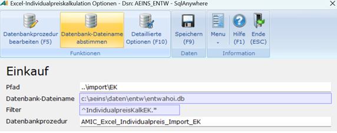
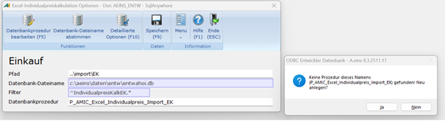

# Export konfigurieren

<!-- source: https://amic.de/hilfe/_ExportKonfigurieren.htm -->

Hauptmenü > Preise / Konditionen > Preiskalkulation tabellarisch > Individualpreiskalkulation Excel > Funktion ***Optionen Einkauf/Verkauf***

Direktsprung **[PKXI]** > Funktion ***Optionen Einkauf/Verkauf***

Um die Einrichtung der Individualpreiskalkulation Excel zu starten, müssen die folgenden Schritte ausgeführt werden:

1. Die Variante **Individualpreise Excel Einkauf** oder **Individualpreise Excel Verkauf** für die Einkaufs – oder Verkaufspreise auswählen.

2. Auf **Optionen Einkauf** bzw. **Optionen Verkauf** klicken oder **F10** drücken.

3. Im Feld Pfad angeben, an welcher Stelle im Dateisystem die exportierte Excel-Datei gespeichert werden soll (z. B. ..\\import\\EK oder ..\\import\\VK).

4. im Feld ***Datenbankprozedur*** **F3** drücken, um die Standardprozedur ***AMIC_Excel_Individualpreis_Import_EK*** bzw. ***AMIC_Excel_Individualpreis_Import_VK*** (EK für Einkauf, VK für Verkauf) einzutragen, wenn diese nicht bereits gesetzt ist. Wenn alternativ eine private Prozedur verwendet werden soll, kann diese hier hinterlegt werden.

Hinweis!

Die Felder „Filter“ und „Datenbank-Dateiname“ sind bereits durch die in A.eins konfigurierten Filter sowie die hinterlegte Datenbank vorbelegt.

Optional: Private Datenbankprozedur anlegen

Für den Import können auch private Datenbankprozeduren verwendet werden. Um diese anzulegen, muss im Feld ***Datenbankprozedur*** ***der Name der neuen Prozedur eingetragen werden.***

Hinweis!

Private Datenbankprozeduren müssen immer mit einem vorangestellten **P_** anfangen.

Die private Datenbankprozedur wird nun anhand der Standardprozedur ***AMIC_Excel_Individualpreis_Import_EK*** bzw. ***AMIC_Excel_Individualpreis_Import_VK*** angelegt und kann direkt im hinterlegten Editor bearbeitet werden.
