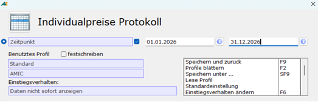
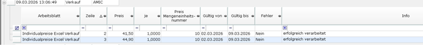

# Import-Protokoll prüfen

<!-- source: https://amic.de/hilfe/_ImportProtokollPruefen.htm -->

Hauptmenü > Preise / Konditionen > Preiskalkulation tabellarisch > Individualpreiskalkulation Excel

Direktsprung **[PKXI]**

In der Variante **Individualpreise Protokoll** werden alle durchgeführten Importe gesammelt und können nachträglich noch einmal überprüft werden. Dafür die folgenden Schritte ausführen:

<strong>1.</strong> Mit dem Klick auf das **Fernglas-Symbol** im oberen Bereich oder das Drücken der Taste **F2** kommt man in den Dialog **Individualpreise Protokoll**. Hier kann nach dem Zeitpunkt des Imports gefiltert werden. Dafür das Optionsfeld **Zeitpunkt** aktvieren und einen gültigen Zeitraum eintragen. Über Doppelklick öffnet sich der interaktive Kalender. Alternativ kann ein Datum oder der Wert „heute“ eingetragen werden. **Speichern und zurück** wählen oder **F9 drücken**, um den Dialog zu schließen und die Auswahlliste zu aktualisieren.

****

<strong>2.</strong> In der Auswahlliste werden nun alle Importe aus dem gewählten Zeitraum angezeigt. Neben dem **Zeitpunkt** des Imports gibt es das Feld **Typ**, das kennzeichnet, ob es sich um einen Import von Einkaufs- oder Verkaufspreisen handelt sowie das Feld **Bediener** mit dem Kürzel des ausführenden Bedieners.

<strong>3.</strong> Um mehr über einen Import zu erfahren, kann auf das **Plus-Symbol** an der linken Seite des Eintrags geklickt werden. Die Gruppierung wird für diesen Eintrag aufgehoben.

****

<strong>4.</strong> In der Auswahlliste sind jetzt Informationen zu dem Import jeder Zeile der Excel-Datei zu finden.

<strong>5.</strong> Pro Zeile wird eine Auswahl an Werten aus der Excel-Datei aufgelistet. Wichtig sind vor allem die Felder **Fehler** und **Info.**

<strong>a. Fehler:</strong> Sollte ein Fehler beim Import der Zeile aufgetreten sein, steht hier als Ausprägung „Ja“. Ohne Fehler hält das Feld den Wert „Nein“.

<strong>b. Info:</strong> Bei einem Fehler beim Import der Zeile sind hier mehr Informationen über den Fehler zu finden. Ansonsten meldet das Feld, dass die Zeile erfolgreich verarbeitet, übersprungen oder gelöscht wurde.

Dokument anzeigen

Neben der Überprüfung des Imports auf Fehler bietet sich Ihnen im Protokoll auch die Möglichkeit, die importierte Excel-Datei erneut zu öffnen.

Falls im vorigen Schritt das **Plus-Symbol** benutzt wurde, um nähere Informationen über den Import abzurufen, muss diese diese Auswahl mit einem Klick auf das **Minus-Symbol** geschlossen werden.

Um die Excel-Datei des Imports zu öffnen, kann der Eintrag aus der Auswahlliste mit einem Klick ausgewählt und die Funktion ***Dokument anzeigen*** aus dem Menüband aufgerufen oder **F11** gedrückt werden. Alternativ reicht auch ein Doppelklick auf die ausgewählte Zeile. Die Excel-Datei, die importiert wurde, öffnet sich erneut. So können die Daten noch einmal überprüft sowie editiert, abgespeichert und erneut importiert werden.
