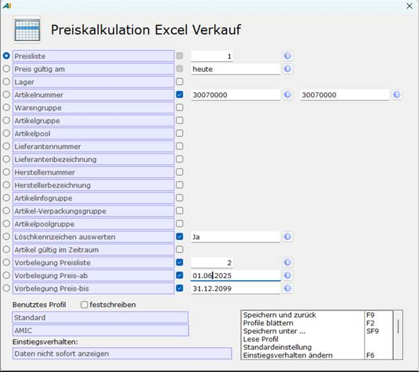

# Datenexportprofil einrichten

<!-- source: https://amic.de/hilfe/_datenexportprofileinrichten.htm -->

Hauptmenü > Preise / Konditionen > Preiskalkulation tabellarisch > Preiskalkulation Excel

Direktsprung **[PKX]**.

1. Über das ***Fernglas-Symbol*** im Bereich Auswahl den Dialog ***Preiskalkulation Excel VK*** bzw. EK aufrufen.

2. Wählen Sie die ***Preisliste*** aus, aus welcher die gefilterten Preise gezogen werden sollen.

3. Wählen Sie unter ***Preis gültig am*** ein Datum über den Kalender und bestätigen Sie dies per Doppelklick.

ODER:

Tragen Sie ein **Gültigkeitsdatum** ein oder den Wert **heute**.

Hinweis!

Wenn sich in der Preisliste auch Artikel befinden, die keinen Preis für den Tag hinterlegt haben, werden auch diese in die Exceldatei exportiert.

Beachten Sie dies Verhalten bei der Einstellung Ihrer Filterkriterien.

4. Wählen Sie weitere Filterkriterien Ihrer Preise, indem vor dem Kriterium die Optionsfelder aktivieren.

5. Wählen Sie unter ***Vorbelegung Preisliste*** die Preisliste, in welche die neuen Preise in A.eins importiert werden.

6. Geben Sie unter ***Vorbelegung Preis ab*** und ***Vorbelegung Preis bis*** den Gültigkeitszeitraum der neuen Preise für die Artikel ein.

7. Speichern Sie die Einstellungen, indem Sie ***F9*** drücken oder ***Speichern und zurück*** in Optionsbox auswählen.

Die Auswahlliste wird angezeigt Ihnen in Gruppierung der Preislistengruppe der gefilterten Artikel an.

Hinweis!

***Liste zeigt Gruppierung einer Preisliste***

Die Liste zeigt **NICHT** die einzelnen Artikel an, sondern die Gruppierungen und die Preislistengruppe an.

Selbst bei Filterung in Profilen explizit nach einem oder mehreren Artikelnummern werden Gruppierungen und Preislistengruppen angezeigt. 

Dadurch können Sie bei der Kalkulation für Artikel mit gleicher Preislistengruppe die Preise komfortabel einmal pflegen.

Wenn Sie den einzelnen Artikel anzeigen möchten, heben Sie im Bereich Auswahl die Gruppierung auf.
