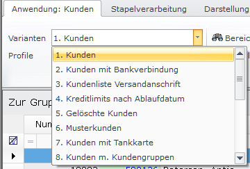
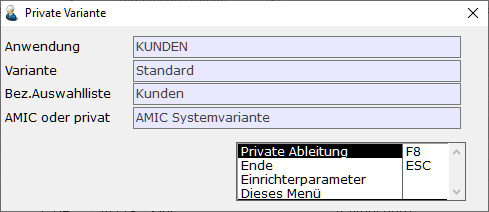
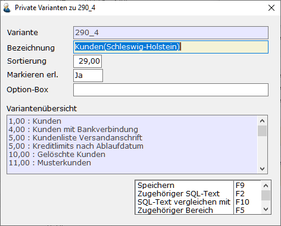

# Private Varianten und SQL-Texte

<!-- source: https://amic.de/hilfe/auswahllisten.htm -->

Auswahllisten sind eine in A.eins integrierte Technologie um verschiedene Anwendungen zur Auswahl von Belegen, Kunden, Anschriften Buchungen etc. in Listenform anzuzeigen. Eine Reihe von Anwendungen sind vom System vorgegeben. Innerhalb einer Anwendung kann es verschieden Varianten geben. Als Beispiel hierfür wird die Anwendung Kundenstamm (Direktsprung **[KU]**) verwendet:

Von den Varianten können private Ableitungen erstellt werden, die dann abgeänderte Inhalte enthalten. Private Ableitungen haben immer den Nachteil, dass Änderungen von AMIC nach einem Programmupdate dort nicht mit enthalten sind.

Um eine private Ableitung einer bestehenden Variante zu erstellen, startet man die Anwendung und wählt dort die Variante aus, die privatisiert werden soll. Dann führt man die Funktion „***private Variante***“ **Strg+F2** aus. Mit dieser Funktion können später auch schon existierende Varianten bearbeitet werden. Dann stehen zusätzlich noch die Funktionen „***Bearbeiten***“ **F5** und „***Löschen***“ **F7** zur Verfügung.

Nach ausführen der Funktion „Private Ableitung“ öffnet sich ein weiterer Dialog:

| | **Beschreibung** |
| --- | --- |
| Bezeichnung | Die Bezeichnung, wie sie später in der Anwendung zu sehen ist.  |
| Sortierung | Hier kann man angeben, an welcher Stelle in der Varianten-Auswahl diese private Variante stehen soll. Vorbelegt wird der Wert immer so, dass die private Variante am Ende einsortiert wird,  |
| Markieren erlaubt | Wenn hier ein **Nein** eingetragen wird, dann ist das Markieren einzelner Zeilen nicht mehr möglich und es gilt für alle Funktionen immer die Gesamtauswahl.  |
| Option Box | Sollen in dieser Variante andere Funktionen angeboten werden, so kann man eine eigen Optionbox hinterlegen, in der man die Funktionen zur Verfügung stellen kann. |

Funktionen:

| | **Beschreibung** |
| --- | --- |
| Speichern | Speichert die Änderungen.  |
| Zugehöriger SQL-Text | Hier kann der SQL-Text bearbeitet werden. Eine Liste der Schlüsselwörter findet an hier.  |
| SQL-Text vergleichen mit | Es öffnet sich eine F3-Auswahl, in der alle Varianten der aktiven Anwendung zu Auswahl angeboten werden. Anschließend öffnet sich ein Tool, in dem der private SQL-Text mit dem SQL-Text der ausgewählten Variante verglichen wird.  |
| Zugehöriger Bereich | Zu jeder Variante gehört auch eine eigene [Bereichsauswahl](../auswahlliste_2_0/anwendungsregister/f2_bereichsauswahl/index.md). Die zu dieser privaten Variante gehörende Bereichsauswahl lässt sich hier bearbeiten.  |
| Zugehörige Optionbox | Mit dieser Funktion lässt sich die die hinterlegte Optionbox(s.o.) bearbeiten.  |
| Export | Entlädt die private Variante in eine Textdatei, die so über OSQL auf einer anderen Datenbank wieder eingespielt werden kann.  |

Siehe auch:

- [Schlüsselwörter im SQL-Text](./schluesselwoerter_im_sql_text.md)
- [Feldtyp im SQL-Text](./feldtyp_im_sql_text.md)
