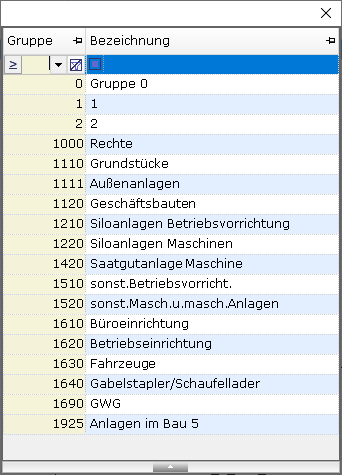
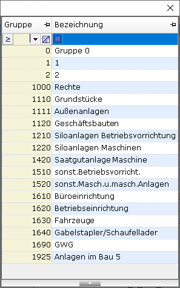
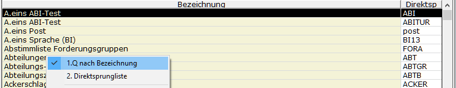
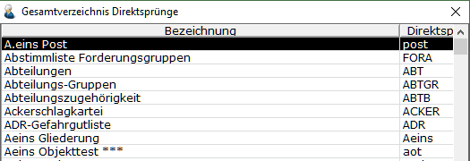
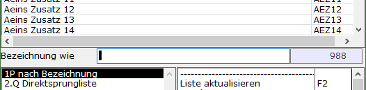
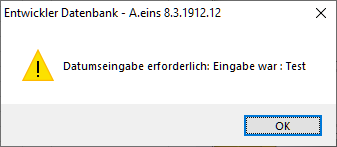

# Schlüsselwörter im SQL-Text

<!-- source: https://amic.de/hilfe/SchluesselwoerterImSQLText.htm -->

Die hier aufgeführten Schüsselwörter gelten für die Auswahlliste im alten Design(AW 1.0), die im neuen Design(AW 2.0) und die F3-Auswahl(IB). Teilweise stehen Schlüsselwort nicht in jedem Teil zur Verfügung (siehe Hinweis). Alle Schlüsselwörter müssen großgeschrieben werden.

<table class="AMIC-Tabelle" style="WIDTH: 100%; BORDER-COLLAPSE: collapse" cellspacing="0" cellpadding="0" width="100%" border="0"><tbody><tr><td style="WIDTH: 145.5pt; BACKGROUND: #005d5b; PADDING-BOTTOM: 0pt; PADDING-TOP: 0pt; PADDING-LEFT: 5.4pt; PADDING-RIGHT: 5.4pt" width="194"></td><td style="WIDTH: 95.1pt; BACKGROUND: #005d5b; PADDING-BOTTOM: 0pt; PADDING-TOP: 0pt; PADDING-LEFT: 5.4pt; PADDING-RIGHT: 5.4pt" width="127">
<b>Gütigkeitsbereich</b>
</td><td style="WIDTH: 773.35pt; BACKGROUND: #005d5b; PADDING-BOTTOM: 0pt; PADDING-TOP: 0pt; PADDING-LEFT: 5.4pt; PADDING-RIGHT: 5.4pt" width="1031">
<b>Beschreibung</b>
</td></tr><tr><td style="BORDER-TOP: medium none; BORDER-RIGHT: white 1.5pt solid; WIDTH: 145.5pt; BACKGROUND: #bad9d9; BORDER-BOTTOM: medium none; PADDING-BOTTOM: 0pt; PADDING-TOP: 0pt; PADDING-LEFT: 5.4pt; BORDER-LEFT: medium none; PADDING-RIGHT: 5.4pt" valign="top" width="194">
VAR
</td><td style="BORDER-TOP: medium none; BORDER-RIGHT: white 1.5pt solid; WIDTH: 95.1pt; BACKGROUND: #bad9d9; BORDER-BOTTOM: medium none; PADDING-BOTTOM: 0pt; PADDING-TOP: 0pt; PADDING-LEFT: 5.4pt; BORDER-LEFT: medium none; PADDING-RIGHT: 5.4pt" valign="top" width="127"></td><td style="BORDER-TOP: medium none; BORDER-RIGHT: medium none; WIDTH: 773.35pt; BACKGROUND: #bad9d9; BORDER-BOTTOM: medium none; PADDING-BOTTOM: 0pt; PADDING-TOP: 0pt; PADDING-LEFT: 5.4pt; BORDER-LEFT: medium none; PADDING-RIGHT: 5.4pt" valign="top" width="1031">
Mithilfe von VAR können zusammengesetzte Inhalte oder Formeln für das SQL-Statement vordefiniert werden.  

VAR Name A.AdressName+', '+A.AdressVorname

FIELD Nummer,S.KundNummer,I4,8

FIELD Name,Name,char,20 SQL select :FIELDS from Kundenstamm s join Anschriftstamm a on a.adressid=s.adressidhauptadr  

 Das SQL wird erweitert auf:

Select S.KUNDNUMMER,A.AdressName+', '+A.AdressVorname NAME, from Kundenstamm s join Anschriftstamm a on a.adressid=s.adressidhauptadr

</td></tr><tr><td style="BORDER-TOP: medium none; BORDER-RIGHT: white 1.5pt solid; WIDTH: 145.5pt; BACKGROUND: #eff7f7; BORDER-BOTTOM: medium none; PADDING-BOTTOM: 0pt; PADDING-TOP: 0pt; PADDING-LEFT: 5.4pt; BORDER-LEFT: medium none; PADDING-RIGHT: 5.4pt" valign="top" width="194">
FIELD
</td><td style="BORDER-TOP: medium none; BORDER-RIGHT: white 1.5pt solid; WIDTH: 95.1pt; BACKGROUND: #eff7f7; BORDER-BOTTOM: medium none; PADDING-BOTTOM: 0pt; PADDING-TOP: 0pt; PADDING-LEFT: 5.4pt; BORDER-LEFT: medium none; PADDING-RIGHT: 5.4pt" valign="top" width="127"></td><td style="BORDER-TOP: medium none; BORDER-RIGHT: medium none; WIDTH: 773.35pt; BACKGROUND: #eff7f7; BORDER-BOTTOM: medium none; PADDING-BOTTOM: 0pt; PADDING-TOP: 0pt; PADDING-LEFT: 5.4pt; BORDER-LEFT: medium none; PADDING-RIGHT: 5.4pt" valign="top" width="1031">
Beschreibung einer Spalte. Die ersten vier Parameter müssen immer in einer festen Reihenfolge angegeben werden:

1)&nbsp;&nbsp; Spaltenüberschrift. Die Überschrift kann sich in der AW 2.0 über mehrere Zeilen erstrecken. Um das zu erreichen, fügt man mit &lt;br&gt; einen Zeilenumbruch ein.

2)&nbsp;&nbsp; Datenbankfeld. Der Name muss eindeutig sein.

3)&nbsp;&nbsp; <a class="topic-link" href="./feldtyp_im_sql_text.md">Feldtyp</a>

4)&nbsp;&nbsp; Breite der Spalte in Zeichen. Für die F3-Auswahl 2.0 gibt diese Zahl die maximale Breite an, in der die Spalte dargestellt wird, da hier die Breite der Spalte aus dem Feldinhalt errechnet wird.

…

FIELD Name,name,char,20

FIELD Typ,KundTyp,FS KundTyp,10

FIELD Matchcode,MA,char,15

FIELD Kunden-&lt;br&gt;bezeichnung,Kundbezeich,char,30 …

Zusätzlich existieren noch weitere Parameter, die wiederrum über ein Schlüsselwort verfügen. Sie können in beliebiger Kombination verwendet werden.
<table class="AMIC-Tabelle" style="BORDER-COLLAPSE: collapse" cellspacing="0" cellpadding="0" border="0"><tbody><tr><th style="WIDTH: 167.7pt; BACKGROUND: #005d5b; PADDING-BOTTOM: 0pt; PADDING-TOP: 0pt; PADDING-LEFT: 5.4pt; PADDING-RIGHT: 5.4pt" width="224">&nbsp;</th><th style="WIDTH: 626.25pt; BACKGROUND: #005d5b; PADDING-BOTTOM: 0pt; PADDING-TOP: 0pt; PADDING-LEFT: 5.4pt; PADDING-RIGHT: 5.4pt" width="835">&nbsp;</th></tr><tr><td style="BORDER-TOP: medium none; BORDER-RIGHT: white 1.5pt solid; WIDTH: 167.7pt; BACKGROUND: #bad9d9; BORDER-BOTTOM: medium none; PADDING-BOTTOM: 0pt; PADDING-TOP: 0pt; PADDING-LEFT: 5.4pt; BORDER-LEFT: medium none; PADDING-RIGHT: 5.4pt" valign="top" width="224">GROUP=</td><td style="BORDER-TOP: medium none; BORDER-RIGHT: medium none; WIDTH: 626.25pt; BACKGROUND: #bad9d9; BORDER-BOTTOM: medium none; PADDING-BOTTOM: 0pt; PADDING-TOP: 0pt; PADDING-LEFT: 5.4pt; BORDER-LEFT: medium none; PADDING-RIGHT: 5.4pt" valign="top" width="835">Siehe <a class="topic-link" href="../auswahlliste_2_0/anwendungsregister/index.md#AnwendungsregisterGruppierung">Anwendungsregister/Gruppierung</a> &nbsp;</td></tr><tr><td style="BORDER-TOP: medium none; BORDER-RIGHT: white 1.5pt solid; WIDTH: 167.7pt; BACKGROUND: #eff7f7; BORDER-BOTTOM: medium none; PADDING-BOTTOM: 0pt; PADDING-TOP: 0pt; PADDING-LEFT: 5.4pt; BORDER-LEFT: medium none; PADDING-RIGHT: 5.4pt" valign="top" width="224">SUM= oder SUM</td><td style="BORDER-TOP: medium none; BORDER-RIGHT: medium none; WIDTH: 626.25pt; BACKGROUND: #eff7f7; BORDER-BOTTOM: medium none; PADDING-BOTTOM: 0pt; PADDING-TOP: 0pt; PADDING-LEFT: 5.4pt; BORDER-LEFT: medium none; PADDING-RIGHT: 5.4pt" valign="top" rowspan="2" width="835">Siehe <a class="topic-link" href="../darstellung_der_auswahlliste/summierung_in_der_auswahlliste/index.md">Summierung der Auswahlliste</a></td></tr><tr><td style="BORDER-TOP: medium none; BORDER-RIGHT: white 1.5pt solid; WIDTH: 167.7pt; BACKGROUND: #bad9d9; BORDER-BOTTOM: medium none; PADDING-BOTTOM: 0pt; PADDING-TOP: 0pt; PADDING-LEFT: 5.4pt; BORDER-LEFT: medium none; PADDING-RIGHT: 5.4pt" valign="top" width="224">SUMFORMAT=</td></tr><tr><td style="BORDER-TOP: medium none; BORDER-RIGHT: white 1.5pt solid; WIDTH: 167.7pt; BACKGROUND: #eff7f7; BORDER-BOTTOM: medium none; PADDING-BOTTOM: 0pt; PADDING-TOP: 0pt; PADDING-LEFT: 5.4pt; BORDER-LEFT: medium none; PADDING-RIGHT: 5.4pt" valign="top" width="224">COLOR=</td><td style="BORDER-TOP: medium none; BORDER-RIGHT: medium none; WIDTH: 626.25pt; BACKGROUND: #eff7f7; BORDER-BOTTOM: medium none; PADDING-BOTTOM: 0pt; PADDING-TOP: 0pt; PADDING-LEFT: 5.4pt; BORDER-LEFT: medium none; PADDING-RIGHT: 5.4pt" valign="top" rowspan="4" width="835">Siehe <a class="topic-link" href="../darstellung_der_auswahlliste/farbgestaltung_der_auswahlliste/index.md">Farbgestaltung der Auswahlliste</a></td></tr><tr><td style="BORDER-TOP: medium none; BORDER-RIGHT: white 1.5pt solid; WIDTH: 167.7pt; BACKGROUND: #bad9d9; BORDER-BOTTOM: medium none; PADDING-BOTTOM: 0pt; PADDING-TOP: 0pt; PADDING-LEFT: 5.4pt; BORDER-LEFT: medium none; PADDING-RIGHT: 5.4pt" valign="top" width="224">BGCOLOR=</td></tr><tr><td style="BORDER-TOP: medium none; BORDER-RIGHT: white 1.5pt solid; WIDTH: 167.7pt; BACKGROUND: #eff7f7; BORDER-BOTTOM: medium none; PADDING-BOTTOM: 0pt; PADDING-TOP: 0pt; PADDING-LEFT: 5.4pt; BORDER-LEFT: medium none; PADDING-RIGHT: 5.4pt" valign="top" width="224">FGCOLOR=</td></tr><tr><td style="BORDER-TOP: medium none; BORDER-RIGHT: white 1.5pt solid; WIDTH: 167.7pt; BACKGROUND: #bad9d9; BORDER-BOTTOM: medium none; PADDING-BOTTOM: 0pt; PADDING-TOP: 0pt; PADDING-LEFT: 5.4pt; BORDER-LEFT: medium none; PADDING-RIGHT: 5.4pt" valign="top" width="224">STYLE=</td></tr><tr><td style="BORDER-TOP: medium none; BORDER-RIGHT: white 1.5pt solid; WIDTH: 167.7pt; BACKGROUND: #eff7f7; BORDER-BOTTOM: medium none; PADDING-BOTTOM: 0pt; PADDING-TOP: 0pt; PADDING-LEFT: 5.4pt; BORDER-LEFT: medium none; PADDING-RIGHT: 5.4pt" valign="top" width="224">HIDDEN</td><td style="BORDER-TOP: medium none; BORDER-RIGHT: medium none; WIDTH: 626.25pt; BACKGROUND: #eff7f7; BORDER-BOTTOM: medium none; PADDING-BOTTOM: 0pt; PADDING-TOP: 0pt; PADDING-LEFT: 5.4pt; BORDER-LEFT: medium none; PADDING-RIGHT: 5.4pt" valign="top" width="835">Spalte wird zwar angelegt jedoch nicht angezeigt. Sie kann über den <a class="topic-link" href="../darstellung_der_auswahlliste/feldauswahl_der_auswahlliste.md">Gestaltungsdialog</a> jederzeit eingeblendet werden.  </td></tr><tr><td style="BORDER-TOP: medium none; BORDER-RIGHT: white 1.5pt solid; WIDTH: 167.7pt; BACKGROUND: #bad9d9; BORDER-BOTTOM: medium none; PADDING-BOTTOM: 0pt; PADDING-TOP: 0pt; PADDING-LEFT: 5.4pt; BORDER-LEFT: medium none; PADDING-RIGHT: 5.4pt" valign="top" width="224">NOINFO</td><td style="BORDER-TOP: medium none; BORDER-RIGHT: medium none; WIDTH: 626.25pt; BACKGROUND: #bad9d9; BORDER-BOTTOM: medium none; PADDING-BOTTOM: 0pt; PADDING-TOP: 0pt; PADDING-LEFT: 5.4pt; BORDER-LEFT: medium none; PADDING-RIGHT: 5.4pt" valign="top" width="835">Diese Spalte wird nicht im Infofenster dargestellt. &nbsp;</td></tr><tr><td style="BORDER-TOP: medium none; BORDER-RIGHT: white 1.5pt solid; WIDTH: 167.7pt; BACKGROUND: #eff7f7; BORDER-BOTTOM: medium none; PADDING-BOTTOM: 0pt; PADDING-TOP: 0pt; PADDING-LEFT: 5.4pt; BORDER-LEFT: medium none; PADDING-RIGHT: 5.4pt" valign="top" width="224">ROWS=</td><td style="BORDER-TOP: medium none; BORDER-RIGHT: medium none; WIDTH: 626.25pt; BACKGROUND: #eff7f7; BORDER-BOTTOM: medium none; PADDING-BOTTOM: 0pt; PADDING-TOP: 0pt; PADDING-LEFT: 5.4pt; BORDER-LEFT: medium none; PADDING-RIGHT: 5.4pt" valign="top" width="835">Innerhalb des Infofensters kann eine Spalte in mehreren Zeilen angezeigt werden. Hinter Rows gibt man die maximale Anzahl Zeilen an. &nbsp;</td></tr><tr><td style="BORDER-TOP: medium none; BORDER-RIGHT: white 1.5pt solid; WIDTH: 167.7pt; BACKGROUND: #bad9d9; BORDER-BOTTOM: medium none; PADDING-BOTTOM: 0pt; PADDING-TOP: 0pt; PADDING-LEFT: 5.4pt; BORDER-LEFT: medium none; PADDING-RIGHT: 5.4pt" valign="top" width="224">MULTILINE= oder MULTILINE</td><td style="BORDER-TOP: medium none; BORDER-RIGHT: medium none; WIDTH: 626.25pt; BACKGROUND: #bad9d9; BORDER-BOTTOM: medium none; PADDING-BOTTOM: 0pt; PADDING-TOP: 0pt; PADDING-LEFT: 5.4pt; BORDER-LEFT: medium none; PADDING-RIGHT: 5.4pt" valign="top" width="835">Die Auswahlliste 2.0 kann Daten über mehrere Zeilen darstellen. Gibt man ein Gleichheitszeichen gefolgt von einer Zahl an, so werden maximal so viele Zeilen dargestellt. &nbsp;</td></tr><tr><td style="BORDER-TOP: medium none; BORDER-RIGHT: white 1.5pt solid; WIDTH: 167.7pt; BACKGROUND: #eff7f7; BORDER-BOTTOM: medium none; PADDING-BOTTOM: 0pt; PADDING-TOP: 0pt; PADDING-LEFT: 5.4pt; BORDER-LEFT: medium none; PADDING-RIGHT: 5.4pt" valign="top" width="224">EXTENDEDFILTER</td><td style="BORDER-TOP: medium none; BORDER-RIGHT: medium none; WIDTH: 626.25pt; BACKGROUND: #eff7f7; BORDER-BOTTOM: medium none; PADDING-BOTTOM: 0pt; PADDING-TOP: 0pt; PADDING-LEFT: 5.4pt; BORDER-LEFT: medium none; PADDING-RIGHT: 5.4pt" valign="top" width="835">Nur Auswahlliste 2.0. Siehe <a class="topic-link" href="../darstellung_der_auswahlliste/feldauswahl_der_auswahlliste.md">Feldauswahl der Auswahlliste</a> &nbsp;</td></tr><tr><td style="BORDER-TOP: medium none; BORDER-RIGHT: white 1.5pt solid; WIDTH: 167.7pt; BACKGROUND: #bad9d9; BORDER-BOTTOM: medium none; PADDING-BOTTOM: 0pt; PADDING-TOP: 0pt; PADDING-LEFT: 5.4pt; BORDER-LEFT: medium none; PADDING-RIGHT: 5.4pt" valign="top" width="224">FILTERCOMPARISION=</td><td style="BORDER-TOP: medium none; BORDER-RIGHT: medium none; WIDTH: 626.25pt; BACKGROUND: #bad9d9; BORDER-BOTTOM: medium none; PADDING-BOTTOM: 0pt; PADDING-TOP: 0pt; PADDING-LEFT: 5.4pt; BORDER-LEFT: medium none; PADDING-RIGHT: 5.4pt" valign="top" width="835">Nur Auswahlliste 2.0 und F3-Auswahl 2.0. Siehe auch <a class="topic-link" href="../darstellung_der_auswahlliste/feldauswahl_der_auswahlliste.md">Feldauswahl der Auswahlliste</a> Diese Option konkurriert mit EXTENDEDFILTER und wird dann nicht ausgewertet. Man kann hier angeben, wie die Filterzeile suchen soll. Möglicher Werte sind:   •&nbsp;&nbsp;&nbsp; <b>gleich</b> •&nbsp;&nbsp;&nbsp; <b>ungleich</b> •&nbsp;&nbsp;&nbsp; <b>kleiner</b> •&nbsp;&nbsp;&nbsp; <b>kleiner oder gleich</b> •&nbsp;&nbsp;&nbsp; <b>größer als</b> •&nbsp;&nbsp;&nbsp; <b>größer oder gleich</b> •&nbsp;&nbsp;&nbsp; <b>beginnt mit</b> •&nbsp;&nbsp;&nbsp; <b>beginnt nicht mit</b> •&nbsp;&nbsp;&nbsp; <b>endet mit</b> •&nbsp;&nbsp;&nbsp; <b>endet nicht mit</b> •&nbsp;&nbsp;&nbsp; <b>enthält</b> •&nbsp;&nbsp;&nbsp; <b>enthält nicht</b> &nbsp; Die Werte können mit oder ohne Leerzeichen angegeben werden, also „endet nicht mit“ oder „endetnichtmit“. Groß- und Kleinschreibung muss nicht beachtet werden. Beispiel: code &nbsp;</td></tr><tr><td style="BORDER-TOP: medium none; BORDER-RIGHT: white 1.5pt solid; WIDTH: 167.7pt; BACKGROUND: #eff7f7; BORDER-BOTTOM: medium none; PADDING-BOTTOM: 0pt; PADDING-TOP: 0pt; PADDING-LEFT: 5.4pt; BORDER-LEFT: medium none; PADDING-RIGHT: 5.4pt" valign="top" width="224">TIPTEXT=</td><td style="BORDER-TOP: medium none; BORDER-RIGHT: medium none; WIDTH: 626.25pt; BACKGROUND: #eff7f7; BORDER-BOTTOM: medium none; PADDING-BOTTOM: 0pt; PADDING-TOP: 0pt; PADDING-LEFT: 5.4pt; BORDER-LEFT: medium none; PADDING-RIGHT: 5.4pt" valign="top" width="835">Hinter diesem Schlüsselwort folgt ein beschreibender Text zu dieser Spalte. Enthält der Text ein Komma, so muss der Text in Anführungszeichen stehen. Der Text erscheint, wenn man mit dem Mauszeiger über die entsprechende Spalte geht. &nbsp;</td></tr><tr><td style="BORDER-TOP: medium none; BORDER-RIGHT: white 1.5pt solid; WIDTH: 167.7pt; BACKGROUND: #bad9d9; BORDER-BOTTOM: medium none; PADDING-BOTTOM: 0pt; PADDING-TOP: 0pt; PADDING-LEFT: 5.4pt; BORDER-LEFT: medium none; PADDING-RIGHT: 5.4pt" valign="top" width="224">TITEL= oder TITLE=</td><td style="BORDER-TOP: medium none; BORDER-RIGHT: medium none; WIDTH: 626.25pt; BACKGROUND: #bad9d9; BORDER-BOTTOM: medium none; PADDING-BOTTOM: 0pt; PADDING-TOP: 0pt; PADDING-LEFT: 5.4pt; BORDER-LEFT: medium none; PADDING-RIGHT: 5.4pt" valign="top" width="835">Hinter dem Gleichheitszeichen folgt der Name einer Datenbankprozedur. Mit dieser Prozedur kann der Titel dynamisch angepasst werden. Diese Datenbankprozedur hat einen Parameter (char 255) in dem der originale Titel geliefert wird. Sie soll eine Überschrift liefern, die dann verwendet wird. Liefert die Funktion als Rückgabewert „-DONOTSHOW-“, dann wird die Spalte ausgeblendet. Dieses Beispiel sorgt dafür, dass die entsprechenden Spalten ausgeblendet werden, wenn keine Daten nach Handelsrecht geführt werden. code &nbsp;</td></tr><tr><td style="BORDER-TOP: medium none; BORDER-RIGHT: white 1.5pt solid; WIDTH: 167.7pt; BACKGROUND: #eff7f7; BORDER-BOTTOM: medium none; PADDING-BOTTOM: 0pt; PADDING-TOP: 0pt; PADDING-LEFT: 5.4pt; BORDER-LEFT: medium none; PADDING-RIGHT: 5.4pt" valign="top" width="224">MINWIDTH=</td><td style="BORDER-TOP: medium none; BORDER-RIGHT: medium none; WIDTH: 626.25pt; BACKGROUND: #eff7f7; BORDER-BOTTOM: medium none; PADDING-BOTTOM: 0pt; PADDING-TOP: 0pt; PADDING-LEFT: 5.4pt; BORDER-LEFT: medium none; PADDING-RIGHT: 5.4pt" valign="top" width="835"><b>Nur für die </b><a class="topic-link" href="../f3_auswahl_2_0_itembox/index.md"><b>F3-Auswahl 2.0</b></a><b>. </b>Dort wird die Spaltenbreite dynamisch berechnet, und zwar anhand der Breite der Überschrift, der maximal Anzahl Zeichen der Sichtbaren Zeilen und der unter 4) angegebene Breite der Spalte(s.o.). Die Breite ist dabei die maximal angezeigte Breite und MINWIDTH ist die Breite in Zeichen, die nicht unterschritten werden soll.  Beispiel: code &nbsp; <table class="MsoTableGridLight" style="BORDER-TOP: medium none; BORDER-RIGHT: medium none; BORDER-COLLAPSE: collapse; BORDER-BOTTOM: medium none; BORDER-LEFT: medium none" cellspacing="0" cellpadding="0" border="1"><tbody><tr><th style="BORDER-TOP: #bfbfbf 1pt solid; BORDER-RIGHT: #bfbfbf 1pt solid; WIDTH: 276pt; BORDER-BOTTOM: #bfbfbf 1pt solid; PADDING-BOTTOM: 0pt; PADDING-TOP: 0pt; PADDING-LEFT: 5.4pt; BORDER-LEFT: #bfbfbf 1pt solid; PADDING-RIGHT: 5.4pt" valign="top" width="368">
Mit MINWIDTH
</th><th style="BORDER-TOP: #bfbfbf 1pt solid; BORDER-RIGHT: #bfbfbf 1pt solid; WIDTH: 276pt; BORDER-BOTTOM: #bfbfbf 1pt solid; PADDING-BOTTOM: 0pt; PADDING-TOP: 0pt; PADDING-LEFT: 5.4pt; BORDER-LEFT: medium none; PADDING-RIGHT: 5.4pt" valign="top" width="368">
Ohne MINWIDTH
</th></tr><tr><td style="BORDER-TOP: medium none; BORDER-RIGHT: #bfbfbf 1pt solid; WIDTH: 276pt; BORDER-BOTTOM: #bfbfbf 1pt solid; PADDING-BOTTOM: 0pt; PADDING-TOP: 0pt; PADDING-LEFT: 5.4pt; BORDER-LEFT: #bfbfbf 1pt solid; PADDING-RIGHT: 5.4pt" valign="top" width="368">

</td><td style="BORDER-TOP: medium none; BORDER-RIGHT: #bfbfbf 1pt solid; WIDTH: 276pt; BORDER-BOTTOM: #bfbfbf 1pt solid; PADDING-BOTTOM: 0pt; PADDING-TOP: 0pt; PADDING-LEFT: 5.4pt; BORDER-LEFT: medium none; PADDING-RIGHT: 5.4pt" valign="top" width="368">

</td></tr></tbody></table> </td></tr><tr><td style="BORDER-TOP: medium none; BORDER-RIGHT: white 1.5pt solid; WIDTH: 167.7pt; BACKGROUND: #bad9d9; BORDER-BOTTOM: medium none; PADDING-BOTTOM: 0pt; PADDING-TOP: 0pt; PADDING-LEFT: 5.4pt; BORDER-LEFT: medium none; PADDING-RIGHT: 5.4pt" valign="top" width="224">XML=</td><td style="BORDER-TOP: medium none; BORDER-RIGHT: medium none; WIDTH: 626.25pt; BACKGROUND: #bad9d9; BORDER-BOTTOM: medium none; PADDING-BOTTOM: 0pt; PADDING-TOP: 0pt; PADDING-LEFT: 5.4pt; BORDER-LEFT: medium none; PADDING-RIGHT: 5.4pt" valign="top" width="835">&nbsp;</td></tr><tr><td style="BORDER-TOP: medium none; BORDER-RIGHT: white 1.5pt solid; WIDTH: 167.7pt; BACKGROUND: #eff7f7; BORDER-BOTTOM: medium none; PADDING-BOTTOM: 0pt; PADDING-TOP: 0pt; PADDING-LEFT: 5.4pt; BORDER-LEFT: medium none; PADDING-RIGHT: 5.4pt" valign="top" width="224">JVARS(owner,Feldname) &nbsp; oder &nbsp; JAVARS_OWNER_FELDNAME</td><td style="BORDER-TOP: medium none; BORDER-RIGHT: medium none; WIDTH: 626.25pt; BACKGROUND: #eff7f7; BORDER-BOTTOM: medium none; PADDING-BOTTOM: 0pt; PADDING-TOP: 0pt; PADDING-LEFT: 5.4pt; BORDER-LEFT: medium none; PADDING-RIGHT: 5.4pt" valign="top" width="835">Nur Auswahlliste 2.0. Ist hinter einer FIELD – Zeile dieses Schlüsselwort angegeben, so wird immer dann, wenn genau ein Datensatz markiert ist, der Wert aus der Datentabelle in die JVar mit dem angegebenen Owner und Feldnamen geschrieben. Diese JVars werden nicht automatisch gelöscht.  Beispiel: code &nbsp; oder &nbsp; code &nbsp;</td></tr></tbody></table></td></tr><tr><td style="BORDER-TOP: medium none; BORDER-RIGHT: white 1.5pt solid; WIDTH: 145.5pt; BACKGROUND: #bad9d9; BORDER-BOTTOM: medium none; PADDING-BOTTOM: 0pt; PADDING-TOP: 0pt; PADDING-LEFT: 5.4pt; BORDER-LEFT: medium none; PADDING-RIGHT: 5.4pt" valign="top" width="194">
SQL
</td><td style="BORDER-TOP: medium none; BORDER-RIGHT: white 1.5pt solid; WIDTH: 95.1pt; BACKGROUND: #bad9d9; BORDER-BOTTOM: medium none; PADDING-BOTTOM: 0pt; PADDING-TOP: 0pt; PADDING-LEFT: 5.4pt; BORDER-LEFT: medium none; PADDING-RIGHT: 5.4pt" valign="top" width="127"></td><td style="BORDER-TOP: medium none; BORDER-RIGHT: medium none; WIDTH: 773.35pt; BACKGROUND: #bad9d9; BORDER-BOTTOM: medium none; PADDING-BOTTOM: 0pt; PADDING-TOP: 0pt; PADDING-LEFT: 5.4pt; BORDER-LEFT: medium none; PADDING-RIGHT: 5.4pt" valign="top" width="1031">
Enthält das SQL-Statement, welches die darzustellenden Daten liefert.

SQL select :FIELDS

&nbsp;from AnKaGruppe

&nbsp;where (1=1 &nbsp;&nbsp; :AUSW_ANKAGRUPPE

&nbsp;order by AnKaGrupNummer

FIELDS fast alle mit FIELD und VAR angegebenen Spalten zusammen (siehe oben). AUSW_ANKAGRUPPE ist der für die F2-Bereichsauswahl verwendete Variablenname.
</td></tr><tr><td style="BORDER-TOP: medium none; BORDER-RIGHT: white 1.5pt solid; WIDTH: 145.5pt; BACKGROUND: #eff7f7; BORDER-BOTTOM: medium none; PADDING-BOTTOM: 0pt; PADDING-TOP: 0pt; PADDING-LEFT: 5.4pt; BORDER-LEFT: medium none; PADDING-RIGHT: 5.4pt" valign="top" width="194">
IDENT
</td><td style="BORDER-TOP: medium none; BORDER-RIGHT: white 1.5pt solid; WIDTH: 95.1pt; BACKGROUND: #eff7f7; BORDER-BOTTOM: medium none; PADDING-BOTTOM: 0pt; PADDING-TOP: 0pt; PADDING-LEFT: 5.4pt; BORDER-LEFT: medium none; PADDING-RIGHT: 5.4pt" valign="top" width="127">
AW
</td><td style="BORDER-TOP: medium none; BORDER-RIGHT: medium none; WIDTH: 773.35pt; BACKGROUND: #eff7f7; BORDER-BOTTOM: medium none; PADDING-BOTTOM: 0pt; PADDING-TOP: 0pt; PADDING-LEFT: 5.4pt; BORDER-LEFT: medium none; PADDING-RIGHT: 5.4pt" valign="top" width="1031">
Eine Liste von bis zu vier Feldern, die dazu dienen, eine Datenzeile eindeutig zu identifizieren.
</td></tr><tr><td style="BORDER-TOP: medium none; BORDER-RIGHT: white 1.5pt solid; WIDTH: 145.5pt; BACKGROUND: #bad9d9; BORDER-BOTTOM: medium none; PADDING-BOTTOM: 0pt; PADDING-TOP: 0pt; PADDING-LEFT: 5.4pt; BORDER-LEFT: medium none; PADDING-RIGHT: 5.4pt" valign="top" width="194">
IDSQL
</td><td style="BORDER-TOP: medium none; BORDER-RIGHT: white 1.5pt solid; WIDTH: 95.1pt; BACKGROUND: #bad9d9; BORDER-BOTTOM: medium none; PADDING-BOTTOM: 0pt; PADDING-TOP: 0pt; PADDING-LEFT: 5.4pt; BORDER-LEFT: medium none; PADDING-RIGHT: 5.4pt" valign="top" width="127">
AW
</td><td style="BORDER-TOP: medium none; BORDER-RIGHT: medium none; WIDTH: 773.35pt; BACKGROUND: #bad9d9; BORDER-BOTTOM: medium none; PADDING-BOTTOM: 0pt; PADDING-TOP: 0pt; PADDING-LEFT: 5.4pt; BORDER-LEFT: medium none; PADDING-RIGHT: 5.4pt" valign="top" width="1031">
Ein SQL-Statement, mit dem der in der Auswahlliste markierte Datensatz eindeutig identifiziert wird. Innerhalb dieses Statements kann auf die hinter IDENT stehenden Felder über die Platzhalter ID1, ID2, ID3 und ID4 zugegriffen werden.

…

IDENT s.KundId

IDSQL select *

&nbsp;&nbsp;&nbsp;&nbsp;&nbsp; from KUNDENSTAMM s

&nbsp;&nbsp;&nbsp;&nbsp;&nbsp; where s.kundid = :ID1 …  

</td></tr><tr><td style="BORDER-TOP: medium none; BORDER-RIGHT: white 1.5pt solid; WIDTH: 145.5pt; BACKGROUND: #eff7f7; BORDER-BOTTOM: medium none; PADDING-BOTTOM: 0pt; PADDING-TOP: 0pt; PADDING-LEFT: 5.4pt; BORDER-LEFT: medium none; PADDING-RIGHT: 5.4pt" valign="top" width="194">
RETURN
</td><td style="BORDER-TOP: medium none; BORDER-RIGHT: white 1.5pt solid; WIDTH: 95.1pt; BACKGROUND: #eff7f7; BORDER-BOTTOM: medium none; PADDING-BOTTOM: 0pt; PADDING-TOP: 0pt; PADDING-LEFT: 5.4pt; BORDER-LEFT: medium none; PADDING-RIGHT: 5.4pt" valign="top" width="127"></td><td style="BORDER-TOP: medium none; BORDER-RIGHT: medium none; WIDTH: 773.35pt; BACKGROUND: #eff7f7; BORDER-BOTTOM: medium none; PADDING-BOTTOM: 0pt; PADDING-TOP: 0pt; PADDING-LEFT: 5.4pt; BORDER-LEFT: medium none; PADDING-RIGHT: 5.4pt" valign="top" width="1031">
Eine Liste von Feldern, die an das Programm zurückgeliefert werden sollen.
</td></tr><tr><td style="BORDER-TOP: medium none; BORDER-RIGHT: white 1.5pt solid; WIDTH: 145.5pt; BACKGROUND: #bad9d9; BORDER-BOTTOM: medium none; PADDING-BOTTOM: 0pt; PADDING-TOP: 0pt; PADDING-LEFT: 5.4pt; BORDER-LEFT: medium none; PADDING-RIGHT: 5.4pt" valign="top" width="194">
FIXCOL
</td><td style="BORDER-TOP: medium none; BORDER-RIGHT: white 1.5pt solid; WIDTH: 95.1pt; BACKGROUND: #bad9d9; BORDER-BOTTOM: medium none; PADDING-BOTTOM: 0pt; PADDING-TOP: 0pt; PADDING-LEFT: 5.4pt; BORDER-LEFT: medium none; PADDING-RIGHT: 5.4pt" valign="top" width="127"></td><td style="BORDER-TOP: medium none; BORDER-RIGHT: medium none; WIDTH: 773.35pt; BACKGROUND: #bad9d9; BORDER-BOTTOM: medium none; PADDING-BOTTOM: 0pt; PADDING-TOP: 0pt; PADDING-LEFT: 5.4pt; BORDER-LEFT: medium none; PADDING-RIGHT: 5.4pt" valign="top" width="1031">
Legt die Anzahl der Spalten fest, die beim horizontalen Scrollen nicht bewegt werden, also immer Links in der Datentabelle stehen bleiben. In der Auswahlliste 2.0 lässt sich durch den kleinen Pin in der Titelzeile jede Spalte fixieren. Diese Einstellung wird beim erneuten Aufruf der Variante wieder verwendet.
</td></tr><tr><td style="BORDER-TOP: medium none; BORDER-RIGHT: white 1.5pt solid; WIDTH: 145.5pt; BACKGROUND: #eff7f7; BORDER-BOTTOM: medium none; PADDING-BOTTOM: 0pt; PADDING-TOP: 0pt; PADDING-LEFT: 5.4pt; BORDER-LEFT: medium none; PADDING-RIGHT: 5.4pt" valign="top" width="194">
OPTIONS
</td><td style="BORDER-TOP: medium none; BORDER-RIGHT: white 1.5pt solid; WIDTH: 95.1pt; BACKGROUND: #eff7f7; BORDER-BOTTOM: medium none; PADDING-BOTTOM: 0pt; PADDING-TOP: 0pt; PADDING-LEFT: 5.4pt; BORDER-LEFT: medium none; PADDING-RIGHT: 5.4pt" valign="top" width="127"></td><td style="BORDER-TOP: medium none; BORDER-RIGHT: medium none; WIDTH: 773.35pt; BACKGROUND: #eff7f7; BORDER-BOTTOM: medium none; PADDING-BOTTOM: 0pt; PADDING-TOP: 0pt; PADDING-LEFT: 5.4pt; BORDER-LEFT: medium none; PADDING-RIGHT: 5.4pt" valign="top" width="1031">
Dem Schlüsselwort OPTIONS folgen ein oder mehreren durch Komma getrennte weitere Schlüsselwörter.
<table class="AMIC-Tabelle" style="BORDER-COLLAPSE: collapse" cellspacing="0" cellpadding="0" border="0"><tbody><tr><th style="WIDTH: 156.25pt; BACKGROUND: #005d5b; PADDING-BOTTOM: 0pt; PADDING-TOP: 0pt; PADDING-LEFT: 5.4pt; PADDING-RIGHT: 5.4pt" width="208">&nbsp;</th><th style="WIDTH: 59.65pt; BACKGROUND: #005d5b; PADDING-BOTTOM: 0pt; PADDING-TOP: 0pt; PADDING-LEFT: 5.4pt; PADDING-RIGHT: 5.4pt" width="80"><b>Bereich</b></th><th style="WIDTH: 604.4pt; BACKGROUND: #005d5b; PADDING-BOTTOM: 0pt; PADDING-TOP: 0pt; PADDING-LEFT: 5.4pt; PADDING-RIGHT: 5.4pt" width="806"><b>Bedeutung</b></th></tr><tr><td style="BORDER-TOP: medium none; BORDER-RIGHT: white 1.5pt solid; WIDTH: 156.25pt; BACKGROUND: #bad9d9; BORDER-BOTTOM: medium none; PADDING-BOTTOM: 0pt; PADDING-TOP: 0pt; PADDING-LEFT: 5.4pt; BORDER-LEFT: medium none; PADDING-RIGHT: 5.4pt" valign="top" width="208">ONEONLY&nbsp; oder ALLWAYSONE</td><td style="BORDER-TOP: medium none; BORDER-RIGHT: white 1.5pt solid; WIDTH: 59.65pt; BACKGROUND: #bad9d9; BORDER-BOTTOM: medium none; PADDING-BOTTOM: 0pt; PADDING-TOP: 0pt; PADDING-LEFT: 5.4pt; BORDER-LEFT: medium none; PADDING-RIGHT: 5.4pt" valign="top" width="80">AW</td><td style="BORDER-TOP: medium none; BORDER-RIGHT: medium none; WIDTH: 604.4pt; BACKGROUND: #bad9d9; BORDER-BOTTOM: medium none; PADDING-BOTTOM: 0pt; PADDING-TOP: 0pt; PADDING-LEFT: 5.4pt; BORDER-LEFT: medium none; PADDING-RIGHT: 5.4pt" valign="top" width="806">Es kann immer nur eine Zeile zurzeit in der Auswahlliste markiert werden. &nbsp;</td></tr><tr><td style="BORDER-TOP: medium none; BORDER-RIGHT: white 1.5pt solid; WIDTH: 156.25pt; BACKGROUND: #eff7f7; BORDER-BOTTOM: medium none; PADDING-BOTTOM: 0pt; PADDING-TOP: 0pt; PADDING-LEFT: 5.4pt; BORDER-LEFT: medium none; PADDING-RIGHT: 5.4pt" valign="top" width="208">NOPOINT</td><td style="BORDER-TOP: medium none; BORDER-RIGHT: white 1.5pt solid; WIDTH: 59.65pt; BACKGROUND: #eff7f7; BORDER-BOTTOM: medium none; PADDING-BOTTOM: 0pt; PADDING-TOP: 0pt; PADDING-LEFT: 5.4pt; BORDER-LEFT: medium none; PADDING-RIGHT: 5.4pt" valign="top" width="80">&nbsp;</td><td style="BORDER-TOP: medium none; BORDER-RIGHT: medium none; WIDTH: 604.4pt; BACKGROUND: #eff7f7; BORDER-BOTTOM: medium none; PADDING-BOTTOM: 0pt; PADDING-TOP: 0pt; PADDING-LEFT: 5.4pt; BORDER-LEFT: medium none; PADDING-RIGHT: 5.4pt" valign="top" width="806">Der NULL-Wert wird nicht durch einen Punkt dargestellt, sondern die Zelle bleibt einfach leer. Die Darstellung des NULL-Wertes wird in der Auswahlliste 2.0 über das <a class="topic-link" href="../auswahlliste_2_0/darstellungsregister.md">Darstellungsregister</a> festgelegt. &nbsp;</td></tr><tr><td style="BORDER-TOP: medium none; BORDER-RIGHT: white 1.5pt solid; WIDTH: 156.25pt; BACKGROUND: #bad9d9; BORDER-BOTTOM: medium none; PADDING-BOTTOM: 0pt; PADDING-TOP: 0pt; PADDING-LEFT: 5.4pt; BORDER-LEFT: medium none; PADDING-RIGHT: 5.4pt" valign="top" width="208">NOSORT</td><td style="BORDER-TOP: medium none; BORDER-RIGHT: white 1.5pt solid; WIDTH: 59.65pt; BACKGROUND: #bad9d9; BORDER-BOTTOM: medium none; PADDING-BOTTOM: 0pt; PADDING-TOP: 0pt; PADDING-LEFT: 5.4pt; BORDER-LEFT: medium none; PADDING-RIGHT: 5.4pt" valign="top" width="80">AW</td><td style="BORDER-TOP: medium none; BORDER-RIGHT: medium none; WIDTH: 604.4pt; BACKGROUND: #bad9d9; BORDER-BOTTOM: medium none; PADDING-BOTTOM: 0pt; PADDING-TOP: 0pt; PADDING-LEFT: 5.4pt; BORDER-LEFT: medium none; PADDING-RIGHT: 5.4pt" valign="top" width="806">Die Funktion zum Sortieren einer Auswahlliste durch Klicken in die Kopfzeile einer Spalte wird nicht ausgeführt. Es kann also keine Individuelle Sortierung vorgenommen werden &nbsp;</td></tr><tr><td style="BORDER-TOP: medium none; BORDER-RIGHT: white 1.5pt solid; WIDTH: 156.25pt; BACKGROUND: #eff7f7; BORDER-BOTTOM: medium none; PADDING-BOTTOM: 0pt; PADDING-TOP: 0pt; PADDING-LEFT: 5.4pt; BORDER-LEFT: medium none; PADDING-RIGHT: 5.4pt" valign="top" width="208">VONBIS2DBVAR</td><td style="BORDER-TOP: medium none; BORDER-RIGHT: white 1.5pt solid; WIDTH: 59.65pt; BACKGROUND: #eff7f7; BORDER-BOTTOM: medium none; PADDING-BOTTOM: 0pt; PADDING-TOP: 0pt; PADDING-LEFT: 5.4pt; BORDER-LEFT: medium none; PADDING-RIGHT: 5.4pt" valign="top" width="80">AW</td><td style="BORDER-TOP: medium none; BORDER-RIGHT: medium none; WIDTH: 604.4pt; BACKGROUND: #eff7f7; BORDER-BOTTOM: medium none; PADDING-BOTTOM: 0pt; PADDING-TOP: 0pt; PADDING-LEFT: 5.4pt; BORDER-LEFT: medium none; PADDING-RIGHT: 5.4pt" valign="top" width="806">Die Werte, die in der Bereichsauswal angegeben wurden, werden in Datenbankvariablen hinterlegt. Die Namen lauten db_von_1, db_bis_1, usw. Diese Werte sollten nur sparsam verwendet werden, da sie jeweils von der nächsten Anwendung wieder überschrieben werden.  </td></tr><tr><td style="BORDER-TOP: medium none; BORDER-RIGHT: white 1.5pt solid; WIDTH: 156.25pt; BACKGROUND: #bad9d9; BORDER-BOTTOM: medium none; PADDING-BOTTOM: 0pt; PADDING-TOP: 0pt; PADDING-LEFT: 5.4pt; BORDER-LEFT: medium none; PADDING-RIGHT: 5.4pt" valign="top" width="208">NOSTAPEL</td><td style="BORDER-TOP: medium none; BORDER-RIGHT: white 1.5pt solid; WIDTH: 59.65pt; BACKGROUND: #bad9d9; BORDER-BOTTOM: medium none; PADDING-BOTTOM: 0pt; PADDING-TOP: 0pt; PADDING-LEFT: 5.4pt; BORDER-LEFT: medium none; PADDING-RIGHT: 5.4pt" valign="top" width="80">AW</td><td style="BORDER-TOP: medium none; BORDER-RIGHT: medium none; WIDTH: 604.4pt; BACKGROUND: #bad9d9; BORDER-BOTTOM: medium none; PADDING-BOTTOM: 0pt; PADDING-TOP: 0pt; PADDING-LEFT: 5.4pt; BORDER-LEFT: medium none; PADDING-RIGHT: 5.4pt" valign="top" width="806">Die Stapelfunktionalität steht für diese Variante nicht zur Verfügung. &nbsp;</td></tr><tr><td style="BORDER-TOP: medium none; BORDER-RIGHT: white 1.5pt solid; WIDTH: 156.25pt; BACKGROUND: #eff7f7; BORDER-BOTTOM: medium none; PADDING-BOTTOM: 0pt; PADDING-TOP: 0pt; PADDING-LEFT: 5.4pt; BORDER-LEFT: medium none; PADDING-RIGHT: 5.4pt" valign="top" width="208">STAPELMODUS</td><td style="BORDER-TOP: medium none; BORDER-RIGHT: white 1.5pt solid; WIDTH: 59.65pt; BACKGROUND: #eff7f7; BORDER-BOTTOM: medium none; PADDING-BOTTOM: 0pt; PADDING-TOP: 0pt; PADDING-LEFT: 5.4pt; BORDER-LEFT: medium none; PADDING-RIGHT: 5.4pt" valign="top" width="80">AW 2.0</td><td style="BORDER-TOP: medium none; BORDER-RIGHT: medium none; WIDTH: 604.4pt; BACKGROUND: #eff7f7; BORDER-BOTTOM: medium none; PADDING-BOTTOM: 0pt; PADDING-TOP: 0pt; PADDING-LEFT: 5.4pt; BORDER-LEFT: medium none; PADDING-RIGHT: 5.4pt" valign="top" width="806">Die Variante ist immer im Stapel-Bearbeitungsmodus. Im StapelModus muss ein Feld STAPEL_ID aus der Tabelle STAPEL_CONTENT in der Fieldanweisung existieren, es kann auch auf HIDDEN gestellt sein. &nbsp; code &nbsp; Beispiel siehe Vorgangstapel (Direksprung [VRS]) &nbsp;</td></tr><tr><td style="BORDER-TOP: medium none; BORDER-RIGHT: white 1.5pt solid; WIDTH: 156.25pt; BACKGROUND: #bad9d9; BORDER-BOTTOM: medium none; PADDING-BOTTOM: 0pt; PADDING-TOP: 0pt; PADDING-LEFT: 5.4pt; BORDER-LEFT: medium none; PADDING-RIGHT: 5.4pt" valign="top" width="208">INFOBOX</td><td style="BORDER-TOP: medium none; BORDER-RIGHT: white 1.5pt solid; WIDTH: 59.65pt; BACKGROUND: #bad9d9; BORDER-BOTTOM: medium none; PADDING-BOTTOM: 0pt; PADDING-TOP: 0pt; PADDING-LEFT: 5.4pt; BORDER-LEFT: medium none; PADDING-RIGHT: 5.4pt" valign="top" width="80">IB</td><td style="BORDER-TOP: medium none; BORDER-RIGHT: medium none; WIDTH: 604.4pt; BACKGROUND: #bad9d9; BORDER-BOTTOM: medium none; PADDING-BOTTOM: 0pt; PADDING-TOP: 0pt; PADDING-LEFT: 5.4pt; BORDER-LEFT: medium none; PADDING-RIGHT: 5.4pt" valign="top" width="806">Statt die F3-Auswahl bei Auswahl einer Zeile zu schließen, wird die F3 Funktion, die in der Optionbox eingerichtet ist, ausgelöst. &nbsp;</td></tr><tr><td style="BORDER-TOP: medium none; BORDER-RIGHT: white 1.5pt solid; WIDTH: 156.25pt; BACKGROUND: #eff7f7; BORDER-BOTTOM: medium none; PADDING-BOTTOM: 0pt; PADDING-TOP: 0pt; PADDING-LEFT: 5.4pt; BORDER-LEFT: medium none; PADDING-RIGHT: 5.4pt" valign="top" width="208">INSERT</td><td style="BORDER-TOP: medium none; BORDER-RIGHT: white 1.5pt solid; WIDTH: 59.65pt; BACKGROUND: #eff7f7; BORDER-BOTTOM: medium none; PADDING-BOTTOM: 0pt; PADDING-TOP: 0pt; PADDING-LEFT: 5.4pt; BORDER-LEFT: medium none; PADDING-RIGHT: 5.4pt" valign="top" width="80">IB</td><td style="BORDER-TOP: medium none; BORDER-RIGHT: medium none; WIDTH: 604.4pt; BACKGROUND: #eff7f7; BORDER-BOTTOM: medium none; PADDING-BOTTOM: 0pt; PADDING-TOP: 0pt; PADDING-LEFT: 5.4pt; BORDER-LEFT: medium none; PADDING-RIGHT: 5.4pt" valign="top" width="806">Bewirkt, dass das Ergebnis dem Feld, auf dem die F3-Auswahl aufgerufen wurde, hinzugefügt wird (also das Feld nicht überschrieben wird) und das Feld nicht verlassen wird. &nbsp;</td></tr><tr><td style="BORDER-TOP: medium none; BORDER-RIGHT: white 1.5pt solid; WIDTH: 156.25pt; BACKGROUND: #bad9d9; BORDER-BOTTOM: medium none; PADDING-BOTTOM: 0pt; PADDING-TOP: 0pt; PADDING-LEFT: 5.4pt; BORDER-LEFT: medium none; PADDING-RIGHT: 5.4pt" valign="top" width="208">NOTAB</td><td style="BORDER-TOP: medium none; BORDER-RIGHT: white 1.5pt solid; WIDTH: 59.65pt; BACKGROUND: #bad9d9; BORDER-BOTTOM: medium none; PADDING-BOTTOM: 0pt; PADDING-TOP: 0pt; PADDING-LEFT: 5.4pt; BORDER-LEFT: medium none; PADDING-RIGHT: 5.4pt" valign="top" width="80">IB</td><td style="BORDER-TOP: medium none; BORDER-RIGHT: medium none; WIDTH: 604.4pt; BACKGROUND: #bad9d9; BORDER-BOTTOM: medium none; PADDING-BOTTOM: 0pt; PADDING-TOP: 0pt; PADDING-LEFT: 5.4pt; BORDER-LEFT: medium none; PADDING-RIGHT: 5.4pt" valign="top" width="806">Das Feld, zu dem man aus der F3-Auswahl zurückkehrt, wird nicht verlassen. &nbsp;</td></tr><tr><td style="BORDER-TOP: medium none; BORDER-RIGHT: white 1.5pt solid; WIDTH: 156.25pt; BACKGROUND: #eff7f7; BORDER-BOTTOM: medium none; PADDING-BOTTOM: 0pt; PADDING-TOP: 0pt; PADDING-LEFT: 5.4pt; BORDER-LEFT: medium none; PADDING-RIGHT: 5.4pt" valign="top" width="208">OLDSTYLE</td><td style="BORDER-TOP: medium none; BORDER-RIGHT: white 1.5pt solid; WIDTH: 59.65pt; BACKGROUND: #eff7f7; BORDER-BOTTOM: medium none; PADDING-BOTTOM: 0pt; PADDING-TOP: 0pt; PADDING-LEFT: 5.4pt; BORDER-LEFT: medium none; PADDING-RIGHT: 5.4pt" valign="top" width="80">IB</td><td style="BORDER-TOP: medium none; BORDER-RIGHT: medium none; WIDTH: 604.4pt; BACKGROUND: #eff7f7; BORDER-BOTTOM: medium none; PADDING-BOTTOM: 0pt; PADDING-TOP: 0pt; PADDING-LEFT: 5.4pt; BORDER-LEFT: medium none; PADDING-RIGHT: 5.4pt" valign="top" width="806">Diese F3-Auswahl wird immer im alten Design dargestellt, unabhängig von den Einstellungen im Bedienerstamm. &nbsp;</td></tr><tr><td style="BORDER-TOP: medium none; BORDER-RIGHT: white 1.5pt solid; WIDTH: 156.25pt; BACKGROUND: #bad9d9; BORDER-BOTTOM: medium none; PADDING-BOTTOM: 0pt; PADDING-TOP: 0pt; PADDING-LEFT: 5.4pt; BORDER-LEFT: medium none; PADDING-RIGHT: 5.4pt" valign="top" width="208">NEWSTYLE &nbsp;</td><td style="BORDER-TOP: medium none; BORDER-RIGHT: white 1.5pt solid; WIDTH: 59.65pt; BACKGROUND: #bad9d9; BORDER-BOTTOM: medium none; PADDING-BOTTOM: 0pt; PADDING-TOP: 0pt; PADDING-LEFT: 5.4pt; BORDER-LEFT: medium none; PADDING-RIGHT: 5.4pt" valign="top" width="80">IB</td><td style="BORDER-TOP: medium none; BORDER-RIGHT: medium none; WIDTH: 604.4pt; BACKGROUND: #bad9d9; BORDER-BOTTOM: medium none; PADDING-BOTTOM: 0pt; PADDING-TOP: 0pt; PADDING-LEFT: 5.4pt; BORDER-LEFT: medium none; PADDING-RIGHT: 5.4pt" valign="top" width="806">Wird das Schlüsselwort „NEWSTYLE“ verwendet, so wird die F3-Auswahl im neuen Design (<a class="topic-link" href="../f3_auswahl_2_0_itembox/index.md">F3-Auswahl 2.0</a>) dargestellt, unabhängig von den Einstellungen im Bedienerstamm. &nbsp;</td></tr><tr><td style="BORDER-TOP: medium none; BORDER-RIGHT: white 1.5pt solid; WIDTH: 156.25pt; BACKGROUND: #eff7f7; BORDER-BOTTOM: medium none; PADDING-BOTTOM: 0pt; PADDING-TOP: 0pt; PADDING-LEFT: 5.4pt; BORDER-LEFT: medium none; PADDING-RIGHT: 5.4pt" valign="top" width="208">OHNEEINSTIEGSVARIANTE</td><td style="BORDER-TOP: medium none; BORDER-RIGHT: white 1.5pt solid; WIDTH: 59.65pt; BACKGROUND: #eff7f7; BORDER-BOTTOM: medium none; PADDING-BOTTOM: 0pt; PADDING-TOP: 0pt; PADDING-LEFT: 5.4pt; BORDER-LEFT: medium none; PADDING-RIGHT: 5.4pt" valign="top" width="80">IB</td><td style="BORDER-TOP: medium none; BORDER-RIGHT: medium none; WIDTH: 604.4pt; BACKGROUND: #eff7f7; BORDER-BOTTOM: medium none; PADDING-BOTTOM: 0pt; PADDING-TOP: 0pt; PADDING-LEFT: 5.4pt; BORDER-LEFT: medium none; PADDING-RIGHT: 5.4pt" valign="top" width="806">Die Prüfung auf dem Feld wird bei gesetzter OPTION OHNEEINSTIEGSVARIANTE mit der von AMIC vorgesehenen Variante durchgeführt. Unabhängig davon wird bei F3 die vom Anwender eingestellte Variante aufgerufen. &nbsp;</td></tr><tr><td style="BORDER-TOP: medium none; BORDER-RIGHT: white 1.5pt solid; WIDTH: 156.25pt; BACKGROUND: #bad9d9; BORDER-BOTTOM: medium none; PADDING-BOTTOM: 0pt; PADDING-TOP: 0pt; PADDING-LEFT: 5.4pt; BORDER-LEFT: medium none; PADDING-RIGHT: 5.4pt" valign="top" width="208">NOITEMWAHL</td><td style="BORDER-TOP: medium none; BORDER-RIGHT: white 1.5pt solid; WIDTH: 59.65pt; BACKGROUND: #bad9d9; BORDER-BOTTOM: medium none; PADDING-BOTTOM: 0pt; PADDING-TOP: 0pt; PADDING-LEFT: 5.4pt; BORDER-LEFT: medium none; PADDING-RIGHT: 5.4pt" valign="top" width="80">IB 2.0</td><td style="BORDER-TOP: medium none; BORDER-RIGHT: medium none; WIDTH: 604.4pt; BACKGROUND: #bad9d9; BORDER-BOTTOM: medium none; PADDING-BOTTOM: 0pt; PADDING-TOP: 0pt; PADDING-LEFT: 5.4pt; BORDER-LEFT: medium none; PADDING-RIGHT: 5.4pt" valign="top" width="806">Das Eingabefeld für die Eingrenzung über das SQL-Statement per ITEMWAHL steht nicht zur Verfügung und kann somit auch nicht mit <strong>F2</strong> bzw. <strong>Strg+Y</strong> eingeblendet werden.  </td></tr><tr><td style="BORDER-TOP: medium none; BORDER-RIGHT: white 1.5pt solid; WIDTH: 156.25pt; BACKGROUND: #eff7f7; BORDER-BOTTOM: medium none; PADDING-BOTTOM: 0pt; PADDING-TOP: 0pt; PADDING-LEFT: 5.4pt; BORDER-LEFT: medium none; PADDING-RIGHT: 5.4pt" valign="top" width="208">ALFA oder NUM</td><td style="BORDER-TOP: medium none; BORDER-RIGHT: white 1.5pt solid; WIDTH: 59.65pt; BACKGROUND: #eff7f7; BORDER-BOTTOM: medium none; PADDING-BOTTOM: 0pt; PADDING-TOP: 0pt; PADDING-LEFT: 5.4pt; BORDER-LEFT: medium none; PADDING-RIGHT: 5.4pt" valign="top" width="80">IB</td><td style="BORDER-TOP: medium none; BORDER-RIGHT: medium none; WIDTH: 604.4pt; BACKGROUND: #eff7f7; BORDER-BOTTOM: medium none; PADDING-BOTTOM: 0pt; PADDING-TOP: 0pt; PADDING-LEFT: 5.4pt; BORDER-LEFT: medium none; PADDING-RIGHT: 5.4pt" valign="top" width="806">Wenn man in einem Eingabefeld sowohl nach Nummer als auch nach Text suchen möchte, dann muss man eine F3-Auswahl für die Suche nach Nummer definieren und als ALTER(native) eine weitere F3-Auswahl für die Suche nach einem Text definieren. Die F3-Auswahl für die Suche nach Nummer muss <b>OPTIONS NUM</b> enthalten, die für die Suche nach Text muss <b>OPTIONS ALFA</b> enthalten &nbsp;</td></tr><tr><td style="BORDER-TOP: medium none; BORDER-RIGHT: white 1.5pt solid; WIDTH: 156.25pt; BACKGROUND: #bad9d9; BORDER-BOTTOM: medium none; PADDING-BOTTOM: 0pt; PADDING-TOP: 0pt; PADDING-LEFT: 5.4pt; BORDER-LEFT: medium none; PADDING-RIGHT: 5.4pt" valign="top" width="208">MATCH</td><td style="BORDER-TOP: medium none; BORDER-RIGHT: white 1.5pt solid; WIDTH: 59.65pt; BACKGROUND: #bad9d9; BORDER-BOTTOM: medium none; PADDING-BOTTOM: 0pt; PADDING-TOP: 0pt; PADDING-LEFT: 5.4pt; BORDER-LEFT: medium none; PADDING-RIGHT: 5.4pt" valign="top" width="80">IB</td><td style="BORDER-TOP: medium none; BORDER-RIGHT: medium none; WIDTH: 604.4pt; BACKGROUND: #bad9d9; BORDER-BOTTOM: medium none; PADDING-BOTTOM: 0pt; PADDING-TOP: 0pt; PADDING-LEFT: 5.4pt; BORDER-LEFT: medium none; PADDING-RIGHT: 5.4pt" valign="top" width="806">Für F3-Auswahlen mit dieser Option wird LOOKUP nicht ausgewertet. &nbsp;</td></tr><tr><td style="BORDER-TOP: medium none; BORDER-RIGHT: white 1.5pt solid; WIDTH: 156.25pt; BACKGROUND: #eff7f7; BORDER-BOTTOM: medium none; PADDING-BOTTOM: 0pt; PADDING-TOP: 0pt; PADDING-LEFT: 5.4pt; BORDER-LEFT: medium none; PADDING-RIGHT: 5.4pt" valign="top" width="208">MARKALL</td><td style="BORDER-TOP: medium none; BORDER-RIGHT: white 1.5pt solid; WIDTH: 59.65pt; BACKGROUND: #eff7f7; BORDER-BOTTOM: medium none; PADDING-BOTTOM: 0pt; PADDING-TOP: 0pt; PADDING-LEFT: 5.4pt; BORDER-LEFT: medium none; PADDING-RIGHT: 5.4pt" valign="top" width="80">AW</td><td style="BORDER-TOP: medium none; BORDER-RIGHT: medium none; WIDTH: 604.4pt; BACKGROUND: #eff7f7; BORDER-BOTTOM: medium none; PADDING-BOTTOM: 0pt; PADDING-TOP: 0pt; PADDING-LEFT: 5.4pt; BORDER-LEFT: medium none; PADDING-RIGHT: 5.4pt" valign="top" width="806">Beim Betreten der Variante werden sofort alle Zeilen markiert. Wird in der Auswahlliste 2.0 nicht mehr unterstützt. &nbsp;</td></tr></tbody></table></td></tr><tr><td style="BORDER-TOP: medium none; BORDER-RIGHT: white 1.5pt solid; WIDTH: 145.5pt; BACKGROUND: #bad9d9; BORDER-BOTTOM: medium none; PADDING-BOTTOM: 0pt; PADDING-TOP: 0pt; PADDING-LEFT: 5.4pt; BORDER-LEFT: medium none; PADDING-RIGHT: 5.4pt" valign="top" width="194">
ALTER
</td><td style="BORDER-TOP: medium none; BORDER-RIGHT: white 1.5pt solid; WIDTH: 95.1pt; BACKGROUND: #bad9d9; BORDER-BOTTOM: medium none; PADDING-BOTTOM: 0pt; PADDING-TOP: 0pt; PADDING-LEFT: 5.4pt; BORDER-LEFT: medium none; PADDING-RIGHT: 5.4pt" valign="top" width="127">
IB
</td><td style="BORDER-TOP: medium none; BORDER-RIGHT: medium none; WIDTH: 773.35pt; BACKGROUND: #bad9d9; BORDER-BOTTOM: medium none; PADDING-BOTTOM: 0pt; PADDING-TOP: 0pt; PADDING-LEFT: 5.4pt; BORDER-LEFT: medium none; PADDING-RIGHT: 5.4pt" valign="top" width="1031">
Eine Liste von F3-Auswahlen, die zur Auswahl angeboten werden:
</td></tr><tr><td style="BORDER-TOP: medium none; BORDER-RIGHT: white 1.5pt solid; WIDTH: 145.5pt; BACKGROUND: #eff7f7; BORDER-BOTTOM: medium none; PADDING-BOTTOM: 0pt; PADDING-TOP: 0pt; PADDING-LEFT: 5.4pt; BORDER-LEFT: medium none; PADDING-RIGHT: 5.4pt" valign="top" width="194">
WARNINGFUNTION
</td><td style="BORDER-TOP: medium none; BORDER-RIGHT: white 1.5pt solid; WIDTH: 95.1pt; BACKGROUND: #eff7f7; BORDER-BOTTOM: medium none; PADDING-BOTTOM: 0pt; PADDING-TOP: 0pt; PADDING-LEFT: 5.4pt; BORDER-LEFT: medium none; PADDING-RIGHT: 5.4pt" valign="top" width="127">
AW 2.0
</td><td style="BORDER-TOP: medium none; BORDER-RIGHT: medium none; WIDTH: 773.35pt; BACKGROUND: #eff7f7; BORDER-BOTTOM: medium none; PADDING-BOTTOM: 0pt; PADDING-TOP: 0pt; PADDING-LEFT: 5.4pt; BORDER-LEFT: medium none; PADDING-RIGHT: 5.4pt" valign="top" width="1031">
Es ist möglich ein Hintergrundbild einzublenden. Die Funktion wird bei jedem Refresh der Auswahlliste aufgerufen und muss einen Wert vom Typen Integer zurück liefern. Gültige Werte sind:

0 = Kein Hintergrundbild

1 = Information

2 = Warnung

3 = Fehler

Syntax-Beispiel

WARNINGFUNCTION p_namederdatenbankfuntion() //ACHTUNG: Vollständig mit Klammern

oder

WARNINGFUNCTION if db_bedienerid=-1 then 3 else 0 endif

</td></tr><tr><td style="BORDER-TOP: medium none; BORDER-RIGHT: white 1.5pt solid; WIDTH: 145.5pt; BACKGROUND: #bad9d9; BORDER-BOTTOM: medium none; PADDING-BOTTOM: 0pt; PADDING-TOP: 0pt; PADDING-LEFT: 5.4pt; BORDER-LEFT: medium none; PADDING-RIGHT: 5.4pt" valign="top" width="194">
STRIKEOUT
</td><td style="BORDER-TOP: medium none; BORDER-RIGHT: white 1.5pt solid; WIDTH: 95.1pt; BACKGROUND: #bad9d9; BORDER-BOTTOM: medium none; PADDING-BOTTOM: 0pt; PADDING-TOP: 0pt; PADDING-LEFT: 5.4pt; BORDER-LEFT: medium none; PADDING-RIGHT: 5.4pt" valign="top" width="127">
AW 2.0
</td><td style="BORDER-TOP: medium none; BORDER-RIGHT: medium none; WIDTH: 773.35pt; BACKGROUND: #bad9d9; BORDER-BOTTOM: medium none; PADDING-BOTTOM: 0pt; PADDING-TOP: 0pt; PADDING-LEFT: 5.4pt; BORDER-LEFT: medium none; PADDING-RIGHT: 5.4pt" valign="top" width="1031">
Man kann Werte einer Zeile durchgestrichen darstellen. Dazu dient das Schlüsselwort STRICKEOUT gefolgt von dem Feld, welches angibt, ob das Feld durchgestrichen ist(Wert = 1) oder nicht(Wert=0)  

STRICKEOUT f.dsgvo_loekennz

</td></tr><tr><td style="BORDER-TOP: medium none; BORDER-RIGHT: white 1.5pt solid; WIDTH: 145.5pt; BACKGROUND: #eff7f7; BORDER-BOTTOM: medium none; PADDING-BOTTOM: 0pt; PADDING-TOP: 0pt; PADDING-LEFT: 5.4pt; BORDER-LEFT: medium none; PADDING-RIGHT: 5.4pt" valign="top" width="194">
SAVE
</td><td style="BORDER-TOP: medium none; BORDER-RIGHT: white 1.5pt solid; WIDTH: 95.1pt; BACKGROUND: #eff7f7; BORDER-BOTTOM: medium none; PADDING-BOTTOM: 0pt; PADDING-TOP: 0pt; PADDING-LEFT: 5.4pt; BORDER-LEFT: medium none; PADDING-RIGHT: 5.4pt" valign="top" width="127">
AW
</td><td style="BORDER-TOP: medium none; BORDER-RIGHT: medium none; WIDTH: 773.35pt; BACKGROUND: #eff7f7; BORDER-BOTTOM: medium none; PADDING-BOTTOM: 0pt; PADDING-TOP: 0pt; PADDING-LEFT: 5.4pt; BORDER-LEFT: medium none; PADDING-RIGHT: 5.4pt" valign="top" width="1031">
SAVE gefolgt vom Datenbankfeldname:  

SAVE Spaltenname

Der Spaltenname muss ohne Handle angegeben werden und natürlich in der Datenbankabfrage vorhanden sein. Dieses Schlüsselwort bewirkt, dass beim Klicken in eine Zeile der Wert aus dem Feld in die Zwischenablage geschrieben wird und somit anschließend mit Strg+V irgendwo eingefügt werden kann.
</td></tr><tr><td style="BORDER-TOP: medium none; BORDER-RIGHT: white 1.5pt solid; WIDTH: 145.5pt; BACKGROUND: #bad9d9; BORDER-BOTTOM: medium none; PADDING-BOTTOM: 0pt; PADDING-TOP: 0pt; PADDING-LEFT: 5.4pt; BORDER-LEFT: medium none; PADDING-RIGHT: 5.4pt" valign="top" width="194">
XML
</td><td style="BORDER-TOP: medium none; BORDER-RIGHT: white 1.5pt solid; WIDTH: 95.1pt; BACKGROUND: #bad9d9; BORDER-BOTTOM: medium none; PADDING-BOTTOM: 0pt; PADDING-TOP: 0pt; PADDING-LEFT: 5.4pt; BORDER-LEFT: medium none; PADDING-RIGHT: 5.4pt" valign="top" width="127">
AW
</td><td style="BORDER-TOP: medium none; BORDER-RIGHT: medium none; WIDTH: 773.35pt; BACKGROUND: #bad9d9; BORDER-BOTTOM: medium none; PADDING-BOTTOM: 0pt; PADDING-TOP: 0pt; PADDING-LEFT: 5.4pt; BORDER-LEFT: medium none; PADDING-RIGHT: 5.4pt" valign="top" width="1031">
Die <a class="topic-link" href="../darstellung_der_auswahlliste/auswahllisten_legende.md">Farblegende</a> der Auswahlliste
</td></tr><tr><td style="BORDER-TOP: medium none; BORDER-RIGHT: white 1.5pt solid; WIDTH: 145.5pt; BACKGROUND: #eff7f7; BORDER-BOTTOM: medium none; PADDING-BOTTOM: 0pt; PADDING-TOP: 0pt; PADDING-LEFT: 5.4pt; BORDER-LEFT: medium none; PADDING-RIGHT: 5.4pt" valign="top" width="194">
DELPROC
</td><td style="BORDER-TOP: medium none; BORDER-RIGHT: white 1.5pt solid; WIDTH: 95.1pt; BACKGROUND: #eff7f7; BORDER-BOTTOM: medium none; PADDING-BOTTOM: 0pt; PADDING-TOP: 0pt; PADDING-LEFT: 5.4pt; BORDER-LEFT: medium none; PADDING-RIGHT: 5.4pt" valign="top" width="127">
AW
</td><td style="BORDER-TOP: medium none; BORDER-RIGHT: medium none; WIDTH: 773.35pt; BACKGROUND: #eff7f7; BORDER-BOTTOM: medium none; PADDING-BOTTOM: 0pt; PADDING-TOP: 0pt; PADDING-LEFT: 5.4pt; BORDER-LEFT: medium none; PADDING-RIGHT: 5.4pt" valign="top" width="1031">
Veraltete Technik um Löschfunktionen für Anwendungen anzubinden.
</td></tr><tr><td style="BORDER-TOP: medium none; BORDER-RIGHT: white 1.5pt solid; WIDTH: 145.5pt; BACKGROUND: #bad9d9; BORDER-BOTTOM: medium none; PADDING-BOTTOM: 0pt; PADDING-TOP: 0pt; PADDING-LEFT: 5.4pt; BORDER-LEFT: medium none; PADDING-RIGHT: 5.4pt" valign="top" width="194">
INFOWINDOW
</td><td style="BORDER-TOP: medium none; BORDER-RIGHT: white 1.5pt solid; WIDTH: 95.1pt; BACKGROUND: #bad9d9; BORDER-BOTTOM: medium none; PADDING-BOTTOM: 0pt; PADDING-TOP: 0pt; PADDING-LEFT: 5.4pt; BORDER-LEFT: medium none; PADDING-RIGHT: 5.4pt" valign="top" width="127">
AW 1.0
</td><td style="BORDER-TOP: medium none; BORDER-RIGHT: medium none; WIDTH: 773.35pt; BACKGROUND: #bad9d9; BORDER-BOTTOM: medium none; PADDING-BOTTOM: 0pt; PADDING-TOP: 0pt; PADDING-LEFT: 5.4pt; BORDER-LEFT: medium none; PADDING-RIGHT: 5.4pt" valign="top" width="1031">
Hiermit kann gesteuert werden, wie das Informationsfenster beim Öffnen der Anwendung reagiert. Mögliche Einstellungen sind:
<table class="AMIC-Tabelle" style="BORDER-COLLAPSE: collapse" cellspacing="0" cellpadding="0" border="0"><tbody><tr><th style="WIDTH: 129.5pt; BACKGROUND: #005d5b; PADDING-BOTTOM: 0pt; PADDING-TOP: 0pt; PADDING-LEFT: 5.4pt; PADDING-RIGHT: 5.4pt" width="173">&nbsp;</th><th style="WIDTH: 639.25pt; BACKGROUND: #005d5b; PADDING-BOTTOM: 0pt; PADDING-TOP: 0pt; PADDING-LEFT: 5.4pt; PADDING-RIGHT: 5.4pt" width="852">Bedeutung</th></tr><tr><td style="BORDER-TOP: medium none; BORDER-RIGHT: white 1.5pt solid; WIDTH: 129.5pt; BACKGROUND: #bad9d9; BORDER-BOTTOM: medium none; PADDING-BOTTOM: 0pt; PADDING-TOP: 0pt; PADDING-LEFT: 5.4pt; BORDER-LEFT: medium none; PADDING-RIGHT: 5.4pt" valign="top" width="173">INFOWINDOW AN</td><td style="BORDER-TOP: medium none; BORDER-RIGHT: medium none; WIDTH: 639.25pt; BACKGROUND: #bad9d9; BORDER-BOTTOM: medium none; PADDING-BOTTOM: 0pt; PADDING-TOP: 0pt; PADDING-LEFT: 5.4pt; BORDER-LEFT: medium none; PADDING-RIGHT: 5.4pt" valign="top" width="852">Das Informationsfenster wird sofort aktiv geöffnet</td></tr><tr><td style="BORDER-TOP: medium none; BORDER-RIGHT: white 1.5pt solid; WIDTH: 129.5pt; BACKGROUND: #eff7f7; BORDER-BOTTOM: medium none; PADDING-BOTTOM: 0pt; PADDING-TOP: 0pt; PADDING-LEFT: 5.4pt; BORDER-LEFT: medium none; PADDING-RIGHT: 5.4pt" valign="top" width="173">INFOWINDOW AUS</td><td style="BORDER-TOP: medium none; BORDER-RIGHT: medium none; WIDTH: 639.25pt; BACKGROUND: #eff7f7; BORDER-BOTTOM: medium none; PADDING-BOTTOM: 0pt; PADDING-TOP: 0pt; PADDING-LEFT: 5.4pt; BORDER-LEFT: medium none; PADDING-RIGHT: 5.4pt" valign="top" width="852">Dies ist die Standardeinstellung. Das Informationsfenster muss per Funktionsaufruf gestartet werden.</td></tr><tr><td style="BORDER-TOP: medium none; BORDER-RIGHT: white 1.5pt solid; WIDTH: 129.5pt; BACKGROUND: #bad9d9; BORDER-BOTTOM: medium none; PADDING-BOTTOM: 0pt; PADDING-TOP: 0pt; PADDING-LEFT: 5.4pt; BORDER-LEFT: medium none; PADDING-RIGHT: 5.4pt" valign="top" width="173">INFOWINDOW NIE</td><td style="BORDER-TOP: medium none; BORDER-RIGHT: medium none; WIDTH: 639.25pt; BACKGROUND: #bad9d9; BORDER-BOTTOM: medium none; PADDING-BOTTOM: 0pt; PADDING-TOP: 0pt; PADDING-LEFT: 5.4pt; BORDER-LEFT: medium none; PADDING-RIGHT: 5.4pt" valign="top" width="852">Die Funktionalität des Informationsfensters steht für diese Variante nicht zur Verfügung.</td></tr></tbody></table>
Das Informationsfenster wird nur für Anwendungen angeboten, die auf unterster Ebene geöffnet wurden.
</td></tr><tr><td style="BORDER-TOP: medium none; BORDER-RIGHT: white 1.5pt solid; WIDTH: 145.5pt; BACKGROUND: #eff7f7; BORDER-BOTTOM: medium none; PADDING-BOTTOM: 0pt; PADDING-TOP: 0pt; PADDING-LEFT: 5.4pt; BORDER-LEFT: medium none; PADDING-RIGHT: 5.4pt" valign="top" width="194">
DEFAULT
</td><td style="BORDER-TOP: medium none; BORDER-RIGHT: white 1.5pt solid; WIDTH: 95.1pt; BACKGROUND: #eff7f7; BORDER-BOTTOM: medium none; PADDING-BOTTOM: 0pt; PADDING-TOP: 0pt; PADDING-LEFT: 5.4pt; BORDER-LEFT: medium none; PADDING-RIGHT: 5.4pt" valign="top" width="127">
AW 2.0
</td><td style="BORDER-TOP: medium none; BORDER-RIGHT: medium none; WIDTH: 773.35pt; BACKGROUND: #eff7f7; BORDER-BOTTOM: medium none; PADDING-BOTTOM: 0pt; PADDING-TOP: 0pt; PADDING-LEFT: 5.4pt; BORDER-LEFT: medium none; PADDING-RIGHT: 5.4pt" valign="top" width="1031">
Im SQL-TEXT für die neue Auswahlliste existiert ein neues Schlüsselwort DEFAULT:

DEFAULT fa_kundnummer=:GETVALUE (IDENT,Kundnummer),fa_belegreferenz=:GETVALUE (IDENT,belegreferenz)

Oder

DEFAULT fa_kundnummer=":GETVALUE (IDENT,Kundnummer)",fa_belegreferenz=":GETVALUE (IDENT,belegreferenz)"

Liefert beides mal dasselbe Ergebnis, die Hochkomma werden entfernt. Hochkamma sind dann notwendig, wenn das, was zurückgeliefert wird, ein Komma enthält. Komma sind ansonsten Trennzeichen:

DEFAULT&nbsp; KundSQL="select kundnummer&nbsp; ,&nbsp; Kundbezeich from kundenstamm where Kundid=:GETVALUE(IDENT,KUNDID)"

<table class="AMIC-Tabelle" style="BORDER-COLLAPSE: collapse" cellspacing="0" cellpadding="0" border="0"><tbody><tr><th style="WIDTH: 79.9pt; BACKGROUND: #005d5b; PADDING-BOTTOM: 0pt; PADDING-TOP: 0pt; PADDING-LEFT: 5.4pt; PADDING-RIGHT: 5.4pt" width="107">Parameter</th><th style="WIDTH: 688.85pt; BACKGROUND: #005d5b; PADDING-BOTTOM: 0pt; PADDING-TOP: 0pt; PADDING-LEFT: 5.4pt; PADDING-RIGHT: 5.4pt" width="918">Bedeutung</th></tr><tr><td style="BORDER-TOP: medium none; BORDER-RIGHT: white 1.5pt solid; WIDTH: 79.9pt; BACKGROUND: #bad9d9; BORDER-BOTTOM: medium none; PADDING-BOTTOM: 0pt; PADDING-TOP: 0pt; PADDING-LEFT: 5.4pt; BORDER-LEFT: medium none; PADDING-RIGHT: 5.4pt" valign="top" width="107">IDENT</td><td style="BORDER-TOP: medium none; BORDER-RIGHT: medium none; WIDTH: 688.85pt; BACKGROUND: #bad9d9; BORDER-BOTTOM: medium none; PADDING-BOTTOM: 0pt; PADDING-TOP: 0pt; PADDING-LEFT: 5.4pt; BORDER-LEFT: medium none; PADDING-RIGHT: 5.4pt" valign="top" width="918">Wert aus der IDENTLISTE der darunterliegenden Auswahlliste</td></tr><tr><td style="BORDER-TOP: medium none; BORDER-RIGHT: white 1.5pt solid; WIDTH: 79.9pt; BACKGROUND: #eff7f7; BORDER-BOTTOM: medium none; PADDING-BOTTOM: 0pt; PADDING-TOP: 0pt; PADDING-LEFT: 5.4pt; BORDER-LEFT: medium none; PADDING-RIGHT: 5.4pt" valign="top" width="107">RETURN</td><td style="BORDER-TOP: medium none; BORDER-RIGHT: medium none; WIDTH: 688.85pt; BACKGROUND: #eff7f7; BORDER-BOTTOM: medium none; PADDING-BOTTOM: 0pt; PADDING-TOP: 0pt; PADDING-LEFT: 5.4pt; BORDER-LEFT: medium none; PADDING-RIGHT: 5.4pt" valign="top" width="918">Wert aus der RETURNLISTE der darunterliegenden Auswahlliste</td></tr><tr><td style="BORDER-TOP: medium none; BORDER-RIGHT: white 1.5pt solid; WIDTH: 79.9pt; BACKGROUND: #bad9d9; BORDER-BOTTOM: medium none; PADDING-BOTTOM: 0pt; PADDING-TOP: 0pt; PADDING-LEFT: 5.4pt; BORDER-LEFT: medium none; PADDING-RIGHT: 5.4pt" valign="top" width="107">FELD</td><td style="BORDER-TOP: medium none; BORDER-RIGHT: medium none; WIDTH: 688.85pt; BACKGROUND: #bad9d9; BORDER-BOTTOM: medium none; PADDING-BOTTOM: 0pt; PADDING-TOP: 0pt; PADDING-LEFT: 5.4pt; BORDER-LEFT: medium none; PADDING-RIGHT: 5.4pt" valign="top" width="918">Wert eines Feldes aus der darunterliegenden Maske</td></tr><tr><td style="BORDER-TOP: medium none; BORDER-RIGHT: white 1.5pt solid; WIDTH: 79.9pt; BACKGROUND: #eff7f7; BORDER-BOTTOM: medium none; PADDING-BOTTOM: 0pt; PADDING-TOP: 0pt; PADDING-LEFT: 5.4pt; BORDER-LEFT: medium none; PADDING-RIGHT: 5.4pt" valign="top" width="107">SVMAIN</td><td style="BORDER-TOP: medium none; BORDER-RIGHT: medium none; WIDTH: 688.85pt; BACKGROUND: #eff7f7; BORDER-BOTTOM: medium none; PADDING-BOTTOM: 0pt; PADDING-TOP: 0pt; PADDING-LEFT: 5.4pt; BORDER-LEFT: medium none; PADDING-RIGHT: 5.4pt" valign="top" width="918">Ein Wert aus dem letzten SVMAIN-Kontext</td></tr><tr><td style="BORDER-TOP: medium none; BORDER-RIGHT: white 1.5pt solid; WIDTH: 79.9pt; BACKGROUND: #bad9d9; BORDER-BOTTOM: medium none; PADDING-BOTTOM: 0pt; PADDING-TOP: 0pt; PADDING-LEFT: 5.4pt; BORDER-LEFT: medium none; PADDING-RIGHT: 5.4pt" valign="top" width="107">CEMAIN</td><td style="BORDER-TOP: medium none; BORDER-RIGHT: medium none; WIDTH: 688.85pt; BACKGROUND: #bad9d9; BORDER-BOTTOM: medium none; PADDING-BOTTOM: 0pt; PADDING-TOP: 0pt; PADDING-LEFT: 5.4pt; BORDER-LEFT: medium none; PADDING-RIGHT: 5.4pt" valign="top" width="918">Ein Wert aus dem letzten CEMAIN-Kontext</td></tr></tbody></table>
Siehe auch <a class="topic-link" href="../darstellung_der_auswahlliste/standardvorbelegung_in_der_auswahlliste_definieren_nur_auswa/index.md">Standardvorbelegung</a>.

ACHTUNG: Da GETVALUE sich auf die vorherige MASKE/Auswahlliste bezieht, ist es hier nicht möglich von der Auswahlliste 2.0 die Funktion F4 (Druck/Quickreport)&nbsp; aufzurufen.
</td></tr><tr><td style="BORDER-TOP: medium none; BORDER-RIGHT: white 1.5pt solid; WIDTH: 145.5pt; BACKGROUND: #bad9d9; BORDER-BOTTOM: medium none; PADDING-BOTTOM: 0pt; PADDING-TOP: 0pt; PADDING-LEFT: 5.4pt; BORDER-LEFT: medium none; PADDING-RIGHT: 5.4pt" valign="top" width="194">
PILEAPP und PILE_TYP
</td><td style="BORDER-TOP: medium none; BORDER-RIGHT: white 1.5pt solid; WIDTH: 95.1pt; BACKGROUND: #bad9d9; BORDER-BOTTOM: medium none; PADDING-BOTTOM: 0pt; PADDING-TOP: 0pt; PADDING-LEFT: 5.4pt; BORDER-LEFT: medium none; PADDING-RIGHT: 5.4pt" valign="top" width="127">
AW
</td><td style="BORDER-TOP: medium none; BORDER-RIGHT: medium none; WIDTH: 773.35pt; BACKGROUND: #bad9d9; BORDER-BOTTOM: medium none; PADDING-BOTTOM: 0pt; PADDING-TOP: 0pt; PADDING-LEFT: 5.4pt; BORDER-LEFT: medium none; PADDING-RIGHT: 5.4pt" valign="top" width="1031">
Es gibt einen Mechanismus zur Stapelbildung von Vorgängen. Auswahllisten mit dem Schlüsselwort PILEAPP signalisieren dem System, dass es sich um eine Auswahllisten mit Vorgangsdaten handelt. Hinter PILEAPP muss der Name der Anwendung folgen, die dann beim Umschalten in die Stapelverarbeitung verwendet werden soll. Innerhalb der PILEAPP-Anwendung muss dann das Schlüsselwort PILE_TYP verwendet werden.
</td></tr><tr><td style="BORDER-TOP: medium none; BORDER-RIGHT: white 1.5pt solid; WIDTH: 145.5pt; BACKGROUND: #eff7f7; BORDER-BOTTOM: medium none; PADDING-BOTTOM: 0pt; PADDING-TOP: 0pt; PADDING-LEFT: 5.4pt; BORDER-LEFT: medium none; PADDING-RIGHT: 5.4pt" valign="top" width="194">
INFO
</td><td style="BORDER-TOP: medium none; BORDER-RIGHT: white 1.5pt solid; WIDTH: 95.1pt; BACKGROUND: #eff7f7; BORDER-BOTTOM: medium none; PADDING-BOTTOM: 0pt; PADDING-TOP: 0pt; PADDING-LEFT: 5.4pt; BORDER-LEFT: medium none; PADDING-RIGHT: 5.4pt" valign="top" width="127">
IB
</td><td style="BORDER-TOP: medium none; BORDER-RIGHT: medium none; WIDTH: 773.35pt; BACKGROUND: #eff7f7; BORDER-BOTTOM: medium none; PADDING-BOTTOM: 0pt; PADDING-TOP: 0pt; PADDING-LEFT: 5.4pt; BORDER-LEFT: medium none; PADDING-RIGHT: 5.4pt" valign="top" width="1031">
Die Bezeichnung der F3-Auswahl, wie sie in der Varianten-Auswahl erscheint:  

INFO nach Bezeichnung

</td></tr><tr><td style="BORDER-TOP: medium none; BORDER-RIGHT: white 1.5pt solid; WIDTH: 145.5pt; BACKGROUND: #bad9d9; BORDER-BOTTOM: medium none; PADDING-BOTTOM: 0pt; PADDING-TOP: 0pt; PADDING-LEFT: 5.4pt; BORDER-LEFT: medium none; PADDING-RIGHT: 5.4pt" valign="top" width="194">
MASK
</td><td style="BORDER-TOP: medium none; BORDER-RIGHT: white 1.5pt solid; WIDTH: 95.1pt; BACKGROUND: #bad9d9; BORDER-BOTTOM: medium none; PADDING-BOTTOM: 0pt; PADDING-TOP: 0pt; PADDING-LEFT: 5.4pt; BORDER-LEFT: medium none; PADDING-RIGHT: 5.4pt" valign="top" width="127">
IB 1.0
</td><td style="BORDER-TOP: medium none; BORDER-RIGHT: medium none; WIDTH: 773.35pt; BACKGROUND: #bad9d9; BORDER-BOTTOM: medium none; PADDING-BOTTOM: 0pt; PADDING-TOP: 0pt; PADDING-LEFT: 5.4pt; BORDER-LEFT: medium none; PADDING-RIGHT: 5.4pt" valign="top" width="1031">
Gibt die verwendete Dialogmaske der F3-Auswahl - und damit die Größe – an. Dieses Feld ist optional. Mögliche Werte sind ITEM60, ITEM80, ITEM100 und ITEM200: Ist keiner dieser Werte gesetzt, dann wird ITEM 80 verwendet  

MASK ITEM100

</td></tr><tr><td style="BORDER-TOP: medium none; BORDER-RIGHT: white 1.5pt solid; WIDTH: 145.5pt; BACKGROUND: #eff7f7; BORDER-BOTTOM: medium none; PADDING-BOTTOM: 0pt; PADDING-TOP: 0pt; PADDING-LEFT: 5.4pt; BORDER-LEFT: medium none; PADDING-RIGHT: 5.4pt" valign="top" width="194">
TITLE
</td><td style="BORDER-TOP: medium none; BORDER-RIGHT: white 1.5pt solid; WIDTH: 95.1pt; BACKGROUND: #eff7f7; BORDER-BOTTOM: medium none; PADDING-BOTTOM: 0pt; PADDING-TOP: 0pt; PADDING-LEFT: 5.4pt; BORDER-LEFT: medium none; PADDING-RIGHT: 5.4pt" valign="top" width="127">
IB
</td><td style="BORDER-TOP: medium none; BORDER-RIGHT: medium none; WIDTH: 773.35pt; BACKGROUND: #eff7f7; BORDER-BOTTOM: medium none; PADDING-BOTTOM: 0pt; PADDING-TOP: 0pt; PADDING-LEFT: 5.4pt; BORDER-LEFT: medium none; PADDING-RIGHT: 5.4pt" valign="top" width="1031">
Titelzeile der F3-Auswahl im alten Design.

TITLE Gesamtverzeichnis Direktsprünge

</td></tr><tr><td style="BORDER-TOP: medium none; BORDER-RIGHT: white 1.5pt solid; WIDTH: 145.5pt; BACKGROUND: #bad9d9; BORDER-BOTTOM: medium none; PADDING-BOTTOM: 0pt; PADDING-TOP: 0pt; PADDING-LEFT: 5.4pt; BORDER-LEFT: medium none; PADDING-RIGHT: 5.4pt" valign="top" width="194">
IB_LABEL
</td><td style="BORDER-TOP: medium none; BORDER-RIGHT: white 1.5pt solid; WIDTH: 95.1pt; BACKGROUND: #bad9d9; BORDER-BOTTOM: medium none; PADDING-BOTTOM: 0pt; PADDING-TOP: 0pt; PADDING-LEFT: 5.4pt; BORDER-LEFT: medium none; PADDING-RIGHT: 5.4pt" valign="top" width="127">
IB
</td><td style="BORDER-TOP: medium none; BORDER-RIGHT: medium none; WIDTH: 773.35pt; BACKGROUND: #bad9d9; BORDER-BOTTOM: medium none; PADDING-BOTTOM: 0pt; PADDING-TOP: 0pt; PADDING-LEFT: 5.4pt; BORDER-LEFT: medium none; PADDING-RIGHT: 5.4pt" valign="top" width="1031">
Gibt den Text an, der vor dem Eingabefeld steht.  

IB_LABEL Bezeichnung wie

</td></tr><tr><td style="BORDER-TOP: medium none; BORDER-RIGHT: white 1.5pt solid; WIDTH: 145.5pt; BACKGROUND: #eff7f7; BORDER-BOTTOM: medium none; PADDING-BOTTOM: 0pt; PADDING-TOP: 0pt; PADDING-LEFT: 5.4pt; BORDER-LEFT: medium none; PADDING-RIGHT: 5.4pt" valign="top" width="194">
BEEP
</td><td style="BORDER-TOP: medium none; BORDER-RIGHT: white 1.5pt solid; WIDTH: 95.1pt; BACKGROUND: #eff7f7; BORDER-BOTTOM: medium none; PADDING-BOTTOM: 0pt; PADDING-TOP: 0pt; PADDING-LEFT: 5.4pt; BORDER-LEFT: medium none; PADDING-RIGHT: 5.4pt" valign="top" width="127">
IB
</td><td style="BORDER-TOP: medium none; BORDER-RIGHT: medium none; WIDTH: 773.35pt; BACKGROUND: #eff7f7; BORDER-BOTTOM: medium none; PADDING-BOTTOM: 0pt; PADDING-TOP: 0pt; PADDING-LEFT: 5.4pt; BORDER-LEFT: medium none; PADDING-RIGHT: 5.4pt" valign="top" width="1031">
Mit diesem Schlüsselwort wird festgelegt, dass ein System-Beep gesendet wird, bevor die F3-Auswahl geöffnet wird. Es muss die Frequenz und die Dauer in ms angegeben werden. Fehlt die Angabe der Dauer, so wird ein Ton für die Dauer von 1 Sek ausgegeben.

Die dritten und nachfolgenden Parameter sind eine Liste von JVARS, des Owners 1971 (JVAR_BEEP), die gesetzt sein müssen, damit dieser Beep ausgelöst wird. Fehlt die Angabe gänzlich, wird der Beep in jedem Fall ausgelöst.

BEEP 800, 350, SVPOSBAR2BEEP

</td></tr><tr><td style="BORDER-TOP: medium none; BORDER-RIGHT: white 1.5pt solid; WIDTH: 145.5pt; BACKGROUND: #bad9d9; BORDER-BOTTOM: medium none; PADDING-BOTTOM: 0pt; PADDING-TOP: 0pt; PADDING-LEFT: 5.4pt; BORDER-LEFT: medium none; PADDING-RIGHT: 5.4pt" valign="top" width="194">
OPTIONBOX
</td><td style="BORDER-TOP: medium none; BORDER-RIGHT: white 1.5pt solid; WIDTH: 95.1pt; BACKGROUND: #bad9d9; BORDER-BOTTOM: medium none; PADDING-BOTTOM: 0pt; PADDING-TOP: 0pt; PADDING-LEFT: 5.4pt; BORDER-LEFT: medium none; PADDING-RIGHT: 5.4pt" valign="top" width="127">
IB
</td><td style="BORDER-TOP: medium none; BORDER-RIGHT: medium none; WIDTH: 773.35pt; BACKGROUND: #bad9d9; BORDER-BOTTOM: medium none; PADDING-BOTTOM: 0pt; PADDING-TOP: 0pt; PADDING-LEFT: 5.4pt; BORDER-LEFT: medium none; PADDING-RIGHT: 5.4pt" valign="top" width="1031">
Mit diesem Schlüsselwort kann man an die Optionbox der F3-Auswahl eine weitere Optionbox anhängen. In dieser Optionbox können dann z.B. Funktionen für den Aufruf für Stammdatenpfleger oder die Hilfe-Funktion enthalten sein.

OPTIONBOX OB_IB_KOSTENSTELLEN

</td></tr><tr><td style="BORDER-TOP: medium none; BORDER-RIGHT: white 1.5pt solid; WIDTH: 145.5pt; BACKGROUND: #eff7f7; BORDER-BOTTOM: medium none; PADDING-BOTTOM: 0pt; PADDING-TOP: 0pt; PADDING-LEFT: 5.4pt; BORDER-LEFT: medium none; PADDING-RIGHT: 5.4pt" valign="top" width="194">
PARAMS
</td><td style="BORDER-TOP: medium none; BORDER-RIGHT: white 1.5pt solid; WIDTH: 95.1pt; BACKGROUND: #eff7f7; BORDER-BOTTOM: medium none; PADDING-BOTTOM: 0pt; PADDING-TOP: 0pt; PADDING-LEFT: 5.4pt; BORDER-LEFT: medium none; PADDING-RIGHT: 5.4pt" valign="top" width="127">
IB
</td><td style="BORDER-TOP: medium none; BORDER-RIGHT: medium none; WIDTH: 773.35pt; BACKGROUND: #eff7f7; BORDER-BOTTOM: medium none; PADDING-BOTTOM: 0pt; PADDING-TOP: 0pt; PADDING-LEFT: 5.4pt; BORDER-LEFT: medium none; PADDING-RIGHT: 5.4pt" valign="top" width="1031">
Die PARAMS-Anweisung dient dazu, vom Programm übermittelte Parameter mit einem Standardwert zu versorgen. Diese werden nur angenommen, wenn die entsprechenden Parameter nicht versorgt worden sind. Dies Standardwerte werden auch verwendet, um die F3-Auswahl zu testen. Wie bei allen Kommandos kann das PARAMS -Statement auch mehrere durch Komma getrennte Parameter enthalten

PARAMS&nbsp; KONTO = 70000,JAHR = 2012, PERI = 12

Im SQL können dann KONTO, JAHR, PERI wie folgt verwendet werden:

… where a.kontonummer = :KONTO

&nbsp;&nbsp; and c.Jahrnummer = :JAHR

&nbsp;&nbsp; and c.Perinummer = :PERI …

</td></tr><tr><td style="BORDER-TOP: medium none; BORDER-RIGHT: white 1.5pt solid; WIDTH: 145.5pt; BACKGROUND: #bad9d9; BORDER-BOTTOM: medium none; PADDING-BOTTOM: 0pt; PADDING-TOP: 0pt; PADDING-LEFT: 5.4pt; BORDER-LEFT: medium none; PADDING-RIGHT: 5.4pt" valign="top" width="194">
LPARAMS
</td><td style="BORDER-TOP: medium none; BORDER-RIGHT: white 1.5pt solid; WIDTH: 95.1pt; BACKGROUND: #bad9d9; BORDER-BOTTOM: medium none; PADDING-BOTTOM: 0pt; PADDING-TOP: 0pt; PADDING-LEFT: 5.4pt; BORDER-LEFT: medium none; PADDING-RIGHT: 5.4pt" valign="top" width="127"></td><td style="BORDER-TOP: medium none; BORDER-RIGHT: medium none; WIDTH: 773.35pt; BACKGROUND: #bad9d9; BORDER-BOTTOM: medium none; PADDING-BOTTOM: 0pt; PADDING-TOP: 0pt; PADDING-LEFT: 5.4pt; BORDER-LEFT: medium none; PADDING-RIGHT: 5.4pt" valign="top" width="1031">
Wie PARAMS, nur werden LPARAMS in den durch das Schlüsselwort COPY erstellten SQL-Texten überschrieben.  

COPY AW_Preise_VK_Preise

LPARAMS EKVK=EK

</td></tr><tr><td style="BORDER-TOP: medium none; BORDER-RIGHT: white 1.5pt solid; WIDTH: 145.5pt; BACKGROUND: #eff7f7; BORDER-BOTTOM: medium none; PADDING-BOTTOM: 0pt; PADDING-TOP: 0pt; PADDING-LEFT: 5.4pt; BORDER-LEFT: medium none; PADDING-RIGHT: 5.4pt" valign="top" width="194">
ITEMWAHL
</td><td style="BORDER-TOP: medium none; BORDER-RIGHT: white 1.5pt solid; WIDTH: 95.1pt; BACKGROUND: #eff7f7; BORDER-BOTTOM: medium none; PADDING-BOTTOM: 0pt; PADDING-TOP: 0pt; PADDING-LEFT: 5.4pt; BORDER-LEFT: medium none; PADDING-RIGHT: 5.4pt" valign="top" width="127">
IB
</td><td style="BORDER-TOP: medium none; BORDER-RIGHT: medium none; WIDTH: 773.35pt; BACKGROUND: #eff7f7; BORDER-BOTTOM: medium none; PADDING-BOTTOM: 0pt; PADDING-TOP: 0pt; PADDING-LEFT: 5.4pt; BORDER-LEFT: medium none; PADDING-RIGHT: 5.4pt" valign="top" width="1031">
ITEMWAHL hat zwei Bedeutungen-

1)&nbsp;&nbsp; Verwendet man ITEMWAHL als Schlüsselwort, so dient es dazu, den Typen der Eingabe genauer zu bestimmen:
<table class="AMIC-Tabelle" style="BORDER-COLLAPSE: collapse" cellspacing="0" cellpadding="0" border="0"><tbody><tr><th style="WIDTH: 200.4pt; BACKGROUND: #005d5b; PADDING-BOTTOM: 0pt; PADDING-TOP: 0pt; PADDING-LEFT: 5.4pt; PADDING-RIGHT: 5.4pt" width="267">&nbsp;</th><th style="WIDTH: 568.35pt; BACKGROUND: #005d5b; PADDING-BOTTOM: 0pt; PADDING-TOP: 0pt; PADDING-LEFT: 5.4pt; PADDING-RIGHT: 5.4pt" width="758">&nbsp;</th></tr><tr><td style="BORDER-TOP: medium none; BORDER-RIGHT: white 1.5pt solid; WIDTH: 200.4pt; BACKGROUND: #bad9d9; BORDER-BOTTOM: medium none; PADDING-BOTTOM: 0pt; PADDING-TOP: 0pt; PADDING-LEFT: 5.4pt; BORDER-LEFT: medium none; PADDING-RIGHT: 5.4pt" valign="top" width="267">ALFA</td><td style="BORDER-TOP: medium none; BORDER-RIGHT: medium none; WIDTH: 568.35pt; BACKGROUND: #bad9d9; BORDER-BOTTOM: medium none; PADDING-BOTTOM: 0pt; PADDING-TOP: 0pt; PADDING-LEFT: 5.4pt; BORDER-LEFT: medium none; PADDING-RIGHT: 5.4pt" valign="top" width="758">Standardeinstellung. Es erfolgt keine Prüfung, man kann alles eingeben.</td></tr><tr><td style="BORDER-TOP: medium none; BORDER-RIGHT: white 1.5pt solid; WIDTH: 200.4pt; BACKGROUND: #eff7f7; BORDER-BOTTOM: medium none; PADDING-BOTTOM: 0pt; PADDING-TOP: 0pt; PADDING-LEFT: 5.4pt; BORDER-LEFT: medium none; PADDING-RIGHT: 5.4pt" valign="top" width="267">INT</td><td style="BORDER-TOP: medium none; BORDER-RIGHT: medium none; WIDTH: 568.35pt; BACKGROUND: #eff7f7; BORDER-BOTTOM: medium none; PADDING-BOTTOM: 0pt; PADDING-TOP: 0pt; PADDING-LEFT: 5.4pt; BORDER-LEFT: medium none; PADDING-RIGHT: 5.4pt" valign="top" width="758">Nur Integer-Zahlen werden durchgelassen.</td></tr><tr><td style="BORDER-TOP: medium none; BORDER-RIGHT: white 1.5pt solid; WIDTH: 200.4pt; BACKGROUND: #bad9d9; BORDER-BOTTOM: medium none; PADDING-BOTTOM: 0pt; PADDING-TOP: 0pt; PADDING-LEFT: 5.4pt; BORDER-LEFT: medium none; PADDING-RIGHT: 5.4pt" valign="top" width="267">REAL</td><td style="BORDER-TOP: medium none; BORDER-RIGHT: medium none; WIDTH: 568.35pt; BACKGROUND: #bad9d9; BORDER-BOTTOM: medium none; PADDING-BOTTOM: 0pt; PADDING-TOP: 0pt; PADDING-LEFT: 5.4pt; BORDER-LEFT: medium none; PADDING-RIGHT: 5.4pt" valign="top" width="758">Nur Floating Zahlen werden durchgelassen.</td></tr><tr><td style="BORDER-TOP: medium none; BORDER-RIGHT: white 1.5pt solid; WIDTH: 200.4pt; BACKGROUND: #eff7f7; BORDER-BOTTOM: medium none; PADDING-BOTTOM: 0pt; PADDING-TOP: 0pt; PADDING-LEFT: 5.4pt; BORDER-LEFT: medium none; PADDING-RIGHT: 5.4pt" valign="top" width="267">DAT</td><td style="BORDER-TOP: medium none; BORDER-RIGHT: medium none; WIDTH: 568.35pt; BACKGROUND: #eff7f7; BORDER-BOTTOM: medium none; PADDING-BOTTOM: 0pt; PADDING-TOP: 0pt; PADDING-LEFT: 5.4pt; BORDER-LEFT: medium none; PADDING-RIGHT: 5.4pt" valign="top" width="758">Datumseingaben sind erlaubt. Gibt man hier etwas an, so wird ein Hinweistext ausgegeben: </td></tr></tbody></table>
Hinter dem Typen kann durch Komma getrennt ein Vorbelegung eingetragen werden, die Verwendet wird, falls kein Wert an die F3Auswahl übergeben wurde. Wird bei Typ Datum keine Vorbelegung angegeben, so wird das Tagesdatum verwendet um einen SQL-Syntaxfehler zu vermeiden.

2)&nbsp;&nbsp; Verwendet man ITEMWAHL mit vorangestelltem Doppelpunkt im SQL-Text, dann wird dort vor dem Ausführen des Statements der Wert aus dem Eingabefeld eingesetzt  

SQL select

&nbsp;SachKontBezeich,KontoNummer, SachKontOPKennz,SachKontSteuKenn,SachKontZinsKenn,SachKontErfSperr,SachKontJWKKennz

&nbsp;from SachKontstamm

&nbsp;where isnull(sachkontloekennz,0)=0 and kontonummer &gt;= ':ITEMWAHL'

</td></tr><tr><td style="BORDER-TOP: medium none; BORDER-RIGHT: white 1.5pt solid; WIDTH: 145.5pt; BACKGROUND: #bad9d9; BORDER-BOTTOM: medium none; PADDING-BOTTOM: 0pt; PADDING-TOP: 0pt; PADDING-LEFT: 5.4pt; BORDER-LEFT: medium none; PADDING-RIGHT: 5.4pt" valign="top" width="194">
ITEM1

ITEM2
</td><td style="BORDER-TOP: medium none; BORDER-RIGHT: white 1.5pt solid; WIDTH: 95.1pt; BACKGROUND: #bad9d9; BORDER-BOTTOM: medium none; PADDING-BOTTOM: 0pt; PADDING-TOP: 0pt; PADDING-LEFT: 5.4pt; BORDER-LEFT: medium none; PADDING-RIGHT: 5.4pt" valign="top" width="127">
IB
</td><td style="BORDER-TOP: medium none; BORDER-RIGHT: medium none; WIDTH: 773.35pt; BACKGROUND: #bad9d9; BORDER-BOTTOM: medium none; PADDING-BOTTOM: 0pt; PADDING-TOP: 0pt; PADDING-LEFT: 5.4pt; BORDER-LEFT: medium none; PADDING-RIGHT: 5.4pt" valign="top" width="1031">
Benötigt man zwei Kriterien, um die Suchabfrage einzugrenzen, so kann man im Eingabefeld die Werte durch kommt getrennt eingeben und im SQL-Text dann die Platzhalter ITEM1 und ITEM2 verwenden. Es gelten dieselben Bedeutungen wie für ITEMWAHL.

Im Folgendem Beispiel wird nach der Bezeichnung und dem Vornamen gesucht:

SQL

&nbsp;select :FIELDS

&nbsp;from KundenStamm kus, AnschriftStamm

&nbsp;where (AdressIdHauptAdr = AdressId)

&nbsp;and (KundBezeich like ':ITEM1%')

&nbsp;and (AdressVorname like ':ITEM2%') and (KundLoeKennz = 0)

</td></tr><tr><td style="BORDER-TOP: medium none; BORDER-RIGHT: white 1.5pt solid; WIDTH: 145.5pt; BACKGROUND: #eff7f7; BORDER-BOTTOM: medium none; PADDING-BOTTOM: 0pt; PADDING-TOP: 0pt; PADDING-LEFT: 5.4pt; BORDER-LEFT: medium none; PADDING-RIGHT: 5.4pt" valign="top" width="194">
MUSTENTER nn
</td><td style="BORDER-TOP: medium none; BORDER-RIGHT: white 1.5pt solid; WIDTH: 95.1pt; BACKGROUND: #eff7f7; BORDER-BOTTOM: medium none; PADDING-BOTTOM: 0pt; PADDING-TOP: 0pt; PADDING-LEFT: 5.4pt; BORDER-LEFT: medium none; PADDING-RIGHT: 5.4pt" valign="top" width="127">
IB
</td><td style="BORDER-TOP: medium none; BORDER-RIGHT: medium none; WIDTH: 773.35pt; BACKGROUND: #eff7f7; BORDER-BOTTOM: medium none; PADDING-BOTTOM: 0pt; PADDING-TOP: 0pt; PADDING-LEFT: 5.4pt; BORDER-LEFT: medium none; PADDING-RIGHT: 5.4pt" valign="top" width="1031">
Gibt an, dass mindestens nn Zeichen eingeben werden müssen, bevor das SQL-Statement ausgeführt wird.  

<u>Für die IB 2.0 gilt:</u><u></u>

Es kann auch MUSTENTER 0 angegeben werden. Dann startet das Laden der Daten nicht sofort, es muss aber kein .Zeichen eingegeben werden.

Dieses Kennzeichen kann - ohne private Ableitung zu bilden - über die Funktion „Mindesteingabe“ zentral pro F3-Auswahl gesetzt werden. Das ermöglicht es private Ableitungen zu vermeiden.

Vom Entwickler kann mit der Funktion FLD_ITEM_OPTION ein Wert gesetzt werden.

&nbsp; FLD_ITEM_OPTION("IB_Artikel_nu","MUSTENTER 4")

</td></tr><tr><td style="BORDER-TOP: medium none; BORDER-RIGHT: white 1.5pt solid; WIDTH: 145.5pt; BACKGROUND: #bad9d9; BORDER-BOTTOM: medium none; PADDING-BOTTOM: 0pt; PADDING-TOP: 0pt; PADDING-LEFT: 5.4pt; BORDER-LEFT: medium none; PADDING-RIGHT: 5.4pt" valign="top" width="194">
LOOKUP
</td><td style="BORDER-TOP: medium none; BORDER-RIGHT: white 1.5pt solid; WIDTH: 95.1pt; BACKGROUND: #bad9d9; BORDER-BOTTOM: medium none; PADDING-BOTTOM: 0pt; PADDING-TOP: 0pt; PADDING-LEFT: 5.4pt; BORDER-LEFT: medium none; PADDING-RIGHT: 5.4pt" valign="top" width="127">
IB
</td><td style="BORDER-TOP: medium none; BORDER-RIGHT: medium none; WIDTH: 773.35pt; BACKGROUND: #bad9d9; BORDER-BOTTOM: medium none; PADDING-BOTTOM: 0pt; PADDING-TOP: 0pt; PADDING-LEFT: 5.4pt; BORDER-LEFT: medium none; PADDING-RIGHT: 5.4pt" valign="top" width="1031">
LOOKUP dient dazu, einen Datensatz eindeutig zu Identifizieren und muss im SQL-Befehl angegeben werden, wenn die F3-Auswahl dazu dient, zu prüfen, ob ein Datensatz existiert.

SQL select kontobezeich kundbezeich, :FIELDS

&nbsp;from kontostamm k

&nbsp;where k.KontoNummer &gt;=':ITEMWAHL'

&nbsp; and ( KontoTyp in (1,2) )

&nbsp; :LOOKUP

&nbsp;order by k.KontoNummer

LOOKUP and k.Kontonummer = ':ITEMWAHL'

Bei der Auflistung wird LOOKUP im SQL weggelassen, bei der Prüfung jedoch eingesetzt. Es ergibt sich dann folgendes Statement wenn als Konto 10000 ausgewählt.wurde:

select kontobezeich kundbezeich, :FIELDS

&nbsp;from kontostamm k

&nbsp;where k.KontoNummer &gt;='10000'

&nbsp; and ( KontoTyp in (1,2) )

&nbsp; and k.Kontonummer = '10000'

&nbsp;order by k.KontoNummer

</td></tr><tr><td style="BORDER-TOP: medium none; BORDER-RIGHT: white 1.5pt solid; WIDTH: 145.5pt; BACKGROUND: #eff7f7; BORDER-BOTTOM: medium none; PADDING-BOTTOM: 0pt; PADDING-TOP: 0pt; PADDING-LEFT: 5.4pt; BORDER-LEFT: medium none; PADDING-RIGHT: 5.4pt" valign="top" width="194">
FIBU_INFO
</td><td style="BORDER-TOP: medium none; BORDER-RIGHT: white 1.5pt solid; WIDTH: 95.1pt; BACKGROUND: #eff7f7; BORDER-BOTTOM: medium none; PADDING-BOTTOM: 0pt; PADDING-TOP: 0pt; PADDING-LEFT: 5.4pt; BORDER-LEFT: medium none; PADDING-RIGHT: 5.4pt" valign="top" width="127">
IB
</td><td style="BORDER-TOP: medium none; BORDER-RIGHT: medium none; WIDTH: 773.35pt; BACKGROUND: #eff7f7; BORDER-BOTTOM: medium none; PADDING-BOTTOM: 0pt; PADDING-TOP: 0pt; PADDING-LEFT: 5.4pt; BORDER-LEFT: medium none; PADDING-RIGHT: 5.4pt" valign="top" width="1031">
Spezialität der <a class="topic-link" href="../../finanzbuchhaltung/op_verwaltung/formular_fibu_infofenster.md">Konteninformation</a> in der Finanzbuchhaltung.
</td></tr><tr><td style="BORDER-TOP: medium none; BORDER-RIGHT: white 1.5pt solid; WIDTH: 145.5pt; BACKGROUND: #bad9d9; BORDER-BOTTOM: medium none; PADDING-BOTTOM: 0pt; PADDING-TOP: 0pt; PADDING-LEFT: 5.4pt; BORDER-LEFT: medium none; PADDING-RIGHT: 5.4pt" valign="top" width="194">
FORM nnnn
</td><td style="BORDER-TOP: medium none; BORDER-RIGHT: white 1.5pt solid; WIDTH: 95.1pt; BACKGROUND: #bad9d9; BORDER-BOTTOM: medium none; PADDING-BOTTOM: 0pt; PADDING-TOP: 0pt; PADDING-LEFT: 5.4pt; BORDER-LEFT: medium none; PADDING-RIGHT: 5.4pt" valign="top" width="127">
IB
</td><td style="BORDER-TOP: medium none; BORDER-RIGHT: medium none; WIDTH: 773.35pt; BACKGROUND: #bad9d9; BORDER-BOTTOM: medium none; PADDING-BOTTOM: 0pt; PADDING-TOP: 0pt; PADDING-LEFT: 5.4pt; BORDER-LEFT: medium none; PADDING-RIGHT: 5.4pt" valign="top" width="1031">
Veraltet. Hier konnte die Formularnummer des Formulars für die Kurzliste hinterlegt werden.
</td></tr><tr><td style="BORDER-TOP: medium none; BORDER-RIGHT: white 1.5pt solid; WIDTH: 145.5pt; BACKGROUND: #eff7f7; BORDER-BOTTOM: medium none; PADDING-BOTTOM: 0pt; PADDING-TOP: 0pt; PADDING-LEFT: 5.4pt; BORDER-LEFT: medium none; PADDING-RIGHT: 5.4pt" valign="top" width="194">
VERIFY und VERIFY_INFO
</td><td style="BORDER-TOP: medium none; BORDER-RIGHT: white 1.5pt solid; WIDTH: 95.1pt; BACKGROUND: #eff7f7; BORDER-BOTTOM: medium none; PADDING-BOTTOM: 0pt; PADDING-TOP: 0pt; PADDING-LEFT: 5.4pt; BORDER-LEFT: medium none; PADDING-RIGHT: 5.4pt" valign="top" width="127">
IB
</td><td style="BORDER-TOP: medium none; BORDER-RIGHT: medium none; WIDTH: 773.35pt; BACKGROUND: #eff7f7; BORDER-BOTTOM: medium none; PADDING-BOTTOM: 0pt; PADDING-TOP: 0pt; PADDING-LEFT: 5.4pt; BORDER-LEFT: medium none; PADDING-RIGHT: 5.4pt" valign="top" width="1031">
Wenn eine F3-Auswahl eine Ergebnismenge liefert, die ggf. nicht gültig sind, kann hier eine F3-Auswahl angegeben werden, mit deren Hilfe die Gültigkeit noch einmal geprüft werden kann. Durch Komma getrennt gibt man den Feldnamen an, der für ITEMWAHL - also als Eingabe - verwendet werden soll. Das Schlüsselwort VERIFY_INFO enthält den Text, der ausgegeben wird, wenn die Prüfung fehlschlägt.

VERIFY IB_VERIFY_BAUSTELLE_ARTIKEL,ArtikelId

VERIFY_INFO Artikel gehört nicht zur Baustelle

</td></tr><tr><td style="BORDER-TOP: medium none; BORDER-RIGHT: white 1.5pt solid; WIDTH: 145.5pt; BACKGROUND: #bad9d9; BORDER-BOTTOM: medium none; PADDING-BOTTOM: 0pt; PADDING-TOP: 0pt; PADDING-LEFT: 5.4pt; BORDER-LEFT: medium none; PADDING-RIGHT: 5.4pt" valign="top" width="194">
PRESQL und CTRLSTR
</td><td style="BORDER-TOP: medium none; BORDER-RIGHT: white 1.5pt solid; WIDTH: 95.1pt; BACKGROUND: #bad9d9; BORDER-BOTTOM: medium none; PADDING-BOTTOM: 0pt; PADDING-TOP: 0pt; PADDING-LEFT: 5.4pt; BORDER-LEFT: medium none; PADDING-RIGHT: 5.4pt" valign="top" width="127">
AW
</td><td style="BORDER-TOP: medium none; BORDER-RIGHT: medium none; WIDTH: 773.35pt; BACKGROUND: #bad9d9; BORDER-BOTTOM: medium none; PADDING-BOTTOM: 0pt; PADDING-TOP: 0pt; PADDING-LEFT: 5.4pt; BORDER-LEFT: medium none; PADDING-RIGHT: 5.4pt" valign="top" width="1031">
Hier kann eine JPL-Funktion aufgerufen werden. Diese läuft vor dem SQL-Statement und kann z.B. dafür verwendet werden, JVARS zu setzen, die dann im SQL verwendet werden.  

PRESQL ^jpl rollenkontext_prepare

CTRLSTR ^jpl del_aw_rwsbearb_temp

</td></tr><tr><td style="BORDER-TOP: medium none; BORDER-RIGHT: white 1.5pt solid; WIDTH: 145.5pt; BACKGROUND: #eff7f7; BORDER-BOTTOM: medium none; PADDING-BOTTOM: 0pt; PADDING-TOP: 0pt; PADDING-LEFT: 5.4pt; BORDER-LEFT: medium none; PADDING-RIGHT: 5.4pt" valign="top" width="194">
FIXEDSIZE
</td><td style="BORDER-TOP: medium none; BORDER-RIGHT: white 1.5pt solid; WIDTH: 95.1pt; BACKGROUND: #eff7f7; BORDER-BOTTOM: medium none; PADDING-BOTTOM: 0pt; PADDING-TOP: 0pt; PADDING-LEFT: 5.4pt; BORDER-LEFT: medium none; PADDING-RIGHT: 5.4pt" valign="top" width="127">
IB 2.0
</td><td style="BORDER-TOP: medium none; BORDER-RIGHT: medium none; WIDTH: 773.35pt; BACKGROUND: #eff7f7; BORDER-BOTTOM: medium none; PADDING-BOTTOM: 0pt; PADDING-TOP: 0pt; PADDING-LEFT: 5.4pt; BORDER-LEFT: medium none; PADDING-RIGHT: 5.4pt" valign="top" width="1031">
Die neue F3-Auswahl bestimmt die Spaltenbreite und die Breite des gesamten Fensters anhand der breite der Daten. Ist das nicht gewollt und möchte man die Größe der F3-Auswahl festgelegen, so geschieht dies mit diesem Schlüsselwort. Dabei stehen hinter dem Schlüsselwort die Breite und die Höhe in Pixeln.

FIXEDSIZE 1152,512

Die Größe lässt sich auch Programgesteuert festlegen. Dies geschieht über FLD_ITEM_OPTION und der Syntax ist ein klein wenig anders, da die Breite und Höhe hier in Klammern und ohne Leerzeichen stehen muss.

FLD_ITEM_OPTION(itemBox, "FIXEDSIZE(1152,512)" )

Ist vom Programm eine feste Größe vorgegeben, kann diese in der Itembox mit

FIXEDSIZE 0,0

wieder abgestellt werden.
</td></tr></tbody></table>
