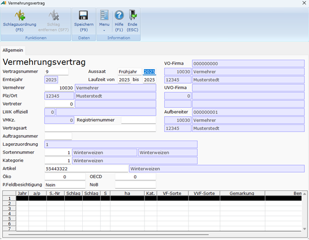
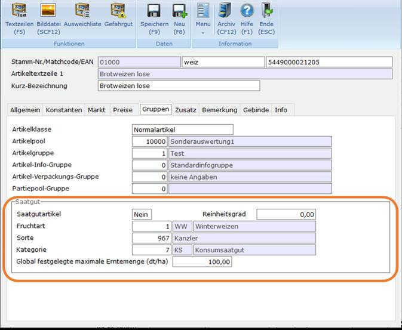
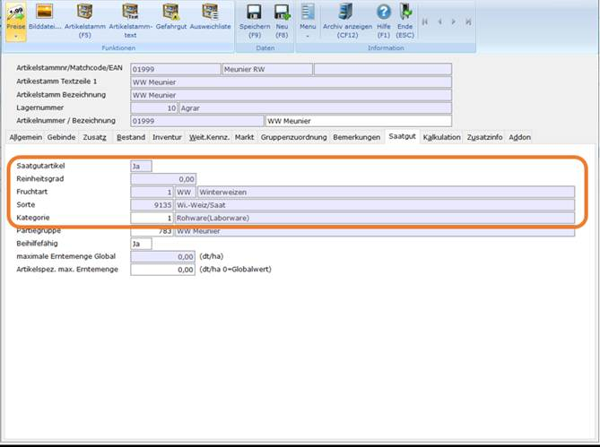
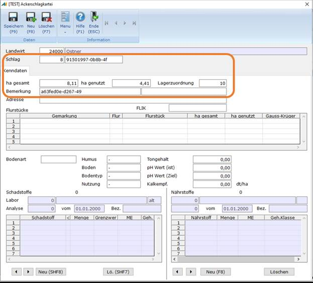
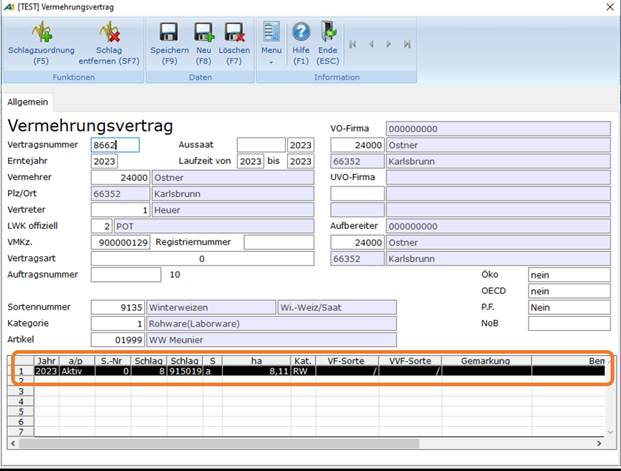
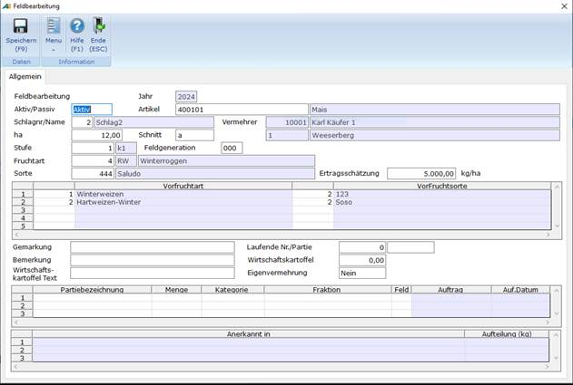
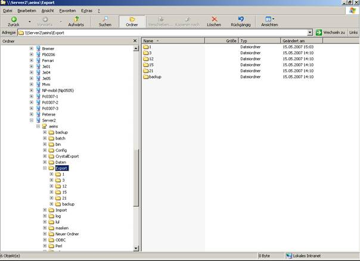

# Vermehrungsvertrag

<!-- source: https://amic.de/hilfe/_vermehrungsvertrag.htm -->

Hauptmenü > Saatzucht > Saatgutabwicklung > Vermehrnungsvertrag

Direktsprung **[SAATV]**

| Name | Bedeutung |
| --- | --- |
| Vertragsnummer | Die eindeutige Vertragsnummer für diesen Datensatz.  
 |
| Erntejahr | Das Jahr der Ernte. Es wird nicht gespeichert, sondern steuert die Anzeige in der Datentabelle.  
Wird hier 0 eingetragen, so werden alle Vorhandenen Schläge angezeigt, ansonsten nur die des Erntejahres.  
Mit dem Einrichterparameter „**Aktuelles Jahr als Erntejahr verwenden, sonst Geschäftsjahr**“ kann die Vorbelegung des Erntejahrs eingestellt werden.  
 |
| Vermehrer | Hier wird die Vermehrernummer - dies ist die Kundennummer aus dem Kundenstamm - eingetragen. Mit der F3-Taste kann hier eine Auswahl aufgerufen werden.  
 |
| Plz/Ort | Die Postleitzahl und der Ort des Vermehrers werden hier angezeigt.  
 |
| Vertreter | Der Vertreter zum Vermehrer wird hier angezeigt.  
 |
| LWK offiziell | Landwirtschaftskammer offiziell/Anerkennungsstelle. Mit der Taste **F3** kann hier eine Auswahl (**IB_Anerkennungsstelle**) aufgerufen werden**.**  
 |
| VMKz. | Die Vermehrerkennziffer  
 |
| Registriernummer |   
 |
| Vertragsart | Die Vertragsart. Mit der Taste **F3** kann hier eine Auswahl (**AF_VERTART**) aufgerufen werden.  
 |
| Auftragsnummer | Die Auftragsnummer  
 |
| Sortennummer | Die Sorte kann hier ausgewählt werden. Mit der Taste **F3** kann hier eine Auswahl (IB_SGALLESORTEN) aufgerufen werden.  
 |
| Kategorie | Die Kategorie der Saatsorte kann hier eingetragen werden. Mit der Taste **F3** kann hier eine Auswahl (IB_SGKATEGORIE) aufgerufen werden.  
 |
| Artikel | Der Artikel kann hier ausgewählt werden. Mit der Taste **F3** kann hier eine Auswahl (IB_ARTIKEL_FRUSORKAT) aufgerufen werden.  
 |
| Aussaat | Der Zeitpunkt der Aussaat.  
 |
| Laufzeit von bis | Die Laufzeit dieses Vermehrungsvertrages.  
 |
| VO-Firma | Identifikation zum Kundenstammsatz der VO - Firma (Vemehrerorganisation). Mit der F3-Taste kann hier eine Auswahl aufgerufen werden.  
 |
| UVO-Firma | Identifikation zum Kundenstammsatz der UVO - Firma (Untervemehrerorganisation).  
 |
| Aufbereiter | Die bundesweite gültige Aufbereiterkennziffer. Mit der F3-Taste kann hier eine Auswahl aufgerufen werden.  
 |
| Öko | Das Ökokennzeichen. Mit der Taste **F3** kann hier eine Auswahl (**AF_OEKO**) aufgerufen werden.  
 |
| OECD | OECD-Eignung. Mit der Taste **F3** kann hier eine Auswahl (**AF_OECD**) aufgerufen werden.  
 |
| P.Feldbesichtigung | Private Feldbesichtigung  
 |
| NoB | Hier kann angegeben werden, ob eine „nicht obligatorische Beschaffenheitsprüfung“ durchgeführt werden soll.  
 |
| Ackerschläge (Grid) | In diesem Grid werden die Ackerschläge zu diesem Vermehrungsvertrag angezeigt. Via Doppelklick auf eine Zeile öffnet sich der entsprechende Datensatz zur Bearbeitung im Pfleger Feldbearbeitung.  
 |

Um Flächen zur Besichtigung durch die Kammer anmelden zu können, müssen einige Stammdaten gepflegt werden:

Sind [Fruchtarten](../fruchtarten.md) und [Sorten](../saatsorten.md) eingerichtet, so muss noch die Verbindung zwischen den Artikeln, dem Artikelstamm und den Sorten geschaffen werden.

• Im Artikelstammpfleger(Direktsprung **[ARS]** und dort ****F5****) auf das Register Gruppen wechseln und dort Saatgutartikel auf **Ja** stellen und die Felder Fruchtart, Sorte und Kategorie ausfüllen.

• Im Artikelpfleger (Direktsprung **[AR]** und dort **F5**) die Funktion ***Saatgut*** aufrufen bzw. auf den Reiter **Saatgut** wechseln. In dem sich öffnenden Dialog muss die Kategorie eingetragen werden.

Hier muss wiederum die Kategorie eingetragen werden.

 

Im Vermehrungsvertrag ist die Vertragsnummer frei wählbar. Das Feld Aussaat beinhaltet den Monat, in dem die Aussaat erfolgt ist. Ggf. mit F3 und Stammdatenpflege zu ergänzen.

Die Vermehrernummer kommt aus dem Kundenstamm, z. B. 30300 für PHP. Hier ist auch die VO-Firma hinterlegt. Sollte wider Erwarten eine andere VO-Firma eingetragen werden, so kann das Feld VO-Firma durchaus geändert werden. Gleiches gilt für die Felder Aufbereiter, VMKz (Vermehrerkennzeichen) und LWK offiziell.  
    

ACHTUNG:

Die Vermehrerkennziffer der Landwirtschaftskammer muss 9-stellig sein. Die ersten beiden Stellen sind die der Landwirtschaftskammer, die für den Landwirt zuständig ist (21 = Schleswig Holstein #######). Die Kammern geben in der Regel nur die Endnummern an – Leerstellen sind mit „0“ aufzufüllen, z. B. 210000011. Wenn die Kammernummer mit „0“ beginnt, dann lediglich 8 Stellen erfassen; die führende „0“ wird vom Programm automatisch zugefügt, wenn die Daten für den Ausdruck aufbereitet werden.

Vertragsart, Registriernummer und Auftragsnr. sind z. Zt. noch nicht belegt, können also übersprungen werden. Für Produktionen nach Öko-Standard kann im Feld Öko ein entsprechender Hinweis angegeben werden – ist bisher noch nicht eingerichtet. Für OECD, Sortennummer, Kategorie und Artikel gibt es nach Betätigung der F3-Taste jeweils Auswahlfenster. ACHTUNG!!! Hier kommt es zu Fehlermeldungen, wenn die Artikel, Artikelstämme und Saatsorten eindeutig zugeordnet worden sind (s. o.). Offiziell gibt es nur die folgenden Stufen:

Vorstufe, Basis, ZS und Z2. Zuchtgartengemisch ist KEINE offizielle Kategorie. D. h. bei Vermehrungen von ZG zu VS ist als Kategorie VS anzugeben; der Status ZG ergibt sich aus der Anerkennungsnummer!!!

Schlagzuordnung F5.

In der sich hier öffnenden Auswahlliste können bereits erfasst Schläge ausgewählt mit der Funktion ***Übernehmen*** **F9 übernommen werden** oder neu erfasst werde(***Neu*** **F8**).

Hier bitte die Schlagnummer, -bezeichnung, - größe, Lagerzuordnung und ggf. Bemerkungen eingeben. Weitere Eingaben sind NICHT erforderlich.

Den gewünschten Schlag markieren und mit F9 übernehmen.

Die Daten erscheinen dann in der Tabelle am Fuße der Vertragsmaske

Um die Vorfrüchte zuordnen zu können, muss der Schlag markiert und per Doppelklick geöffnet werden.

Vorfrüchte und Basispartie bitte lt. Aufstellung (SZ oder RGR) erfassen.  
Die Ertragsschätzung wird aus der Saatsorte vorbelegt.

Funktionen

| Funktion | Taste | Bedeutung |
| --- | --- | --- |
| Auftrag erstellen | F8 | Erstellt aus den im Basissaatgutgrid(erster Spaltenname Partiebezeichnung) eigetragene Artikel einen Auftrag und öffnet diesen zur Korrektur |

Um nun die LWK-Anmeldung aufzurufen, ruft man aus der Anwendung Vermehrungsvertrag (Direktsprung **[SAATV]**) die Funktion ***LWK-Anmeldung*** **SCF9** auf.

Es werden die Daten angezeigt, die die Voraussetzung für die elektronische Übergabe an die LWK erfüllen.

Es gibt nun die Möglichkeit:

• nur Drucken (Crystal-Report wird aktualisiert und kann gedruckt werden)

• nur Diskette

• Druck und Diskette

Für die Übergabe per Diskette muss vorher in den Optionen (Direktsprung **[OPT]**) dir Option „SaatLWKDiskettenPfad“ gesetzt werden. Ist diese Option nicht gesetzt, dann werden die Daten in das Export-Unterverzeichnis von A.eins geschrieben.

Die Nummern bezeichnen die verschiedenen LWK. Sowohl die .log als auch die .txt-Datei muss an die LWK geschickt werden (als Anlage einer E-Mail).
