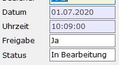
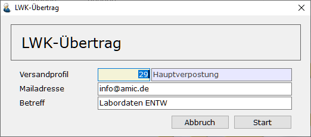

# LWK-Übertrage

<!-- source: https://amic.de/hilfe/_lwkuebertrag.htm -->

Hauptmenü > Saatzucht > Saatenlabor > Labordaten > Variante LWK-Übertrag > Funktion Übertrage an die LWK

oder Direktsprung [LABOR]

Die Funktion Übertrag an die LWK findet man in der Variante „LWK-Übertrag“. In dieser Variante werden die Daten bereits so angezeigt, wie sie dann übertragen werden. In der F2-Bereichsauswahl wird neben der Probenummer und der Partiebezeichnung auch die Freigabe abgefragt. Dieser Wert wird auf der Labordatenmaske abgefragt und es werden nur die Daten übertragen, bei denen die Freigabe auf **Ja** steht.  

Sind alle Daten für die LWK erfasst, so kann man den Übertrag mit der Funktion Übertrage an die LWK starten. Es erscheint folgender Dialog, in dem man das [Versandprofil](../../mailversand_allgemein/einrichtung_mailversand/versandprofilstamm.md), die Mailadresse an die die Daten gesendet werden sollen und die Betreffzeile angeben muss. Diese Daten werden gespeichert und beim nächsten Aufruf wieder vorgeschlagen.

