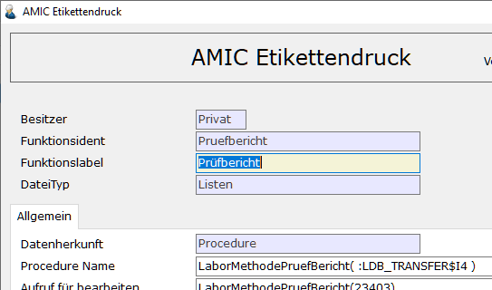

# Labormethoden

<!-- source: https://amic.de/hilfe/_labormethoden.htm -->

Hauptmenü > Saatzucht > Saatenlabor > Methoden

oder Direktsprung **[LABME]**

In diesem Stammdatenpfleger werden die Labormethoden gepflegt. Labormethoden dienen dazu, verschieden Laborverfahren zusammenzufassen um.

| Name | Bedeutung |
| --- | --- |
| Nummer | Eindeutige Nummer dieser Methode, wie sie in den Labordaten verwendet wird.  
 |
| Bezeichnung | Die Methodenbezeichnung  
 |
| Fruchtart |   
 |
| Zweck (Probentyp) | Hier wird die Norm angezeigt. Aus dem Format „AF_QUALART“ **kann** **eine Auswahl** via Taste **F3** **aufgerufen werden**.  
Ist hier der Einrichterparameter ‚Methodenauswahl auf Probentyp eingeschränkt‘ der Labordaten-Maske (Probensatzbearbeitung) mit dem Wert ‚Ja‘ versehen, so wird die Methodenauswahl im LABOR-Modul bei der Erstellung eines Probensatzes nach dem dort angegebenen Probentyp (Satzart, Zweck) eingeschränkt.  
 |
| Nummernkreis | Die Nummer des Nummernkreis, der für die Vergabe der Probenummer in den Labordaten verwendet wird.  
 |
| Verfahren (Grid) | Hier werden alle [Verfahren](./laborverfahren.md) die zu einer Methode gehören eingetragen. Die Verfahren werden einer Probe im Labor zugeordnet, sobald die Methode ausgewählt wurde.  
 |

Folgende Felder werden zusätzlich angezeigt, sobald der Einrichterparameter „[Erweiterte Einstellungen](../../firmenstamm/einrichterparameter/labormethoden_epa_labormethoden.md)“ auf „Ja“ gestellt wird.

| Name | Bedeutung |
| --- | --- |
| Norm | Hier wird die Norm angezeigt. Aus dem Format „BF_QUALKL“ **kann** **eine Auswahl** mit **F3** **aufgerufen werden**.  
Ist hier ein Eintrag vorhanden, so wird die Methodenauswahl im LABOR-Modul bei der Erstellung eines Probensatzes nach der dort angegebenen Norm eingeschränkt.  
 |
| Kategorie | Hier wird die Kategorie angezeigt. Aus dem Saatgutstammdatenbereich Kategorien kann mit **F3** **eine Auswahl aufgerufen werden**.  
Ist hier ein Eintrag vorhanden, so wird die Methodenauswahl im LABOR-Modul bei der Erstellung eines Probensatzes nach der dort angegebenen Kategorie eingeschränkt, wenn diese größer 0 ist.  
 |
| Anbauart | Hier wird die Anbauart angezeigt. Aus dem Format „AF_ANBAUART“ **kann** **eine Auswahl** mit **F3** **aufgerufen werden**.  
Ist hier ein Eintrag vorhanden, so wird die Methodenauswahl im Labor-Modul bei der Erstellung eines Probensatzes nach der dort aus dem zugehörigen Artikelstamm (Sinfosdaten) ermittelten Anbauart eingeschränkt, wenn diese nicht NULL ist.  
 |
| Sortentyp | Hier wird der Sortentyp angezeigt. Aus dem Format „AF_SORTENTYP“ **kann** **eine Auswahl** mit **F3** **aufgerufen werden**.  
Ist hier ein Eintrag vorhanden, so wird die Methodenauswahl im Labor-Modul bei der Erstellung eines Probensatzes nach dem dort aus der zugehörigen Sorte ermittelten Sortentyp eingeschränkt, wenn dieser nicht NULL ist.  
 |
| Behandlung | Hier wird die Laborbehandlung angezeigt. Aus dem Format „AF_BEHANDLUN“ **kann** mit **F3** **eine Auswahl aufgerufen werden**.  
Ist hier ein Eintrag vorhanden, so wird die Methodenauswahl im Labor-Modul bei der Erstellung eines Probensatzes nach dem dort eingetragenen Wert für die Behandlung eingeschränkt, wenn dieser größer als 0 ist.  
   
In der Tabelle „Zusätzliche Behandlung“ können weitere Behandlungen erfasst werden, damit diese Methode auch bei diesen Behandlungen im Labor-Modul herangezogen wird.  
 |
| Gültig ab | Hier kann ein Gültigkeitsabdatum eingetragen werden. Dies Datum wird benötigt, wann die Labormethode im Prüfauftrag oder im Labormodul automatisch gesucht wird.  
 |

Prüfbericht

In diesem Grid werden die Prüfberichte hinterlegt, die aus dem Labormodul gedruckt werden können. Das Drucken eines Prüfberichtes ist erst dann möglich, wenn die Kopfdaten komplett erfasst wurden. Es können nur Berichte / Etiketten aus dem Bereich des [AMIC Etikettendrucks](../amic_etikettendruck/index.md#Amic_Etikettendruck) ausgewählt werden. Jeder Prüfbericht, der in diesem Grid eingetragen ist, wird beim Drucken gedruckt.

Technischer Anschluss

Im A.eins System existiert keine Standardvorlage für ein Prüfbericht. Dieser muss vor Ort entwickelt werden. Die Variable „LDB_TRANSFER$I4“ wird mit der „QualitaetsId“ vor dem Aufrufen des Prüfberichtes befüllt.  
Beispiel(siehe Procedure Name):

 

Die Prüfberichte werden in der Tabelle „LaborMethodeEtiketten“ unter Etikettentyp 2 gespeichert.

Etikett Teilproben

In diesem Grid werden die Etiketten für die Teilproben hinterlegt, die aus dem Labormodul gedruckt werden können. Das Drucken der Teilprobenetiketten ist erst dann möglich, wenn die Kopfdaten komplett erfasst wurden. Es können nur Berichte / Etiketten aus dem Bereich des [AMIC Etikettendrucks](../amic_etikettendruck/index.md#Amic_Etikettendruck) ausgewählt werden. Jedes Teilprobenetikett, welches in diesem Grid eingetragen ist, wird beim Drucken gedruckt. In dem Feld Häufigkeit kann die Ausgabehäufigkeit in Prozent angegeben werden. Das Feld wird mit einem Zufallswert vorbelegt. Das Feld Häufigkeit wird nicht im A.eins System standardmäßig ausgewertet.

Technischer Anschluss

Siehe Oben bei Technischer Anschluss Prüfbericht.  
    

Die „Etikett Teilbroben“ werden in der Tabelle „LaborMethodeEtiketten“ unter Etikettentyp 1 gespeichert..
