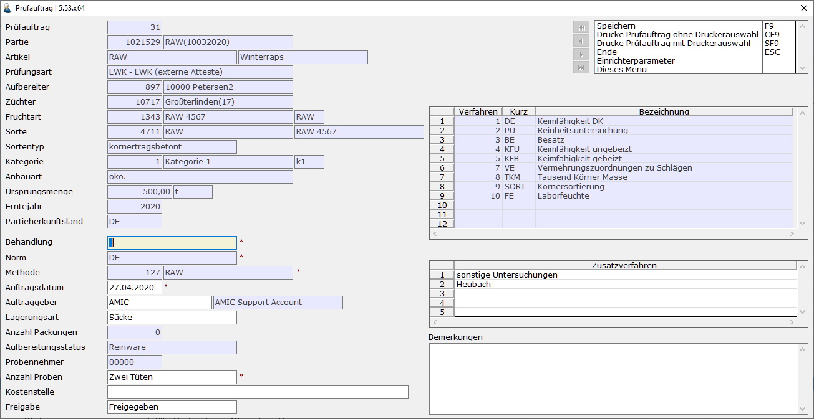

# Prüfaufträge bearbeiten

<!-- source: https://amic.de/hilfe/_pruefauftraegebearbeiten.htm -->

Hauptmenü > Saatzucht > Saatenlabor > Prüfaufträge

oder Direktsprung [PRUEA]

Nachdem ein [Prüfauftrag erstellt](./pruefauftraege_erstellen.md) wurde, können die Aufträge in dieser Anwendung weiterbearbeitet werden.

Die mit \* gekennzeichneten Felder sind Pflichtfelder und müssen ausgefüllt werden, bevor der en Prüfauftrag freigegeben werden kann.
