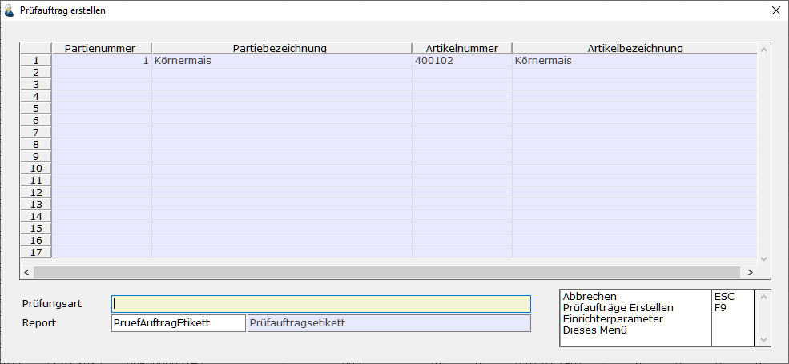

# Prüfaufträge erstellen

<!-- source: https://amic.de/hilfe/_pruefauftraegeerstellen.htm -->

Hauptmenü > Partieverwaltung > Chargen / Partien > Partie-Stammdaten

oder Direktsprung [PAR]

Prüfaufträge werden über den [Partiestamm](../../partieverwaltung/partiestamm/index.md) erstellt. Dort existiert eine Funktion „Prüfauftrag erstellen“, die zu den ausgewählten Partien die Prüfaufträge erstellt:

| Name | Bedeutung |
| --- | --- |
| Prüfungsart | Hier können aus dem Anwenderformat „AF_QUALART“ Prüfungsarten mir F3 ausgewählt werden  
 |
| Datentabelle | In der Datentabelle werden alle ausgewählten Partien angezeigt.  
 |
| Report | Ein Report, der über den AMIC-Etikettendruck erstellt wurde. Beim erstellen eines Prüfauftrages wird dieser Report/dieses Etikett sofort gedruckt.  
 |
| Ohne Druckerauswahl  
Mit Druckerauswahl | Hier kann ausgewählt werden, ob vor dem Druck eine Abfrage nach dem Drucker kommen soll. |

    
Ist ein Prüfauftrag erstellt worden, kann man ihn in der Anwendung [Prüfaufträge](./pruefauftraege_bearbeiten.md) bearbeiten.
