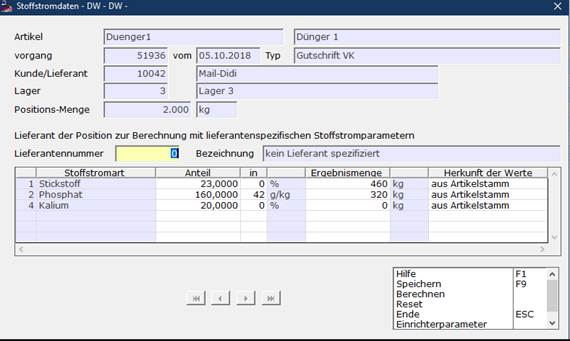

# Editieren von Stoffstromdaten

<!-- source: https://amic.de/hilfe/_stoffstromeditor.htm -->

Mit dem Modul zum Ansehen und zur Korrektur von Stoffstromdaten können die zugehörigen Werte zu je einer Warenbewegung angesehen beziehungsweise geändert werden. Aufrufbar ist das Modul in diversen positionsorientierten Auswahllistenvarianten der Vorgangsbearbeitungsmodule sowie in den dafür geeigneten Auswahllistenvarianten der Rohwarebearbeitung (zu beachten: [Stoffstromdaten in Rohwarebelegen](./stoffstromdaten_in_rohwarebelegen.md)), wie auch der Auswahllistenvariante *‚Produktion mit Positionen‘* des Produktionsmoduls (zu beachten: [Stoffstromdaten in Produktionsbelegen](./stoffstromdaten_in_produktionsbelegen.md)).  
Die Auswahllistenvariante *‚Stoffstrom-Positionen‘* des Moduls *‚Vorgangsübersicht‘* stellt zu den per Bereichsauswahl zu selektierenden Vorgängen nur Positionen zu denjenigen Artikeln dar, denen per Artikelstamm-Zusammensetzung Stoffstrompositionen zugeordnet sind und eignet sich daher besonders als Grundlage zur Änderung der Stoffstromdaten von ganzen Vorgangsgruppen.

Dargestellt werden auf der Maske neben einigen Daten zur Vorgangs- und Positionsidentifikation die zur angezeigten Position aktuell gespeicherten Stoffstromdaten (Anteil, Anteiltyp und Stoffstrommenge) sowie **für Verkaufsbelege der (optional) anzugebende Lieferant** der Position.

Sind diesem Lieferanten im zugehörigen Artikelstammsatz der Position individuelle Stoffstromparameter zugeordnet, so ersetzen diese diejenigen aus der Artikelzusammensetzung. Für **Einkaufsbelege** ist dieses Maskenfeld nicht vorhanden, da der gesamte Vorgang einem Lieferanten zugeordnet ist.  
    
Wurde dem Artikelstamm seit der Berechnung der Daten der Position in seiner [Zusammensetzung](../../artikelstamm_und_artikel/parameter_des_artikelstamms/zusammensetzung.md) ein weiterer Stoffstrombestandteil hinzugefügt, so wird dieser mit dem dort angegebenen Anteil, aber ohne berechnete Menge ebenfalls dargestellt, obwohl diese Daten (noch) nicht zur Position gespeichert sind.  
Die Funktion **‚Berechnen‘** löst eine Neuberechnung der dargestellten Werte aus. Mit der Funktion **‚Reset‘** können die Werte bei Fehleingaben wieder auf die ursprünglich eingelesenen Werte zurückgesetzt werden.  
Die Angabe *‚Herkunft der Werte‘* gibt an, ob der dargestellte Anteilwert der Artikelstamm-Zusammensetzung entnommen wird, der Anteilwert und/oder der Anteiltyp manuell angegeben wurde oder die berechnete Menge manuell erfasst wurde. Bei Änderung des Anteil-Wertes und/oder des Anteiltyp (Spalte ‚in‘) springt diese Anzeige automatisch auf den Wert **Anteil manuell** um. Wird die Menge geändert, so wird hier **Menge manuell** ausgewiesen. Die Einstellung kann auch manuell auf jeden der drei Werte geändert werden:

\- **aus Artikelstamm  
**der Anteilwert und Anteiltyp wird neu aus der Artikelstamm-Zusammensetzung gelesen  
und die Berechnung der Menge wird durchgeführt

\- **Anteil manuell  
**die Berechnung der Menge wird mit dem gegebenen Anteil durchgeführt

\- **Menge manuell  
**der Anteilwert und die Menge bleiben wie dargestellt  
auch bei zukünftigen Neuberechnungen erhalten. 

Zu beachten: Die Berechnungsfunktion wird grundsätzlich immer bei der Bearbeitung der Vorgänge inklusive Umwandlungen entsprechend der geschilderten Einstellung für *‚Herkunft der Werte‘* durchgeführt!
