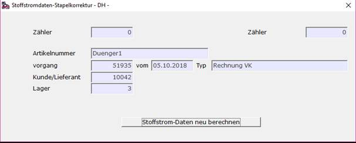

# Stapel-Berechnung von Stoffstromdaten

<!-- source: https://amic.de/hilfe/_stoffstromberechnung.htm -->

Mit dem Modul zur Stapel-Berechnung von Stoffstromdaten können die zugehörigen Werte zu einer großen Zahl von ausgewählten Warenbewegung neu berechnet werden. Aufrufbar ist das Modul in diversen positionsorientierten Auswahllistenvarianten der Vorgangsbearbeitungsmodule sowie in der Auswahllistenvariante ‚Produktion mit Positionen‘ des Produktionsmoduls (zu beachten: [Stoffstromdaten in Produktionsbelegen](./stoffstromdaten_in_produktionsbelegen.md)).  
Die Auswahllistenvariante *‚Stoffstrom-Positionen‘* des Moduls *‚Vorgangsübersicht‘* stellt zu den per Bereichsauswahl zu selektierenden Vorgängen nur Positionen zu denjenigen Artikeln dar, denen per Artikelstamm-Zusammensetzung Stoffstrompositionen zugeordnet sind und eignet sich daher besonders als Grundlage zur Änderung der Stoffstromdaten von ganzen Vorgangsgruppen.  
    
  
    
Das Berechnungsverfahren entspricht dem des im [Stoffstromdaten-Editor](./editieren_von_stoffstromdaten.md) genutzten Berechnungsverfahrens, insbesondere unter Berücksichtigung der jeweiligen Einstellung des Merkmals *‚Herkunft der Werte‘.  
*Bei Auslösen der Funktion durch Betätigen des Buttons **Stoffstrom-Daten neu berechnen** wird die Berechnungsfunktion für alle ausgewählten Vorgangspositionen durchgeführt. Wurden in den zugehörigen Artikelstamm-Zusammensetzungen Stoffstrom-Bestandteile hinzugefügt, die in einer betroffenen Vorgangsposition noch nicht enthalten ist, so werden diese mit dieser Funktion automatisch nachgetragen und berechnet.
