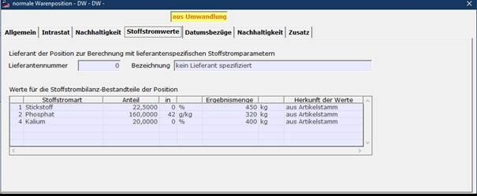

# Stoffstromdatenbearbeitung auf der Warenpositions-Bearbeitungsmaske

<!-- source: https://amic.de/hilfe/_stoffstromwapostab.htm -->

Bei der Erfassung und Korrektur von **Standardvorgängen im Einkauf und Verkauf** werden die zur Position gehörenden Stoffstromdaten auf der zusätzlichen Registerkarte **‚Stoffstromwerte‘** dargestellt und können hier wie im Stoffstrom-Editor bearbeitet werden.

Dargestellt werden auf der Maske die zur angezeigten Position aktuell gespeicherten Stoffstromdaten (Anteil, Anteiltyp und Stoffstrommenge) sowie **für Verkaufsbelege der (optional) anzugebende Lieferant** der Position.

Sind diesem Lieferanten im zugehörigen Artikelstammsatz der Position individuelle Stoffstromparameter zugeordnet, so ersetzen diese diejenigen aus der Artikelzusammensetzung. Für **Einkaufsbelege** ist dieses Maskenfeld nicht vorhanden, da der gesamte Vorgang einem Lieferanten zugeordnet ist.  
   
Wurde dem Artikelstamm seit der Berechnung der Daten der Position in seiner [Zusammensetzung](../../artikelstamm_und_artikel/parameter_des_artikelstamms/zusammensetzung.md) ein weiterer Stoffstrombestandteil hinzugefügt, so wird dieser bei der Vorgangsbearbeitung mit den definierten Stoffstromparametern ebenfalls dargestellt.  
Die Angabe <em>‚Herkunft der Werte‘</em> gibt an, ob der dargestellte Anteilwert der Artikelstamm-Zusammensetzung entnommen wird, der Anteilwert und/oder der Anteiltyp manuell angegeben wurde oder die berechnete Menge manuell erfasst wurde. Bei Änderung des Anteil-Wertes und/oder des Anteiltyp (Spalte ‚in‘) springt diese Anzeige automatisch auf den Wert **Anteil manuell** um. Wird die Menge geändert, so wird hier **Menge manuell** ausgewiesen. Die Einstellung kann auch manuell auf jeden der drei Werte geändert werden:

- **aus Artikelstamm  
**der Anteilwert und Anteiltyp wird neu aus der Artikelstamm-Zusammensetzung gelesen  
und die Berechnung der Menge wird durchgeführt

- **Anteil manuell  
**die Berechnung der Menge wird mit dem gegebenen Anteil durchgeführt

- **Menge manuell  
**der Anteilwert und die Menge bleiben wie dargestellt  
auch bei zukünftigen Neuberechnungen erhalten. 

**Zu beachten:** **Die Berechnungsfunktion wird grundsätzlich immer bei der Bearbeitung der Vorgänge inklusive Umwandlungen entsprechend der geschilderten Einstellung für <em>‚Herkunft der Werte‘</em> durchgeführt!  
    
**
