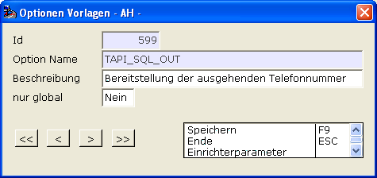
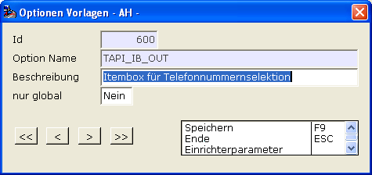
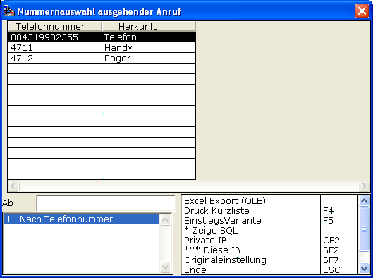

# Eingehende Telefonie

<!-- source: https://amic.de/hilfe/eingehendetelefonie.htm -->

Wesentlich dabei ist, dass das Telefonie-System die eingehende Nummer auf Wunsch veröffentlich. So besitzen fast alle Systeme eine Möglichkeit, die Nummer z.B. in eine Datei wegzuschreiben. Diese Nummer muss nun A.eins mitgeteilt werden.

Durch dieses Verfahren benötigt A.eins selber keine spezielle Unterstützung der Telefonie-Systeme mehr.

Es muss eine j-Datei geschrieben werden die die Nummer ermittelt und diese in der Variablen LDB_TRANSFER$VC zur Verfügung stellt.

Dieses lässt sich auch ohne Telefonie-System bewerkstelligen, man erhält somit die Möglichkeit, das sonstige System A.eins-seitig zu testen.

Exemplarisch erstellt man also mit dem Notepad eine Datei namens nummerholen.j im A.eins-Bin-Verzeichnis mit folgendem Inhalt

cat LDB_TRANSFER$VC "0170111222333444"

Weiterhin wird an Hand dieser Nummer von A.eins mit dem SQL

```sql
CREATE PROCEDURE AMIC_TAPI_KUNDID( IN  in_Telefonnummer varchar(64) )
result
(
  kundid   integer
)
BEGIN
  select distinct
ks.kundid from Kundenstamm ks
  join
AnschriftStamm ansch on
ansch.adressnummer = ks.kundid
  where
replace(replace(replace(trim(AdressTelefon)  , '
',''),'/',''),'-','') = in_Telefonnummer or

replace(replace(replace(trim(AdressTeleMobil), ' ',''),'/',''),'-','') =
in_Telefonnummer;
END
```

die Kundid’s ermittelt.

Dieses ist die standardmäßig ausgelieferte Ermittlungsfunktion und kann vor Ort durch die A.eins-Option TAPI_SQL durch eine privatisierte ersetzt werden.

Weiterhin wird im Falle mehrerer Treffer dem Anwender eine Itembox zur endgültigen Auswahl zur Verfügung gestellt. Diese kann durch die A.eins-Option TAPI_IB vor Ort angepasst werden.

Die Bestimmung der ausgehenden Telefonnummer wurde verallgemeinert, um bestehende Vorort-Situationen besser anpassen zu können.

Dazu gibt es die Optionen



und



Hier lassen sich private SQL-Funktionen und private Itemboxen anbinden.

Mit dieser SQL-Prozedur lassen sich weitere Telefonnummern zur KundId ermitteln und in diesem Falle dann per Itembox zur Auswahl bringen.

Sind die Optionen nicht eingerichtet, so werden die AMIC-Standard-Funktionen „*AMIC_TAPI_NUMMER*“ und „*IB_TAPI_NUMMER*“ herangezogen.

So lässt sich exemplarisch durch

```sql
CREATE PROCEDURE
AMIC_TAPI_NUMMER( IN in_Kundid integer )
result
(
  telnummer varchar(64), telherkunft
varchar(64)
)
BEGIN
  select AdressTelefon , 'Telefon' from
Anschriftstamm an, kundenstamm ks
  where ks.AdressIdHauptAdr = an.AdressID
  and   ks.KundId = in_Kundid
  union select 4711, 'Handy'
  union select 4712, 'Pager';
END
```

Folgendes erreichen:



Mit Hilfe der Option „*TAPI_OUT_ZUSATZ*“ können ausgehende Telefonnummernanrufe generell mit einem Präfix versehen werden. Dieses kann zum Beispiel für eine Amtsholung per führende Null verwendet werden.

Mit der Option „*CATS_KUISEITE*“ lässt sich einrichten

• dass eingehende Anrufe überhaupt mit SHIFT+CTRL+F3 angenommen werden können

• welche KUI-Seite sich bei eingehendem Anruf und SHIFT+CTRL+F3 öffnet, wenn das System diese Nummer gefunden hat

• dass man mit dem System-Parameter „*TapiCall“* die individuelle Rufnummernermittlung des entsprechenden Telefoniesystems ermitteln kann.

Eine weitere Möglichkeit „eingehende“ Telefonie zu behandeln ist:

Die globale Option TAPI_SQL_CONTROLSTRING erlaubt die Angabe einer Datenbank-Funktion, die als Eingangsparameter die eingehende Telefonnummer bekommt. Als Rückgabe dieser Funktion wird ein kompletter A.eins-Controlstring erwartet, der dann von A.eins ausgeführt wird.
