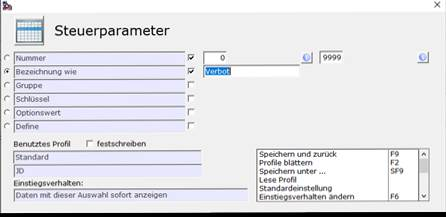
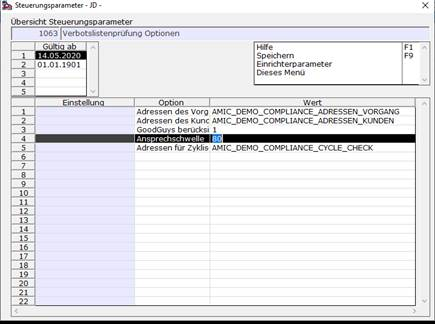
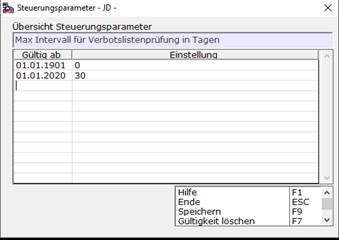
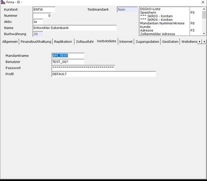
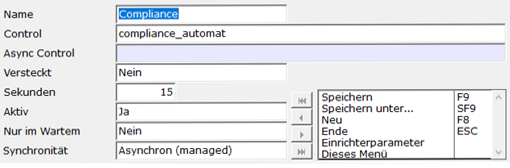

# Schritt 1 Setup

<!-- source: https://amic.de/hilfe/_compliancesfs1.htm -->

Schritt 1.1: AEB Zugang

Um die Sanktionslistenprüfung in A.eins zu nutzen, braucht man einen Zugang zu den Diensten von AEB. Diese übenhemen den Abgleich der Adress/Personendaten in A.eins mit den Sanktionslisten der EU. Man muss also einen Zugang zu den Dienstleitungen von AEB erwerben (dies ist nicht im Preis des Moduls enthalten). Die Angebote von AEB finden sie unter: [https://www.aeb.com/de-de/produkte/compliance-screening/preise-compliance-screening.php](https://www.aeb.com/de-de/produkte/compliance-screening/preise-compliance-screening.php).

Schritt 1.2: Steuerparameter konfigurieren.

Mit dem Direktsprung **[SPA]** gelangt man in die Übersicht der Steuerparameter. Dort kann man mit **F2** nach der Bezeichnung „Verbot“ suchen und bekommt die Übersicht aller Steuerparameter für Compliance angezeigt, indem man mit **F9** die Suche speichert.

SPA 707:

Dieser Steuerparameter ist die Lizenz für dieses Modul und nach dem Erwerb zu aktivieren.

SPA 1063:

Der Steuerparameter 1063 für das Compliancemodul beinhalten Prozeduren, welche die Abfragen der Adress/Personendaten beeinflussen. Da diese in der Komplexität recht anspruchsvoll werden können, muss dies von unserem Amic Support angepasst werden.

In dem Steuerparameter sind auch Werte, welche unkomplex und einfach zu ändern sind:

\- **GoodGuys berücksichtigen**: (0: nein, 1: ja)

\- **Ansprechschwelle** (ist ein Prozentualer Wert, welcher bei Ähnlichkeiten von Namen/Adressen von AEB berechnet wird)

\- **Adressen des Vorgangs:**

Eine Datenbankprozedur, die als Eingabeparameter eine V_ID bekommt und alle Anschriften des Vorgangs ermittelt. Als Standardbeispiel wird hier die Prozedur „AMIC_DEMO_COMPLIANCE_ADRESSEN_VORGANG“ eingetragen.

\- **Adressen des Kunden:**

Eine Datenbankprozedur, die als Eingabeparameter eine KundID bekommt und alle Anschriften des Kunden ermittelt. Als Standardbeispiel wird hier die Prozedur „AMIC_DEMO_COMPLIANCE_ADRESSEN_KUNDEN“ eingetragen.

\- **Adressen für zyklische Anschriftenprüfung**

Eine Datenbankprozedur, die Anschriften für eine regelmäßige Anschriftenprüfung ermittelt.

Als Standardbeispiel wird hier die Prozedur „AMIC_DEMO_COMPLIANCE_CYCLE_CHECK“ eingetragen.

SPA 824:

Der Steuerparameter 824 gibt an, wie viele Tage A.eins die Adress/Personendaten nicht erneut prüft, wenn diese bereits positiv waren.

Schritt 1.3: AEB Zugang (Einbindung A.eins)

Um den Zugang zu AEB in A.eins einzubinden, muss man die Zugangsdaten, welche von AEB bereitgestellt werden, in den Mandantenstamm eintragen. Dafür mit dem Direktsprung **[MND]** in den Mandantenstamm und dort auf das Register „Verbotsliste“ wechseln. Hier werden nun die Zugangsdaten eingetragen und das Profil auf den Wert *„DEFAULT“* gesetzt.

Schritt 1.4: Mandantenserver Prozess einrichten

Mit dem Direktsprung **[MSP]** gelangt man in die Auswahlliste der Mandantenserverprozesse. Dort erstellt man mit ***Neu*** **(F8)** einen neuen Datensatz. Zudem muss man die Maske 1:1 wie im folgenden Bild einrichten und dann mit ***Speichern*** **(F9)** abspeichern:

